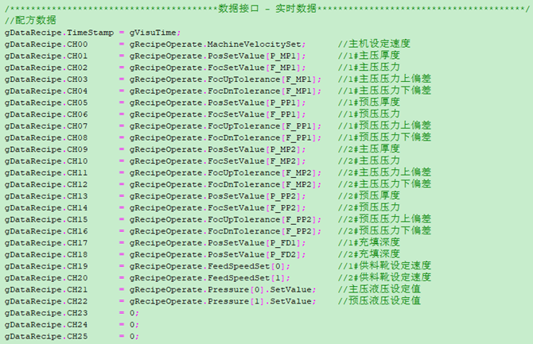
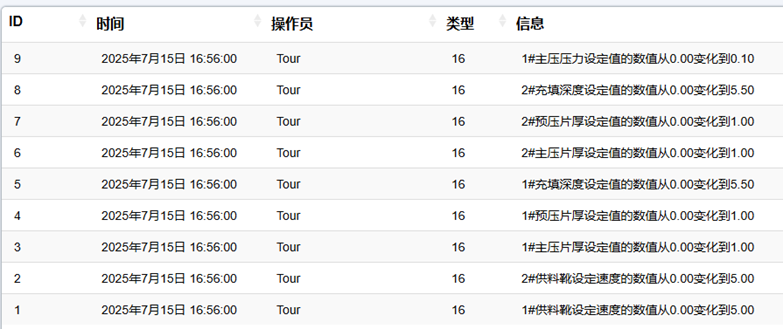
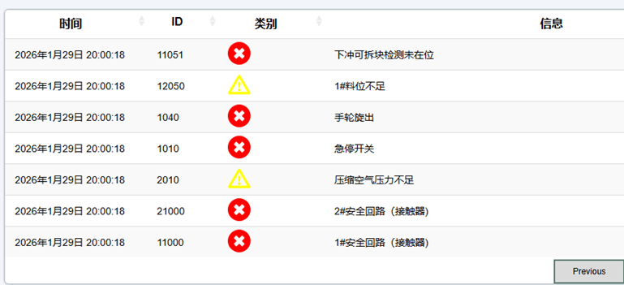
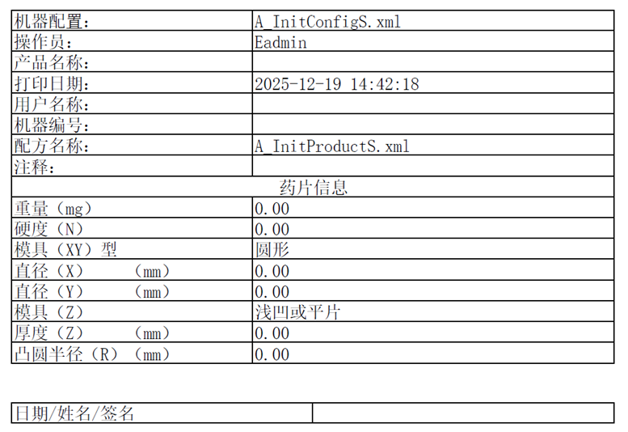
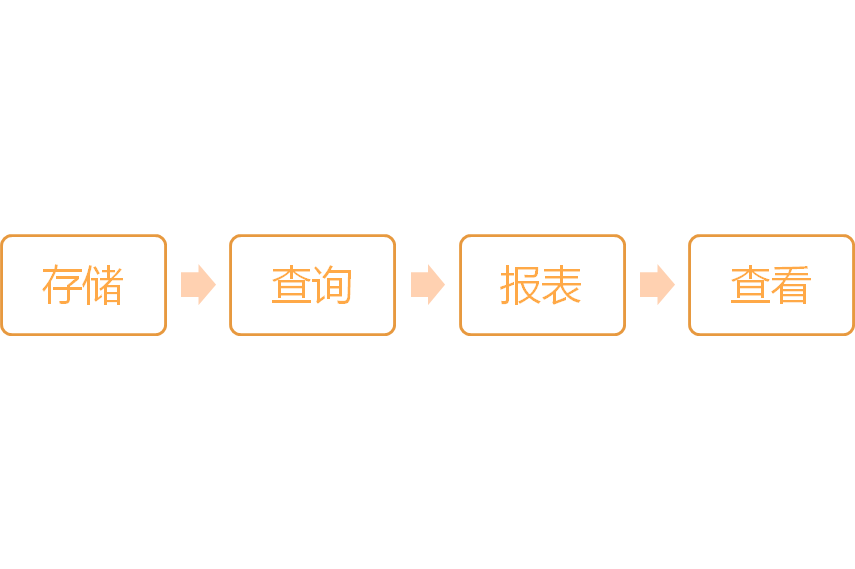
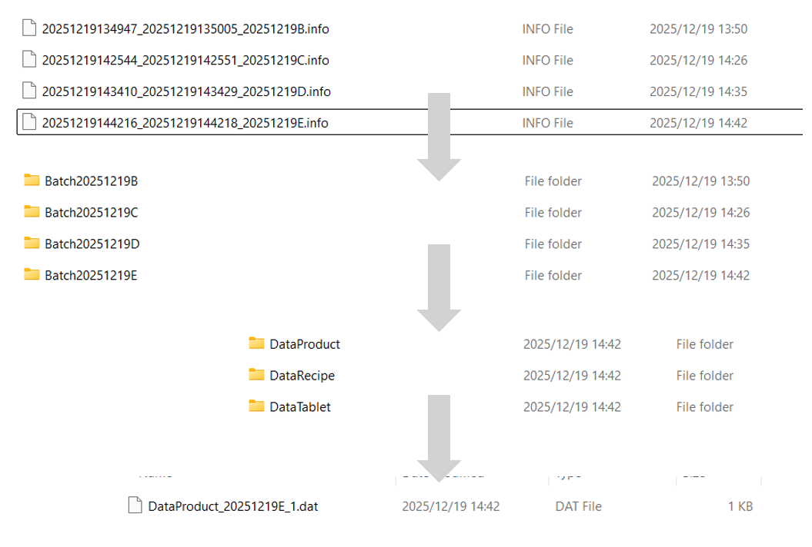
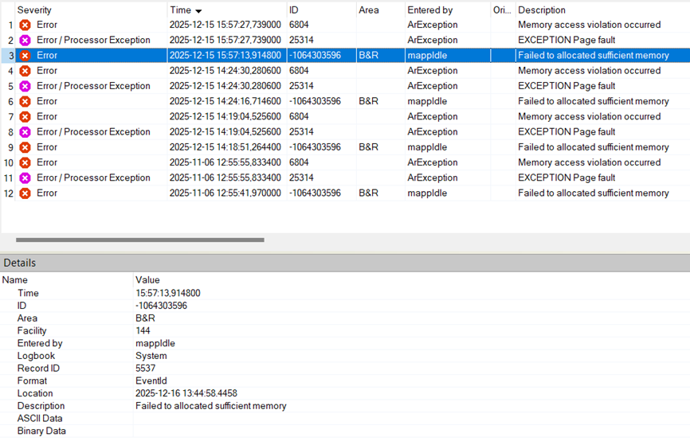
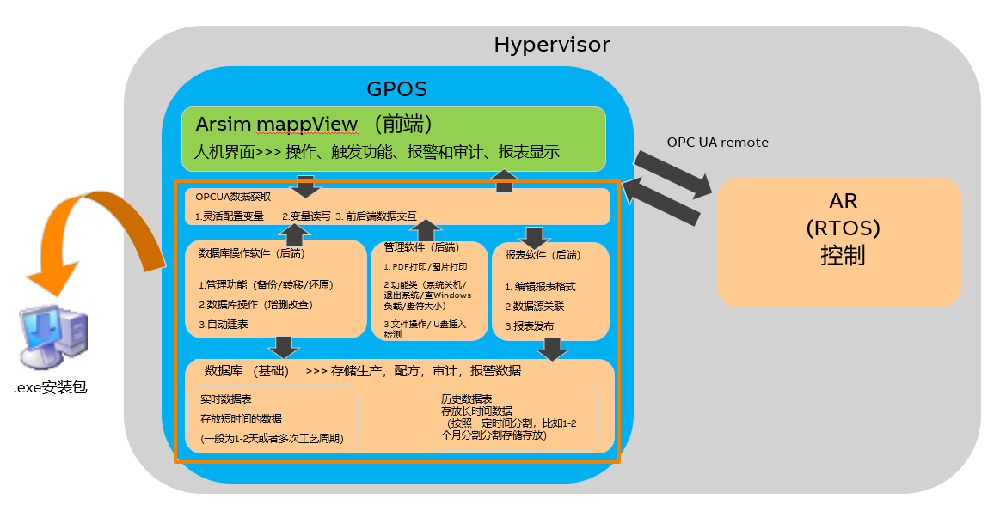

# 新马数据需求整理

---

## 幻灯片 1

### SmartData

### 新马药机数据需求整理

---

## 幻灯片 2

### 一、数据类别

1. **生产数据**
2. **配方数据**
3. **审计追踪**
4. **报警记录**
5. **其它信息**

---

## 幻灯片 3

### 数据类型 – 生产数据

**1 生产数据**

- 存储：根据设定事件进行存储、根据设定时间间隔进行存储
- 查询：根据批号进行查询、根据起始时间进行查询
- 配置：可自由配置变量，配置内容为变量名称、变量描述、单位

---

## 幻灯片 4

### 数据类型 – 配方数据

**1 配方数据**

- 存储：根据设定事件进行存储
- 查询：根据批号进行查询、根据起始时间进行查询
- 配置：可自由配置变量，配置内容为变量名称、变量描述、单位

---

## 幻灯片 5

### 数据类型 – 审计追踪

**3 审计追踪：按钮操作、数值变化**

- 存储：触发后进行存储
- 查询：根据批号进行查询、根据起始时间进行查询
- 存储条目：ID、时间、操作员、类型、信息

---

## 幻灯片 6

### 数据类型 – 报警记录

**4 报警记录**

- 存储：触发后进行存储
- 查询：根据批号进行查询、根据起始时间进行查询
- 存储条目：时间、ID、类别、信息

---

## 幻灯片 7

### 数据类型 – 其它信息

**5 其它信息**

- 存储：开批事件进行存储
- 查询：结批事件进行查询
- 配置：初始阶段可固定内容、报表中固定格式

---

## 幻灯片 8

### 二、报表格式

1. 报表文件格式为 PDF 格式
2. 支持加密
3. 具体参考附件四种报表格式

---

## 幻灯片 9

### 三、查看方式

1. 在线 PDF 查看（支持打印）
2. 可通过 Windows 拷贝到 U 盘

---

## 幻灯片 10

### 四、工作流

---

## 幻灯片 11

### 五、现有方案

**1 数据、配方、其它信息：**

- 通过 FILE 文件进行存储
- 文件名称由批号和时间组成
- 通过检索文件名称进行查询
- 用户分区分配了十几 GB 可用于存储
- 数据文件可用 U 盘拷贝进行备份
- 单独放在用户分区，Hypervisor 损坏不受影响

---

## 幻灯片 12

### 五、现有方案

---

## 幻灯片 13

### 五、现有方案

**2 审计追踪：** 通过 MappAudit 进行存储和查询

**3 报警记录：** 通过 MappAlarm 进行存储和查询

- 存储空间有限，只有几十 MB，存储模式为先进先出，最早的信息被后面的信息覆盖
- 数据无法备份
- 一旦 Hypervisor 系统损坏，数据无法找回

---

## 幻灯片 14

### 五、现有方案

**4 报表生成**

- 使用 MappReport 生成报表
- 报表配置比较繁琐
- 数据较多时（2000 条报警）会产生内存错误导致系统进入 Service 模式

---

## 幻灯片 15

### 五、现有方案

---

## 幻灯片 16

### 六、期待方案

1. 独立于 AR 程序，在 Windows 环境中运行，可利用整个 Windows 的存储空间
2. 通过配置页面或配置文件灵活进行存储变量的配置、存储触发事件或间隔时间的配置
3. 根据配置自行获取 AR 数据，操作界面可通过 mappView 呈现
4. 可配置报表内容和格式、报表以 PDF 格式呈现，需支持加密防止被篡改
5. 数据可备份、可迁移
6. 数据安全方面，除非是卡坏了，除此以外即使 Hypervisor 崩溃也不影响数据恢复

---

## 幻灯片 17

### 需求总结

**用户管理系统**

- 需要有多角色多用户，角色和用户需要有不同读写权限
- 支持密码策略（强制大小写，使用特殊字符），定期修改密码，多次尝试锁定，长时间不操作登出

**审计追踪**

- 记录所有的操作，包括切换页面，点击按钮，用户登录登出
- 记录内容要包括 Who / When / What 要素
- 日志文件不能被篡改，定期归档

**配方管理**

- 创建，编辑，版本控制，下发
- 配方修改需要做审计追踪

**生产数据管理**

- 实时监控采集关键工艺数据 → 快速数据采集 1s 一笔 100–200 点数据录入，可能会出现 1s 以下的短时间数据采集
- 高精度的趋势分析显示（包括实时曲线和历史曲线）
- 图线点数不能插补，不能抽点，可以放大看某段时间

**报警与事件管理**

- 按照严重程度做分级
- 操作员确认报警需要保存报警原因，并且记录到审计追踪中去

**电子签名系统**

- 执行关键操作时（变更配方，修改参数，开关批次，确认报警，确认报表等），强制要求电子签名
- 有时候会出现符合签名的情况（多重电子签名）

**数据库**

- 插入数据需要考虑断点续传
- 防止错误录入
- 误删恢复
- 备份/还原

**电子报表**

- 简单的报表格式编辑（考虑拖拽式编辑报表），支持在线预览
- 按照批次/时间段生成报表查询数据库获得数据
- 在线报表显示，报表打印

**功能性插件**

- 系统退出/关机
- 系统资源显示

**系统集成通讯**

- OPC UA 协议做上下位接口

---

## 幻灯片 18

### 软件方案 → 建议拓扑

**数据库操作软件（后端）**

- 管理功能（备份/转移/还原）
- 数据库操作（增删改查）
- 自动建表

**OPC UA 数据获取**

- 灵活配置变量
- 变量读写
- 前后端数据交互

**报表软件（后端）**

- 编辑报表格式
- 数据源关联
- 报表发布

**实时数据表**：存放短时间的数据（一般为 1–2 天或多次工艺周期）

**管理软件（后端）**

- PDF 打印/图片打印
- 功能类（系统关机/退出系统/查 Windows 负载/盘符大小）
- 文件操作 / U 盘插入检测

**历史数据表**：存放长时间数据（按一定时间分割，如 1–2 个月分割存储）

**.exe 安装包** / **OPC UA remote**

---

## 幻灯片 19

### 功能拆分

**Arsim + mappView 组合（前端）**

- 提供 UI 模板、一组 style 主题和画面切换逻辑
- OPC UA remote 方式链接底层 PLC 或 RTOS 系统

**基础功能**

- 审计重做（基于数据库）→ 显示审计内容
- 报警重做（基于数据库）→ 显示报警内容
- 配方重做（基于数据库）→ 显示配方内容
- 用户管理系统（基于 mappUserX）→ 密码策略、用户登录功能
- 电子签名功能（基于 mappUserX）→ 关键操作时弹出电子签名
- 数据库采集配置功能 → 生成采集配置文件，包括审计、报警、生产数据
- 功能性插件自定义控件库 → 封装 widgetLib 关联后台插件
- 趋势图显示 → ECharts
- 报表显示 → PDF 显示

**电子报表（后端）**

- 独立离线报表格式编辑（考虑拖拽控件编辑报表）
- 数据库数据与控件关联
- 表格 + 图形（折线图）的编辑
- 预览功能
- 接受前端发送的查询指令获取数据库源数据生成报表
- 以 PDF 形式发布报表到本地文件
- 报表加密

**数据库（后端）**

- 审计重做（基于数据库）→ 收集审计信息源、记录审计信息
- 报警重做（基于数据库）→ 收集报警信息源、记录报警信息
- 配方重做（基于数据库）→ 收集配方信息源、记录配方更改/新建等信息
- 根据配置文件获取数据
- 同时响应多条查询语句（暂定 10 组）
- 跨表查询
- 插入数据时根据时间自动建表
- 备份/还原

**功能性插件（后端）**

- 系统退出/关机
- 系统资源显示（芯片使用率，盘符使用情况）
- 截图、打印
- Windows 文件操作

**软件封装（后端）**

- Arsim 部分提取给客户修改 → AS 编程、画面内容修改、style 修改、下位变量关联
- 数据库功能、报表、功能性插件由 BR 维护
- 全部生成安装包，安装后直接获得 Arsim 环境和所有插件，安装包做版本管理

---

