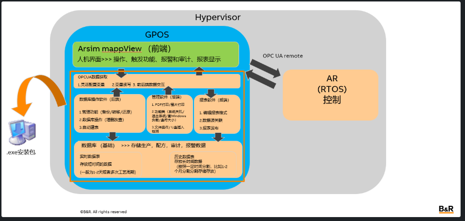

# 会议纪要：需求讨论与方案

**创建者：** Hanzhou Ding  
**上次更新时间：** 2026-03-03  
**阅读时间：** 约 1 分钟

---

## Table of Content

- [Meeting Goal](#meeting-goal)
- [Agenda](#agenda)
- [讨论需求](#讨论需求)
- [建议拓扑方案](#建议拓扑方案)
- [功能拆分](#功能拆分)
- [Tasks](#tasks)
- [Date/Location](#datelocation)

---

## Meeting Goal

讨论需求和分析可能性，以及如何继续推进项目。

---

## Agenda

| 序号 | 时长   | 内容                         |
|------|--------|------------------------------|
| 1    | 90 min | 讨论需求分析和实现可能性     |

---

## 讨论需求

需求分析更新，并且讨论后做了一些调整。参照新马和楚天方案做了总结。

### 用户管理系统

- 需要有多角色多用户，角色和用户需要有不同读写权限
- 支持密码策略（强制大小写、使用特殊字符），定期修改密码，多次尝试锁定，长时间不操作登出

### 审计追踪

- 记录所有的操作，包括切换页面、点击按钮、用户登录登出
- 记录内容要包括 **Who / When / What** 要素
- 日志文件不能被篡改，定期归档

### 配方管理

- 创建、编辑、版本控制、下发
- 配方修改需要做审计追踪

### 生产数据管理

- 实时监控采集关键工艺数据 → 快速数据采集 1s 一笔 100–200 点数据录入，可能会出现 1s 以下的短时间数据采集
- 高精度的趋势分析显示（包括实时曲线和历史曲线）  
  → 图线点数不能插补、不能抽点，可以放大看某段时间

### 报警与事件管理

- 按照严重程度做分级
- 操作员确认报警原因，并且记录到审计追踪中去

### 电子签名系统

- 执行关键操作时（变更配方、修改参数、开关批次、确认报警、确认报表等），强制要求电子签名
- 有时会出现符合签名的情况（多重电子签名）

### 数据库

- 插入数据需要考虑断点续传
- 防止错误录入
- 误删恢复
- 备份/还原

### 电子报表

- 简单的报表格式编辑（考虑拖拽式编辑报表），支持在线预览
- 按照批次/时间段生成报表，查询数据库获得数据
- 在线报表显示、报表打印、加密

### 功能性插件

- 系统退出/关机
- 系统资源显示

### 系统集成通讯

- OPCUA 协议做上下位接口

---

## 建议拓扑方案

---

## 功能拆分

### Arsim + mappView 组合（前端）

- 提供 UI 模板、一组 style 主题和画面切换逻辑
- OPCUA remote 方式链接底层 PLC 或 RTOS 系统

**基础功能：**

- 审计重做（基于数据库）→ 显示审计内容
- 报警重做（基于数据库）→ 显示报警内容
- 配方重做（基于数据库）→ 显示配方内容
- 用户管理系统（基于 mappUserX）→ 密码策略、用户登录功能
- 电子签名功能（基于 mappUserX）→ 关键操作时弹出电子签名
- 功能性插件自定义控件库 → 封装 widgetLib 关联后台插件
- 趋势图显示 → Echart
- 报表显示 → PDF 显示

**数据库采集配置：**

- 生成采集配置文件
- 关联审计、报警、生产数据

### 电子报表（后端）

- 独立离线报表格式编辑 → 考虑拖拽控件编辑报表
- 数据库数据与控件关联
- 表格 + 图形（折线图）的编辑
- 预览功能
- 接受前端发送的查询指令，获取数据库源数据生成报表
- 以 PDF 形式发布报表到本地文件
- 报表 PDF 加密

### 数据库（后端）

**基础功能：**

- 审计重做（基于数据库）→ 收集审计信息源、记录审计信息
- 报警重做（基于数据库）→ 收集报警信息源、记录报警信息
- 配方重做（基于数据库）→ 收集配方信息源、记录配方更改/新建等信息
- 根据配置文件获取数据
- 跨表查询
- 插入数据时根据时间自动建表
- 备份/还原

### 功能性插件（后端）

- 系统退出/关机
- 系统资源显示 → 芯片使用率、盘符使用情况
- 截图
- 打印
- Windows 文件操作

### 软件封装（后端）

- Arsim 部分提取给客户修改 → AS 编程、画面内容修改、style 修改、下位变量关联
- 数据库功能、报表、功能性插件由 BR 维护
- 全部生成安装包，安装后直接获得 Arsim 环境和所有插件，安装包做版本管理

---

## 实现可能性讨论摘要

1. 讨论了如何将原来的 mappView 系统关联到系统中去，需要与董彦超讨论。
2. 讨论了电子报表软件如何实现获取数据库的数据和与上位做 OPCUA 对接。
3. 讨论了数据库系统中的插入和查询的方案。
4. 讨论了前端（mappView）画面和后端打通的问题。

**结论：** 先实现最小系统，做方案验证。

### 最小方案内容

1. **基础功能的 mappView 页面**  
   基于数据库的报警、审计，mappUserX 系统的数字签名，echart 图线显示，触发报表生成和 PDF 显示。
2. **根据配置文件插入审计数据、报警数据和生产数据**  
   根据前端 mappView 画面反馈查询数据。
3. **报表系统**  
   通过 OPCUA 获取查询条件，并且主动拉取数据库表单生成报表。

---

## Tasks

| 负责人     | 任务 |
|------------|------|
| Hanzhou Ding | 基础功能的 mappView 页面（基于数据库的报警、审计，mappUserX 系统的数字签名，echart 图线显示，触发报表生成和 PDF 显示） |
| Hanzhou Ding | 和董彦超讨论方案，考虑如何与他侧融合 |
| Wenjie Cui   | 根据配置文件插入审计数据、报警数据和生产数据，根据前端 mappView 画面反馈查询数据 |
| Haochen Qi   | 报表系统通过 OPCUA 获取查询条件，并且主动拉取数据库表单生成报表 |

**暂定时间节点：** 4 月初

---

## Date/Location

| 日期       | 地点                     |
|------------|--------------------------|
| 2026-03-03 | Shanghai / Jinan Online Teams |

---

## Confidentiality

**Internal**

---

## Context

Concept and dimensioning

---

## Attendees

Wenjie Cui, Bin Liu, Haochen Qi, Yanchao Dong, Pengfei Wang, Jing Zhou, Hanzhou Ding

---

## Distribution list

（待补充）
