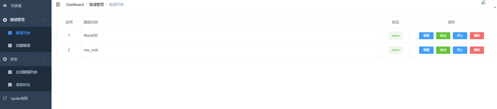
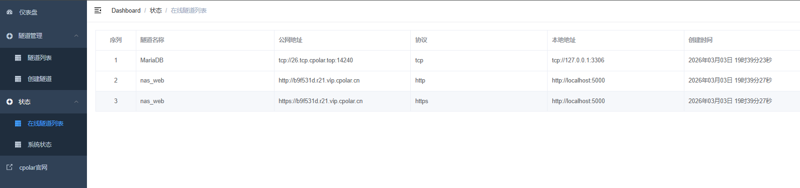
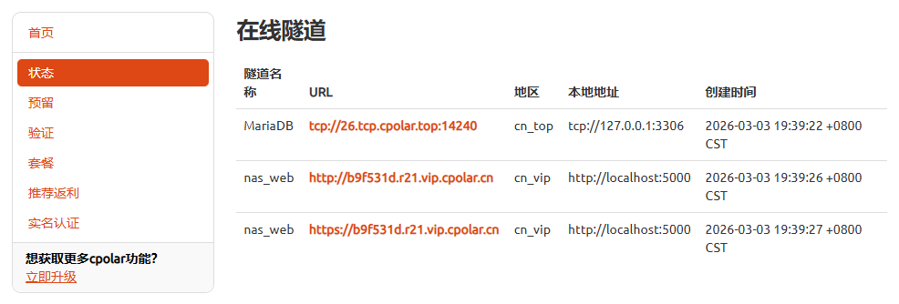
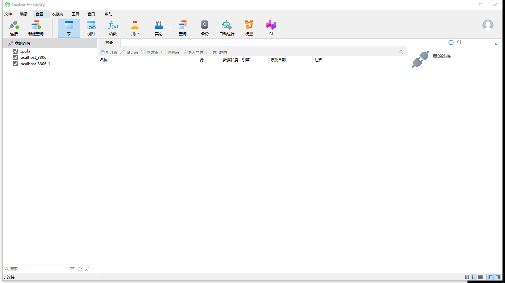
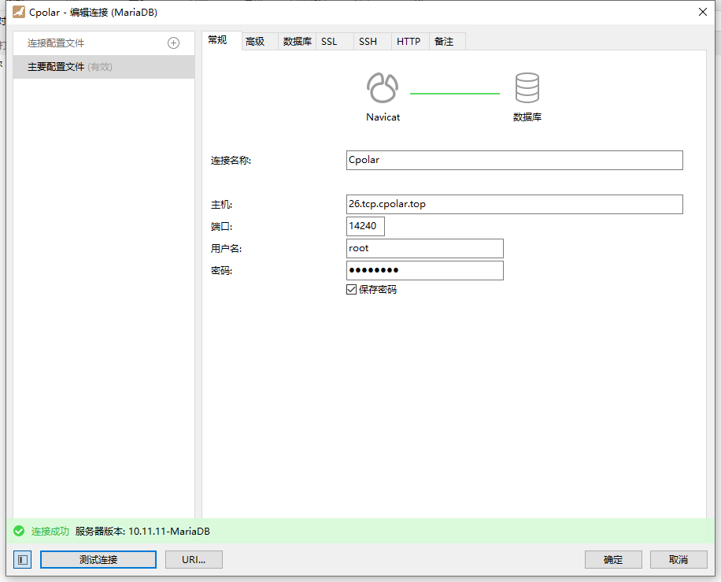
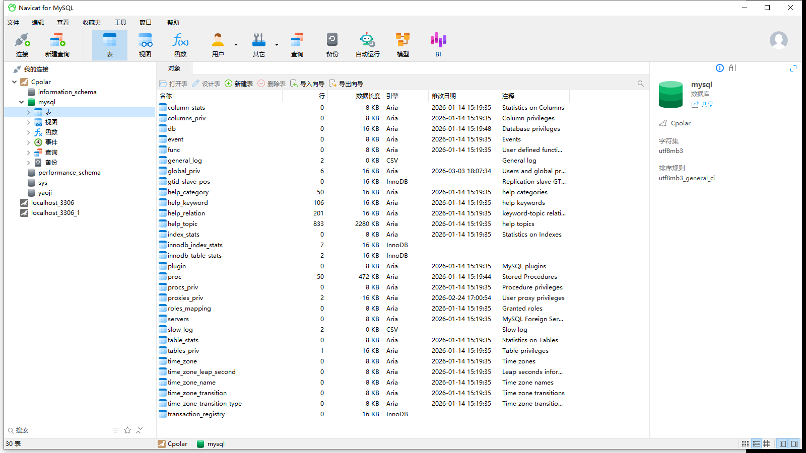

# 003 数据库相关信息记录

## 一、部署与连接信息

数据库已完成部署。

| 项目     | 说明 |
|----------|------|
| 用户名   | `root` |
| 密码     | `Br54644800@` |
| 本地连接 | `192.168.50.22:3306`（主机:端口） |
| 远程连接 | 使用免费 **cpolar** 做 TCP 转发，未充值；主机与端口随机，**需连接时联系戚浩辰获取当前 URL 与端口**。 |

> 密码仅供团队内部使用，请勿外泄。远程 cpolar 说明见群辉套件文档 `001_群辉套件/012_cpolar套件.md`。

### cpolar 在线隧道

查看当前在线隧道及公网地址可登录 cpolar 控制台「状态」页：

- **官网状态页：** <https://dashboard.cpolar.com/status>

**后台穿透地址（经 ddnsto）：** <https://brcpolar.x.ddnsto.com/>  
当前后台未支持绑定多人账号，其他人可能无法登录该穿透地址；需查看在线隧道或连接数据库时请联系 **戚浩辰**。

**本地配置的隧道：**

**后台在线隧道列表：**

### cpolar 充值与价格套餐

远程连接当前使用免费版；若后续需固定 URL/端口可考虑充值。各档位简要对照如下（所有套餐 21 天无理由退款、流量不限，具体以官网为准）：

| 套餐         | 价格        | 带宽    | 说明 |
|--------------|-------------|---------|------|
| 免费版       | 永久免费    | 1Mbps   | 随机 URL/端口，HTTP·TCP 隧道，1 个在线进程，4 条隧道 |
| 基础版       | 99 元/年    | 2Mbps   | 保留 3 个子域名，8 条隧道 |
| 专业版       | 149 元/年   | 3Mbps   | 可自定义域名，保留 5 域名 + 2 个 TCP 地址，12 条隧道 |
| 商业版       | 204 元/年   | 3Mbps   | IP 白名单、泛域名等，20 条隧道，优先客服 |
| NAS 版 10/20M | 600 起/年  | 10M/20M | 面向 NAS，6 个保留 TCP 地址等 |
| NAS 版 30M   | 1800 元/年  | 30Mbps  | 同上，更高带宽 |

---

## 二、连接数据库教程（Navicat for MySQL）

以下以 **Navicat for MySQL** 为例，演示如何连接本库。

### 2.1 新建连接与配置

1. 打开 Navicat，点击 **「连接」** 新建连接（图中为已配置好的连接，仅作参考）。
2. 配置说明：
   - **连接名称**：可随意填写，便于区分即可。
   - **主机、端口**：**本地局域网连接**时，主机填 `192.168.50.22`，端口填 `3306`（即 `192.168.50.22:3306`）；远程连接时填 cpolar 当前提供的地址与端口（联系戚浩辰获取）。
   - **用户名 / 密码**：`root` / `Br54644800@`。

### 2.2 测试连接并保存

1. 填写完成后点击 **「测试连接」**。
2. 若下方提示 **「连接成功」**，即配置正确。
3. 点击 **「确定」** 保存连接；之后在连接列表中**双击该连接**即可连上数据库。

> 上述步骤在**同一局域网**下已测试通过。**跨网（经 cpolar 等）** 尚未实测，理论上可行，后续需再验证；远程时主机与端口请使用 cpolar 状态页当前显示的地址与端口，并联系戚浩辰获取。

### 2.3 连接成功后的界面

双击连接并连接成功后，可看到数据库列表等，例如：

### 其他连接方式

若使用 **其他客户端或方式**（如 DBeaver、命令行 `mysql`、DataGrip 等）连接本库，也可将配置步骤或注意事项补充在本节下方，便于团队统一查阅。连接参数仍为：本地 `192.168.50.22:3306`，用户 `root`，密码 `Br54644800@`；远程以 cpolar 当前地址与端口为准。

---

## 三、当前验证：远程 URL 建表测试

当前在做测试，验证能否通过**远程 cpolar URL** 连接并建表。结果与步骤后续在本节补充。
