# SD_SMA_DATA_COLLECTOR 程序使用
## 1. 开始与新建

双击目录 .\_Prj\SD_SMA_DATA_COLLECTOR 下的 start_collector.bat 文件，启动程序

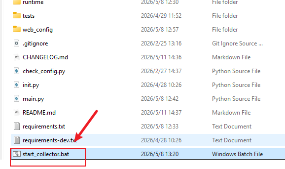

 浏览器输入网址 http://127.0.0.1:8091/config
 访问配置页

> ⚠️注意：如果不在同一电脑上访问，需要修改IP，并且确保防火墙放行对应端口

打开网页后，点击新建，并输入文件名
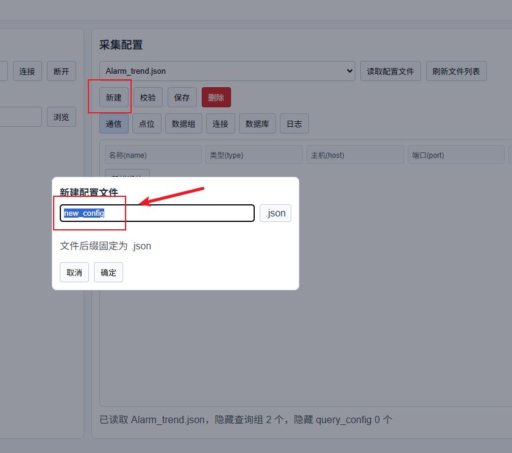

## 2. 配置通信
点击新增通信，添加一个OPCUA连接
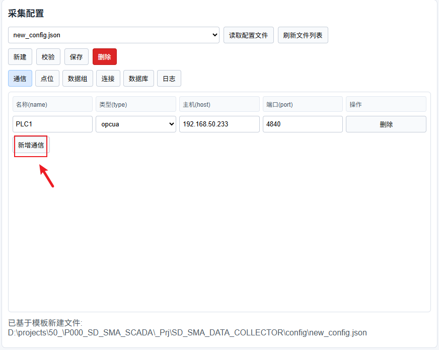

## 3. 配置点位
左侧OPCUA浏览器，按照提示，依次点击连接和浏览打开浏览点位
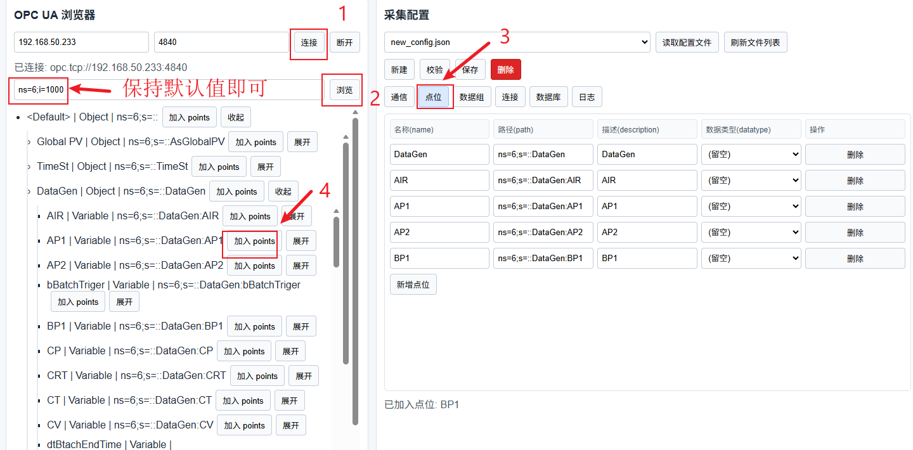

点击加入points，则右侧点位栏就会出现新增的数据点

## 4. 配置数据组
按照如图所示，配置连接
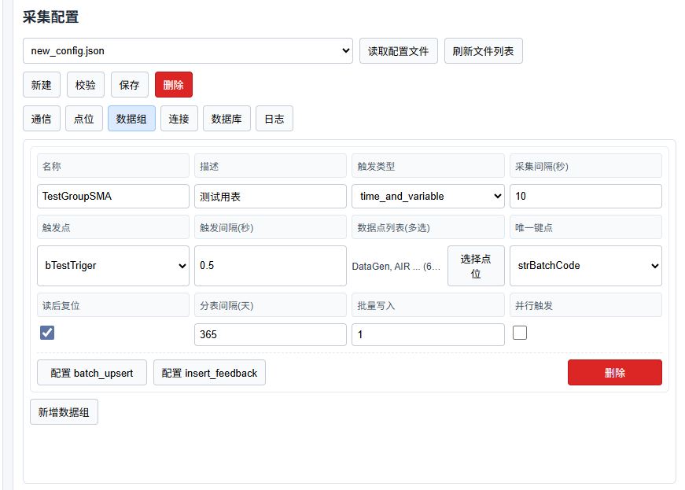

> 数据库内容量级在**3千万条**以内数量级的建议**不要分表**，因此分表间隔不建议设置小于365天

## 5. 配置连接
按如下图所示案例配置连接
单PLC连接的情况下，直接选择你所配置的通信PLC1，勾选所有的数据组。
心跳按需是否设置

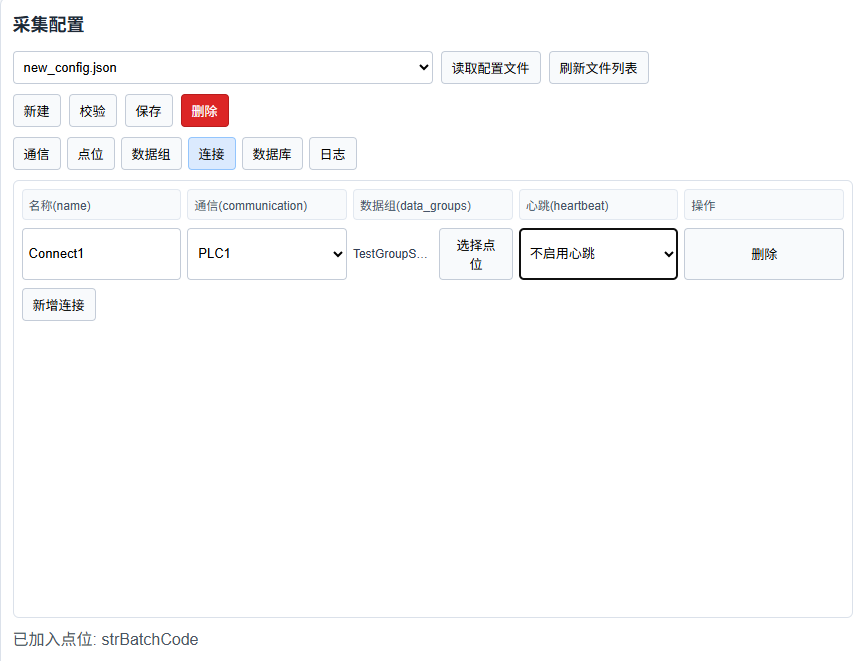

> 心跳需要提前在**点位**处配置对应变量，建议变量类型**UINT**

## 6. 配置数据库

按照实际填写即可，注意数据组选项，一定要勾选所有的数据组
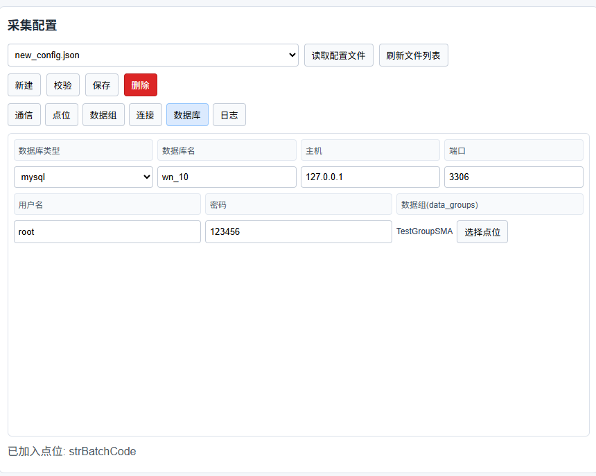

## 7. 设置日志
如图采用默认配置即可，其他需求请看README.MD文档

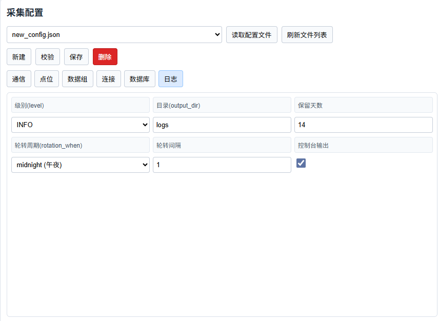

> 为了方便我们的调试，可以把日志等级调整到DEBUG
## 8. 保存与校验

点击保存会将当前设置保存到对应文件
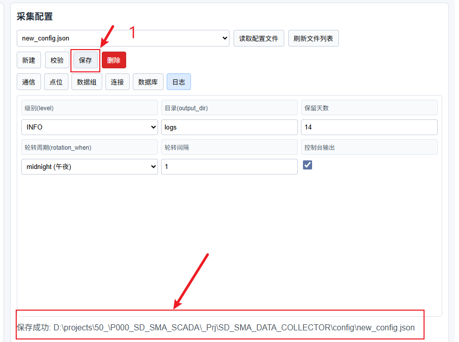

点击校验会初步校验当前设置文件是否存在问题，若成功会提示。
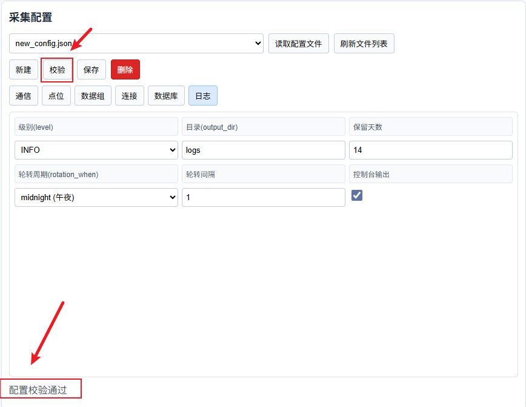

## 9. 启动与验证

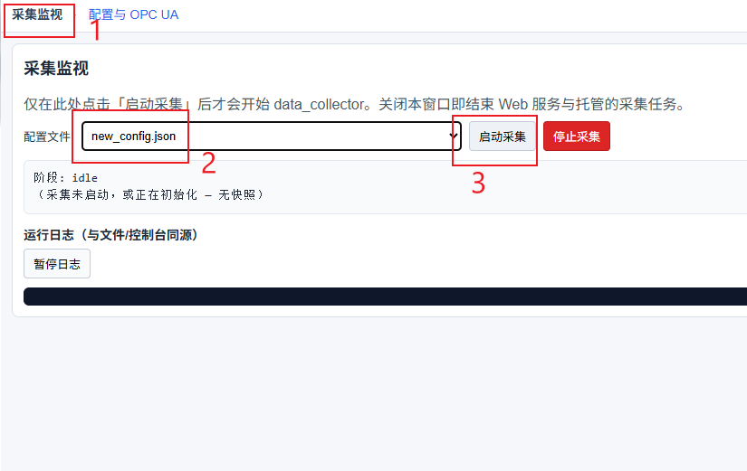

如果一切正常会直接运行，我们可以通过控制台查看程序的详细行为。
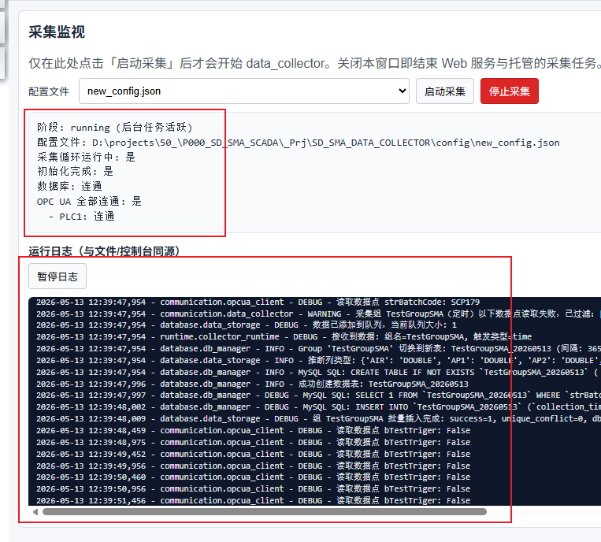

> ⚠️注意：我们这里把日志等级调整到了DEBUG，修改方法查看 [章节7](#7.%20设置日志)

点击停止采集，可以直接停止程序

## 10. 与mappView的集成

webViewer控件配置参考

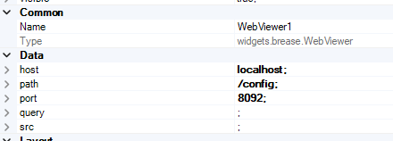

可以把配置与监控页面集成到mappView中
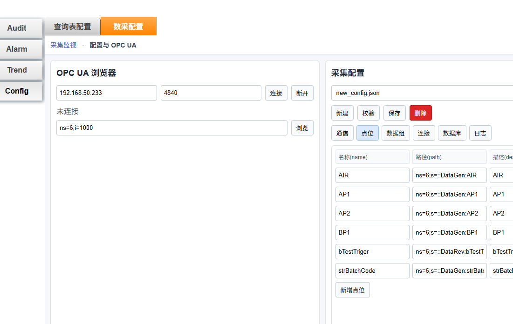
# SD_SMA_DATA_COLLECTOR_QUERY_WEB

## 1. 开始与新建

双击目录 .\_Prj\SD_SMA_DATA_COLLECTOR 下的 start_collector.bat 文件，启动程序

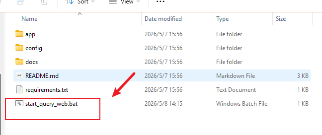

 浏览器输入网址 http://127.0.0.1:8092/config
 访问配置页

> ⚠️注意：如果不在同一电脑上访问，需要修改IP，并且确保防火墙放行对应端口

## 2. 构建查询表

通过该设置，可以自定义查询表的内容的顺序，排序方法，显示名称等。

> ⚠️注意：这里的基准表含义是一个Group中存在多个不同日期后缀的表，选择一个表的字段参考

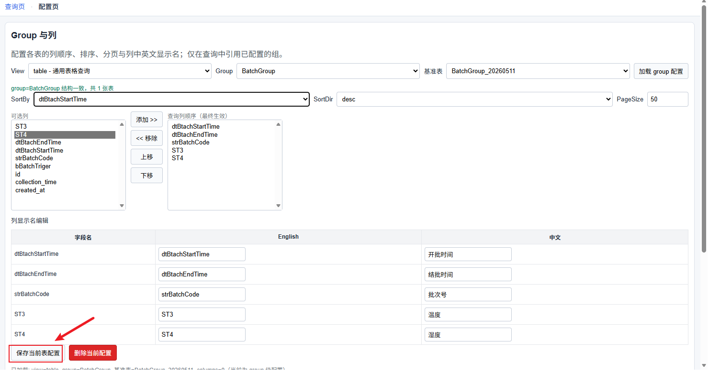

设置完成后一定要保存配置
## 3. 设置插件

设置插件页的映射
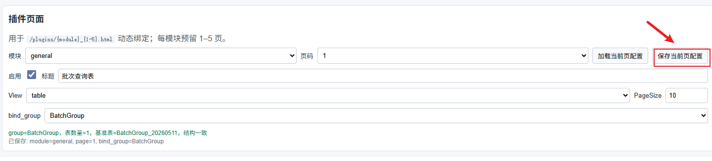

按照如图选项设置即可，完成后要选择保存设置
## 4. 访问与验证

按照刚才的配置，把这个插件分配到了 **/plugins/general_1.html**  的地址
输入网页 http://127.0.0.1:8092/plugins/general_1.html

内容如下，与我们刚才设置的效果一致
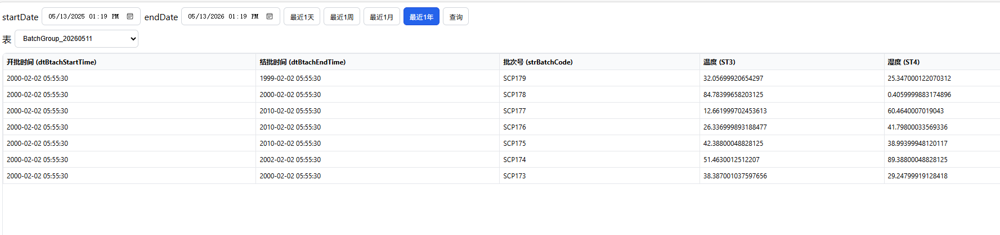
## 5. 与mappView的集成
通过把他集成到mappView中，可以实现类似标准表的查询效果
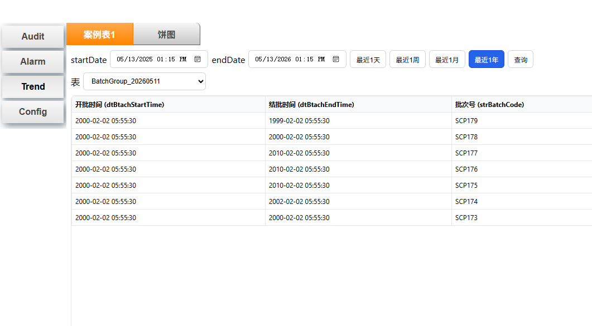

设置页也可较好的集成
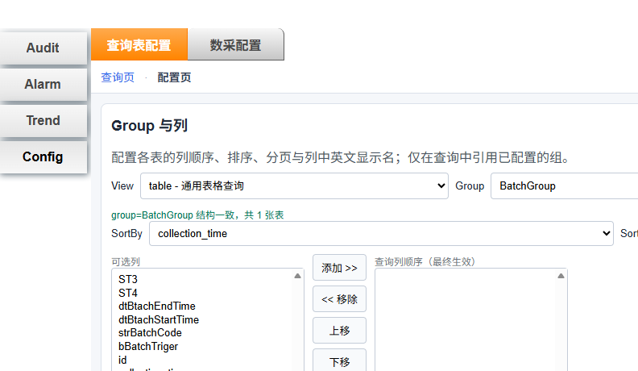

