## 1. 设置数据源

### 1.1 数据库数据源设置

选择左侧**数据源配置**，按照实际填写数据即可。

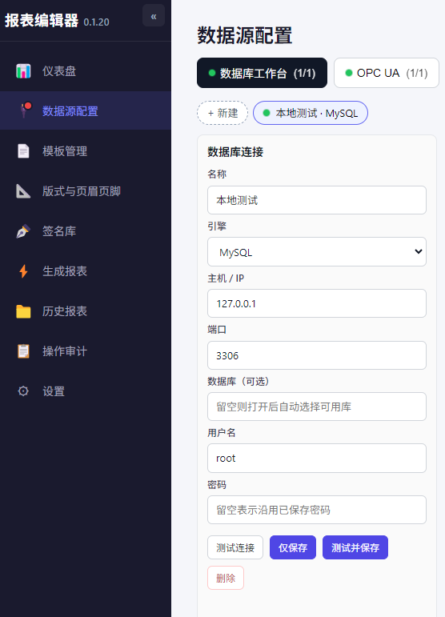

### 1.2 OPCUA数据源设置

选择左侧**数据源配置**，按照实际填写数据即可。

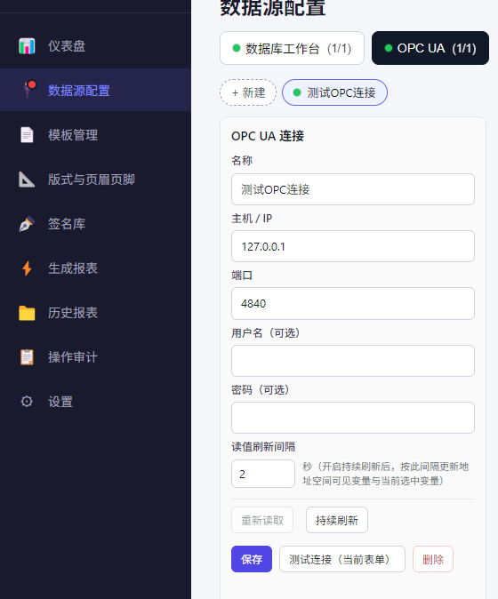


## 2. 设置正文模版

### 2.1 建立模板
选择**模板管理**


选择A4空白纸张
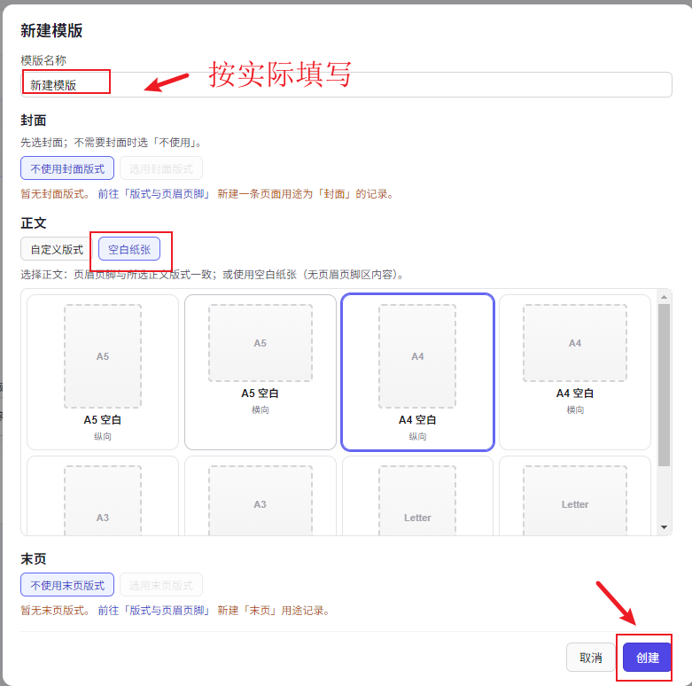

点击修改正文进入
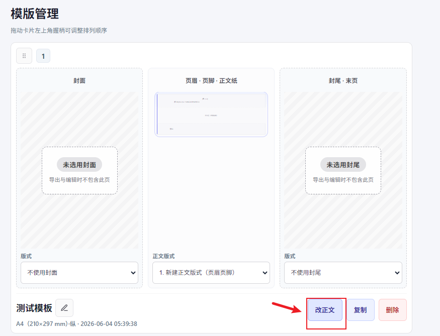

### 2.2 加入数据

#### 2.2.1 加入支持连接数据的控件

目前有2种控件支持连接数据，分别是**数据参数**、 **表格**控件

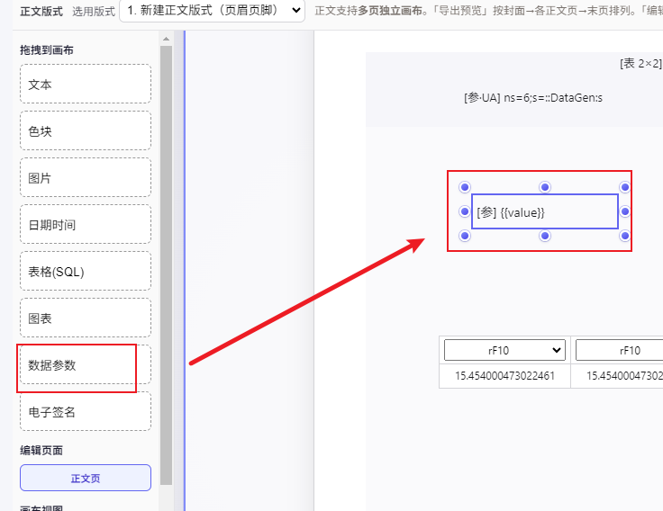

表格控件可以任意设置静态文字或者OPCUA变量等。
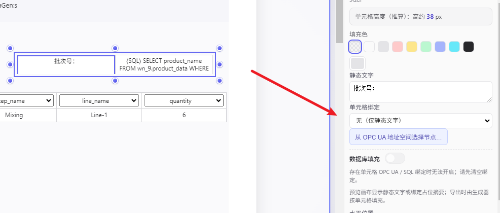
#### 2.2.2 添加OPCUA变量

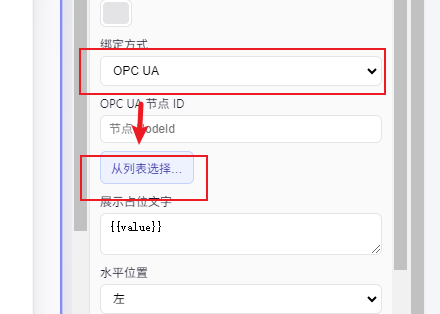


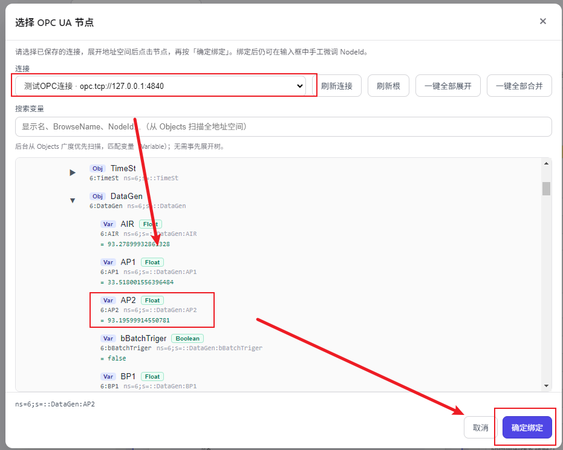


#### 2.2.3 添加SQL标量数据

P0是替代的变量，可以把OPCUA变量传入的批次号，实现表格查询。

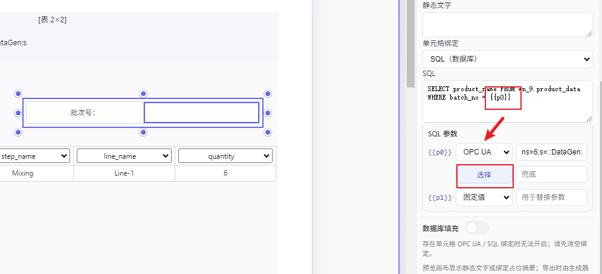

下面是示例的语句。

``` SQL
SELECT product_name FROM wn_9.product_data WHERE batch_no = {{p0}}
```


#### 2.2.4 添加SQL按列查询数据


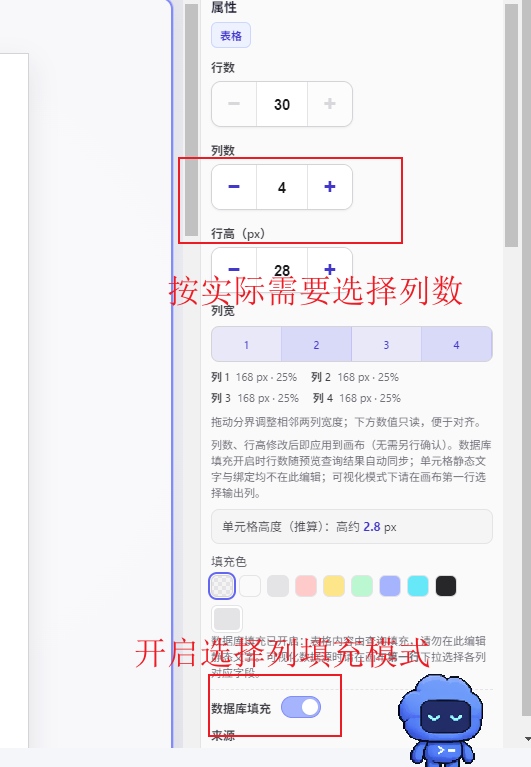


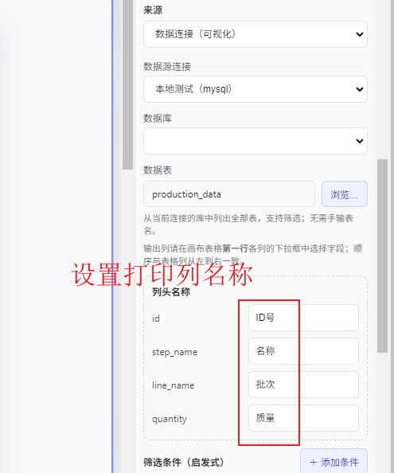


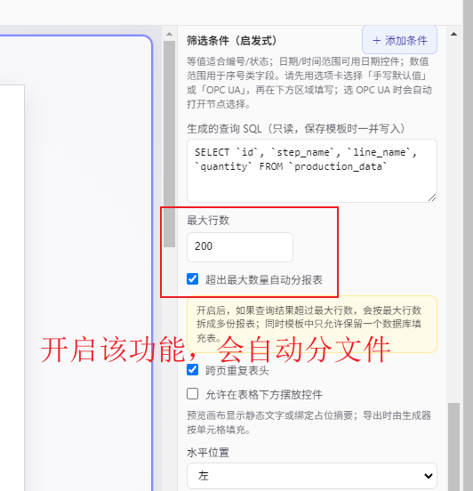


#### 2.2.5 导出预览

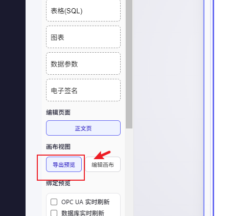

可以看到预览画面


## 3. 设置自动结批流程

### 3.1 设置结批返回结果

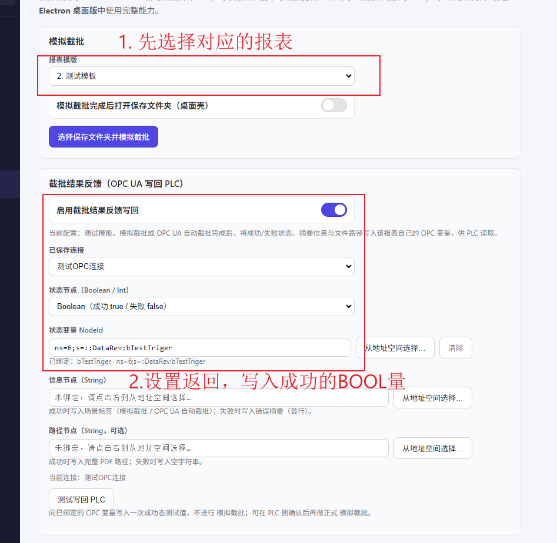


### 3.2 设置保存目录

**4**中的变量会和**3**的保底目录拼接，实现自动分文件夹保存。

比如你设定3种的OPCUA变量读取为"SCP173"，则报表文件保存到 C:\SMA_Report\SCP173

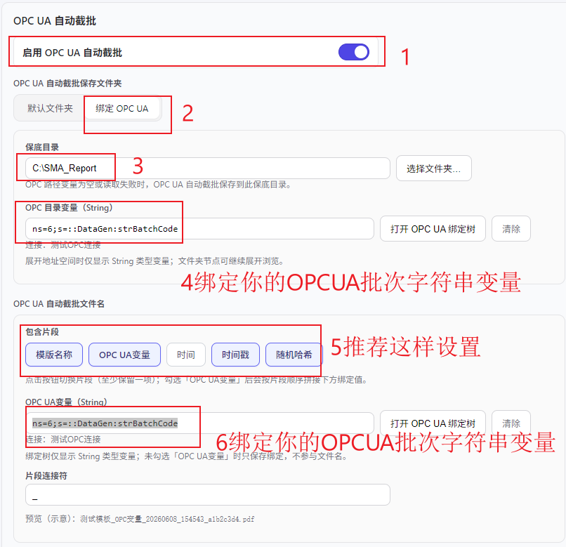

### 3.3 设置触发变量
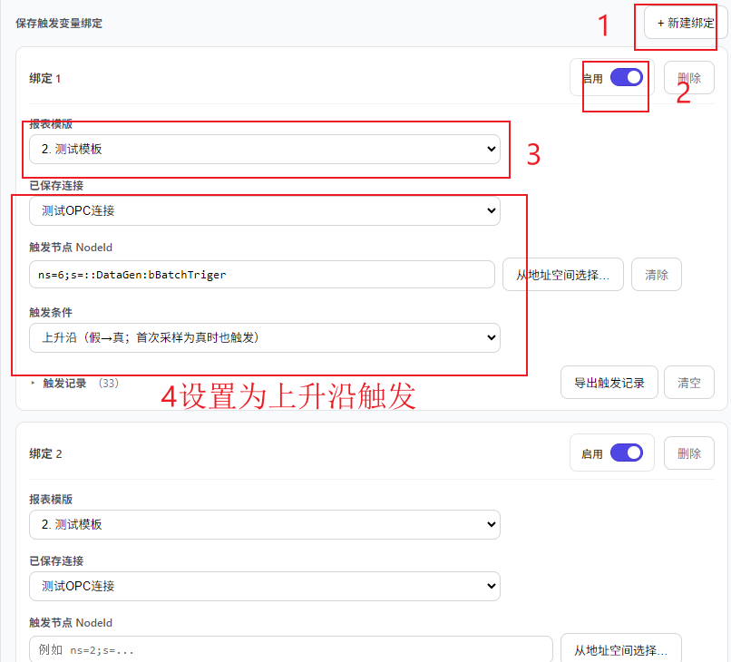