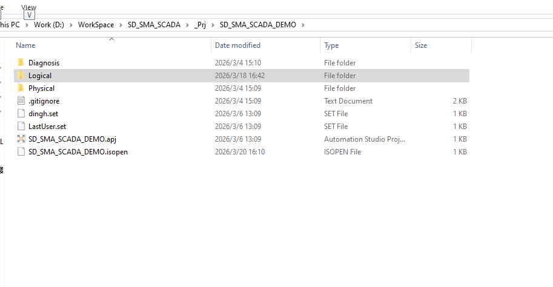
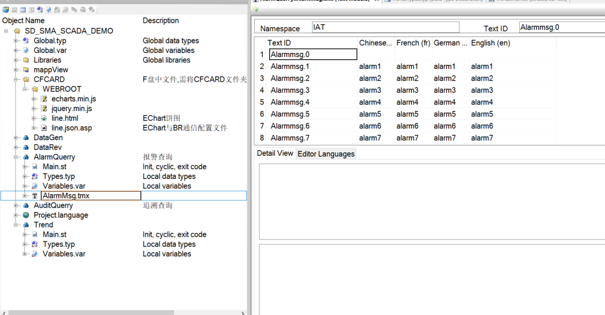
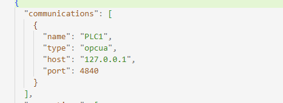
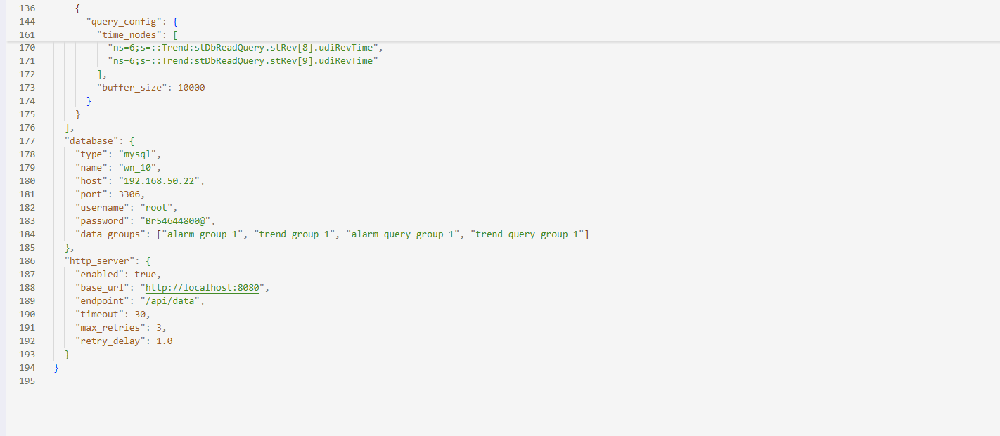
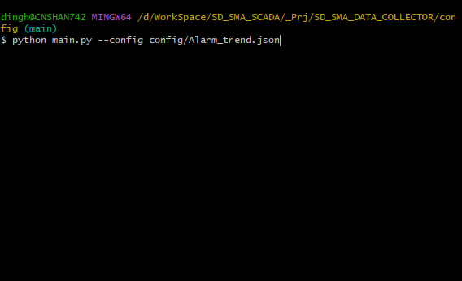
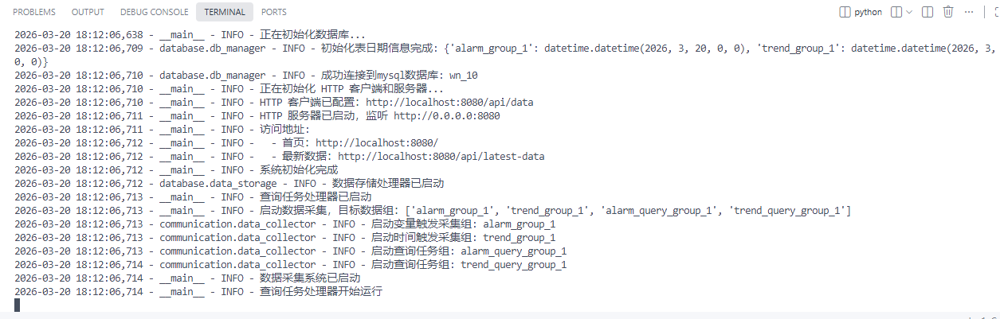
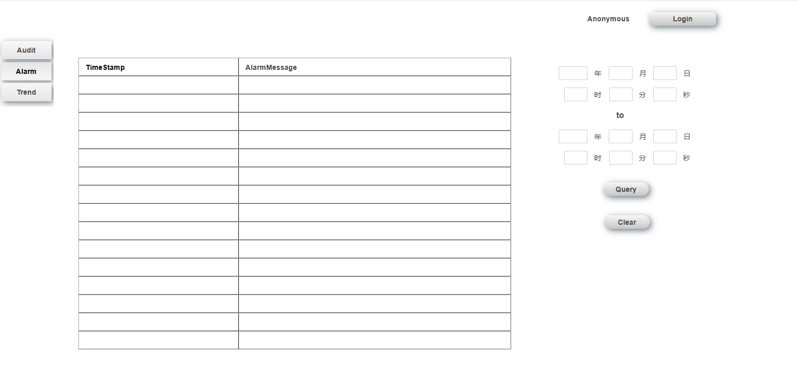

# SD_SMA_SCADA_DEMO 操作与配置说明

## 1. 启动项目
打开 `SD_SMA_SCADA_DEMO` 文件夹。



## 2. 仿真与下载
运行 Automation Studio 仿真器，将项目编译并下载到仿真控制器中。

## 3. 检查程序状态
检查项目中的 `AlarmQuery` 和 `Trend` 这两个程序，确保它们处于有效（Running）状态。


## 4. 报警逻辑说明
在 `AlarmQuery` 程序中：
*   **btrigger**: 用于触发报警的变量。
*   **msg**: 一旦触发，系统会记录 `msg`。目前 `msg` 是一个随机数，该随机数对应的数据与 `AlarmMsg.tmx` 文本文件中的数字绑定。

## 5. 修改配置文件
在启动采集程序前，需要根据实际环境修改配置文件 `Alarm_trend.json`。
*   **文件路径**: `\SD_SMA_SCADA\_Prj\SD_SMA_DATA_COLLECTOR\config`
*   **修改要点**:
    1.  **PLC连接 (OPC UA)**: 确认 PLC 的 OPC UA 服务器地址 (`host`) 和端口。
    2.  **数据库连接 (Database)**: 修改数据库地址 (`host`)、数据库名 (`name`)、用户名 (`username`) 和密码 (`password`)。
    *注意：无需手动建表，数据库表单插件会自动创建所需的表。*




## 6. 启动采集程序
使用命令行启动 Python 程序，并加载配置文件。
命令格式：
```bash
python main.py --config config/Alarm_trend.json
```



## 7. 确认系统状态
正常启动后，控制台会显示日志信息，最终显示“系统初始化完成”及“数据采集系统已启动”。



## 8. 报警查询 (mappView)
在 mappView 的可视化画面中：
1.  选择 **Alarm** 页面。
2.  设置查询的 **开始时间** 和 **结束时间**。
3.  点击 **Query** 按钮进行查询。


