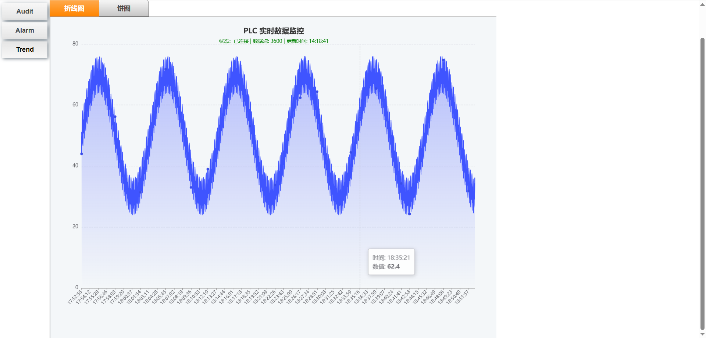

1. 项目简介
一个基于 Web 技术的轻量级前端可视化应用，旨在实时监控并展示 PLC（可编程逻辑控制器）的过程数据。应用采用 ECharts 图表库进行数据渲染，通过 AJAX 轮询机制从后端服务器获取实时数据，并以动态折线图的形式呈现。

2. 技术架构
组件/技术	说明
HTML5/CSS3	页面布局与样式定义，采用响应式设计，适配不同屏幕尺寸。
ECharts (5.x)	核心图表渲染引擎，提供高性能的动态折线图展示与交互功能。
jQuery	用于简化 DOM 操作及处理 AJAX 网络请求。
HTTP REST API	前后端数据交互协议，采用 GET 请求获取 JSON 数据。
后端服务文件为 `server.py`，主要功能是解决跨域问题 (CORS) 并作为数据缓存中心。
3. 功能特性
实时数据刷新： 默认每 2 秒自动向服务器请求最新数据。
状态动态反馈： 标题下方实时显示连接状态（等待连接、已连接、连接失败）及数据点数量。
交互式图表： 支持鼠标悬停查看具体数值（Tooltip），支持图表区域缩放。
视觉优化： 采用渐变色填充区域样式，提升数据可视化的美观度。
4. 后端接口规范
前端应用依赖于后端服务提供数据，接口定义如下：
4.1 接口地址
http://127.0.0.1:8000/data
4.2 请求方式
GET
4.3 响应数据格式 (JSON)
后端应返回一个二维数组，其中每个子数组包含两个元素：[时间戳, 数值]。
示例数据：
[
  [1679000000, 25.4],
  [1679000002, 26.1],
  [1679000004, 24.8]
]
4.4 字段说明
索引	类型	描述
0	Integer/Long	Unix 时间戳（秒级），前端会自动转换为 HH:mm:ss 格式。
1	Float/Number	PLC 实际采集的数值（如温度、压力、速度等）。
5. 关键代码逻辑说明
应用的核心逻辑在于 fetchData 函数与定时器的配合：
初始化： ECharts 实例初始化，并显示“正在连接服务器...”的 Loading 动画。
轮询机制： 使用 setInterval 设置每 2000ms 执行一次 fetchData()。
数据处理： 成功获取数据后，将时间戳格式化为可读时间，并更新图表的 series 和 xAxis 数据。
异常处理： 若请求超时（5秒）或服务器返回错误，图表副标题会变为红色提示“状态：连接失败”。

6. 后端服务详解
后端服务文件为 `server.py`，主要功能是解决跨域问题 (CORS) 并作为数据缓存中心。
3.1 环境准备
运行前需安装依赖库：
pip install flask flask-cors
3.2 核心代码逻辑
服务器维护一个全局列表 `data_store`。当收到 POST 请求时，更新该列表；当收到 GET 请求时，返回该列表。

@app.route('/data', methods=['GET', 'POST'])
def api_data():
    global data_store
    if request.method == 'POST':
        data = request.get_json()
        if isinstance(data, list):
            data_store = data  # 覆盖模式
        else:
            data_store.append(data)  # 追加模式
        return jsonify({"status": "success"}), 200

    return jsonify(data_store), 200

7. 部署与注意事项
1. 该文件为纯静态 HTML，可直接在浏览器打开。
2. 由于使用了 CDN 引用 ECharts 和 jQuery，运行环境需要连接互联网。如果需要在离线环境运行，请下载相应的 .js 文件到本地并修改 script 标签路径。
3. 跨域问题 (CORS)：后端服务器必须配置允许跨域访问（Access-Control-Allow-Origin: *），否则前端无法获取数据。
