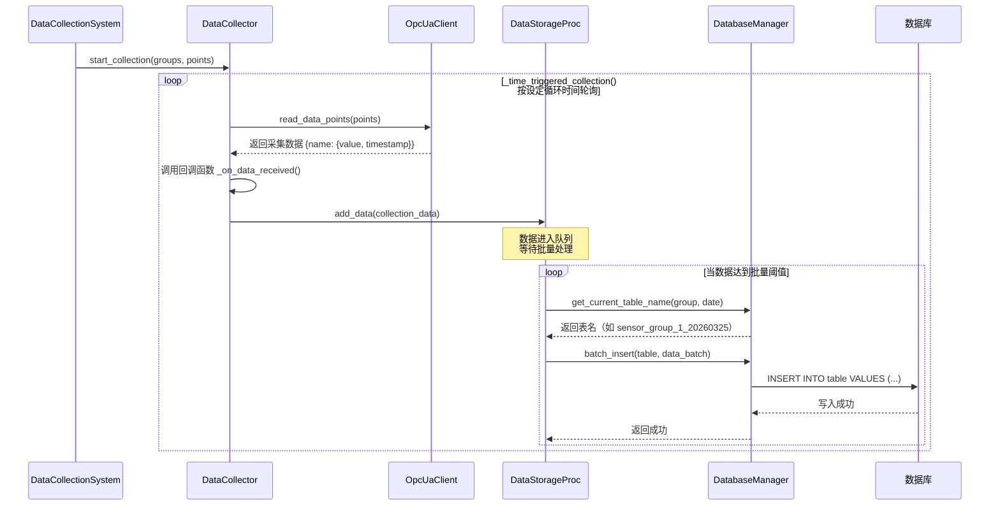
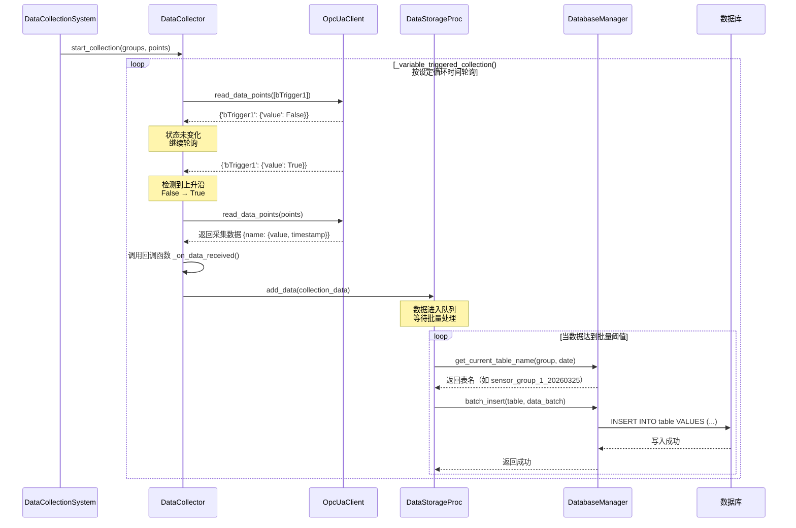
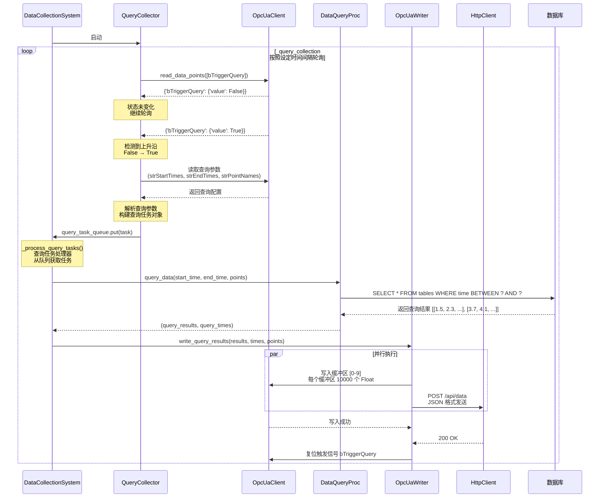

# 系统架构与数据流分析

## 一、系统分层架构

```
┌─────────────────────────────────────────────────────────────┐
│                     应用层 (main.py)                         │
│            DataCollectionSystem - 数据采集系统主类            │
└─────────────────────────────────────────────────────────────┘
                              ↓ 依赖注入
┌─────────────────────────────────────────────────────────────┐
│                     协调层                                   │
│  ┌──────────────────┐  ┌─────────────────────────────────┐  │
│  │ CommunicationMgr │  │  DatabaseManager + Processors   │  │
│  │   通信管理器      │  │    数据库管理器 + 处理器         │  │
│  └──────────────────┘  └─────────────────────────────────┘  │
└─────────────────────────────────────────────────────────────┘
                              ↓ 调用
┌─────────────────────────────────────────────────────────────┐
│                     执行层                                   │
│  ┌──────────────┐  ┌──────────────┐  ┌──────────────────┐  │
│  │ OpcUaClient  │  │ DataCollector│  │ DataStorageProc  │  │
│  │ OPC UA 客户端  │  │ 数据采集器   │  │ 数据存储处理器     │  │
│  └──────────────┘  └──────────────┘  └──────────────────┘  │
│  ┌──────────────┐  ┌──────────────┐  ┌──────────────────┐  │
│  │ HttpClient   │  │OpcUaWriter   │  │ DataQueryProc    │  │
│  │ HTTP 客户端   │  │ OPC UA 写入器 │  │ 数据查询处理器     │  │
│  └──────────────┘  └──────────────┘  └──────────────────┘  │
└─────────────────────────────────────────────────────────────┘
                              ↓ 访问
┌─────────────────────────────────────────────────────────────┐
│                     资源层                                   │
│         OPC UA 服务器          │        MySQL/SQLite 数据库   │
└─────────────────────────────────────────────────────────────┘
```

---

## 二、核心模块职责

### 1. **应用层 - main.py**
**文件**: `main.py`

**核心类**: `DataCollectionSystem`

**职责**:
- 系统总控制器，负责整合所有模块
- 初始化和配置各子系统
- 启动和停止数据采集流程
- 提供采集模式和查询模式两种运行方式

**关键方法**:
```python
async def initialize() -> bool           # 初始化所有组件
async def start() -> None                # 启动系统
async def stop() -> None                 # 停止系统
_on_data_received()                      # 数据接收回调
_process_query_tasks()                   # 查询任务处理循环
```

---

### 2. **协调层**

#### 2.1 **通信管理器 (CommunicationManager)**
**文件**: `communication/communication_manager.py`

**职责**:
- 管理多个 OPC UA 通信连接
- 为不同数据组分配对应的通信客户端
- 统一处理连接建立和断开

**关键方法**:
```python
async def initialize_connections() -> bool     # 初始化所有通信连接
get_client_for_group(group_name) -> OpcUaClient  # 获取组对应的客户端
async def disconnect_all() -> None             # 断开所有连接
```

#### 2.2 **数据库管理器 (DatabaseManager)**
**文件**: `database/db_manager.py`

**职责**:
- 管理数据库连接（MySQL/SQLite）
- 自动创建和维护数据表
- 按时间分表（每天/每月）

**关键方法**:
```python
def connect() -> bool                          # 建立数据库连接
def disconnect() -> None                       # 断开连接
def get_current_table_name(group_name, date)   # 获取当前表名
def create_table_if_not_exists(...)            # 创建表
```

---

### 3. **执行层**

#### 3.1 **OPC UA 客户端 (OpcUaClient)**
**文件**: `communication/opcua_client.py`

**职责**:
- 建立和维护 OPC UA 连接
- 读取和写入 OPC UA 节点
- 支持断线重连和健康检查

**关键方法**:
```python
async def connect() -> bool                    # 连接到 OPC UA 服务器
async def read_data_points(data_points) -> dict  # 读取多个数据点
async def write_value(node_path, value) -> bool  # 写入单个值
async def write_array_value(...)               # 写入数组值
```

#### 3.2 **数据采集器 (DataCollector)**
**文件**: `communication/data_collector.py`

**职责**:
- 执行实际的数据采集逻辑
- 支持三种触发方式：时间触发、变量触发、查询触发
- 将采集到的数据通过回调函数传递给处理器

**关键方法**:
```python
async def start_collection(groups, points_dict)  # 开始采集
async def stop_collection() -> None              # 停止采集
register_data_callback(callback)                 # 注册数据回调
```

**三种触发模式**:
1. **时间触发 (`_time_triggered_collection`)**: 按固定间隔采集
2. **变量触发 (`_variable_triggered_collection`)**: PLC 信号上升沿触发
3. **查询触发 (`_query_collection`)**: 读取查询参数并执行数据库查询

#### 3.3 **数据存储处理器 (DataStorageProcessor)**
**文件**: `database/data_storage.py`

**职责**:
- 接收采集到的数据
- 按数据组分类缓存数据
- 批量写入数据库（可配置批量大小）

**关键方法**:
```python
def add_data(collection_data) -> None          # 添加数据到队列
async def start_processing() -> None           # 启动处理循环
async def stop_processing() -> None            # 停止处理
_process_data_loop()                           # 数据处理主循环
```

#### 3.4 **数据查询处理器 (DataQueryProcessor)**
**文件**: `database/data_query.py`

**职责**:
- 从数据库查询历史数据
- 支持多时间段、多数据点查询
- 导出到 CSV 文件或返回给调用者

**关键方法**:
```python
def query_data(start_times, end_times, point_names, ...) -> list
_query_table_data(table, start_time, end_time, points) -> list
```

#### 3.5 **OPC UA 数据写入器 (OpcUaDataWriter)**
**文件**: `communication/opcua_data_writer.py`

**职责**:
- 将查询结果写入 OPC UA 缓冲区
- 同时发送到 HTTP 服务器（如果配置）
- 支持双通道输出控制

**关键方法**:
```python
async def write_query_results(results, time, points) -> bool
_write_to_opcua_buffers(...)                   # 写入 OPC UA
_send_to_http_server(...)                      # 发送到 HTTP
```

#### 3.6 **HTTP 客户端 (HttpClient)**
**文件**: `communication/http_client.py`

**职责**:
- 发送数据到 HTTP 服务器
- 支持重试机制
- 异步非阻塞发送

**关键方法**:
```python
async def send_data(data) -> bool              # 发送数据
async def close() -> None                      # 关闭会话
```

---

## 三、数据流详解

### 场景 1: 时间触发数据采集与存储



**数据流详细说明**:

1. **采集阶段** (在 DataCollector 中):
   ```python
   # 1. 从 OPC UA 读取原始数据
   data = await opcua_client.read_data_points(data_points)
   # 返回格式：{'rEC': {'value': 25.5, 'timestamp': datetime.now()}, ...}
   
   # 2. 过滤掉值为 None 的数据点
   valid_data = {k: v for k, v in data.items() if v.get('value') is not None}
   
   # 3. 包装成采集数据包
   collection_data = {
       'group_name': 'sensor_group_1',
       'collection_time': datetime.now(),
       'trigger_type': 'time',
       'data': valid_data  # {'rEC': {...}, 'rF10': {...}}
   }
   ```

2. **回调传递** (从 DataCollector → main.py):
   ```python
   # DataCollector 中调用注册的回调
   for callback in self.data_callbacks:
       callback(collection_data)
   
   # main.py 中的回调函数
   def _on_data_received(self, collection_data):
       self.storage_processor.add_data(collection_data)
   ```

3. **批量存储** (在 DataStorageProcessor 中):
   ```python
   # 1. 数据进入队列
   self.data_queue.append(collection_data)
   
   # 2. 当队列数据达到阈值（如 100 条）
   batch = self._get_batch_for_group(group_name, batch_size)
   
   # 3. 构建 SQL 插入语句
   for data_point in batch:
       row = {
           'name': point_name,
           'value': data_value,
           'quality': 'Good',
           'collection_time': timestamp
       }
       rows_to_insert.append(row)
   
   # 4. 批量插入数据库
   INSERT INTO sensor_group_1_20260325 
   (name, value, quality, collection_time) 
   VALUES (:name, :value, :quality, :collection_time)
   ```

---

### 场景 2: 变量触发数据采集

**关键逻辑**:
```python
# 上升沿检测
previous_trigger_state = False
while True:
    trigger_data = await opcua_client.read_data_points([trigger_point])
    current_trigger_value = trigger_data[trigger_point.name]['value']
    
    # 检测上升沿：从 False 变为 True
    if not previous_trigger_state and current_trigger_value:
        # 读取实际数据
        data = await opcua_client.read_data_points(data_points)
        
        # 发送数据
        collection_data = {
            'group_name': 'trigger_group_1',
            'trigger_type': 'variable',
            'data': data
        }
        for callback in self.data_callbacks:
            callback(collection_data)
    
    previous_trigger_state = current_trigger_value
    await asyncio.sleep(0.5)
```

---

### 场景 3: 查询任务触发与数据回写



**查询任务数据结构**:
```python
# 查询任务对象
query_task = {
    'group_name': 'query_group_1',
    'start_time': [datetime(2026, 3, 25, 10, 0)],
    'end_time': [datetime(2026, 3, 25, 11, 0)],
    'point_names': ['rEC', 'rF10'],
    'group_names': ['sensor_group_1'],
    'opcua_client': opcua_client,  # 用于写入的客户端
    'output_file': None
}

# 查询结果格式
query_results = [
    [1.5, 2.3, 3.7, ...],  # rEC 的数据（最多 10000 个）
    [10.1, 11.2, 12.3, ...]  # rF10 的数据
]

query_times = [
    [t1, t2, t3, ...],  # rEC 对应的时间戳
    [t1, t2, t3, ...]   # rF10 对应的时间戳
]
```

**写入 OPC UA 缓冲区**:
```python
# 依次写入 10 个缓冲区
for i, buffer_node in enumerate(self.buffer_nodes):
    if i < len(query_results):
        data_to_write = query_results[i][:self.buffer_size]
        
        # 填充到固定长度
        if len(data_to_write) < self.buffer_size:
            data_to_write.extend([0.0] * (self.buffer_size - len(data_to_write)))
        
        # 写入数组
        await self._write_array_to_node(buffer_node, data_to_write)
        
        # 同时写入时间戳
        time_to_write = query_times[i][:self.buffer_size]
        await self._write_array_to_node(time_nodes[i], time_to_write)
```

**发送到 HTTP 服务器**:
```python
# 构建 JSON 数据
payload = {
    'timestamp': datetime.now().isoformat(),
    'group_name': 'query_group_1',
    'point_names': ['rEC', 'rF10'],
    'data_count': len(query_results),
    'buffers': [
        {
            'buffer_index': 0,
            'values': query_results[0][:100],  # 只发送前 100 个
            'times': [t.isoformat() for t in query_times[0][:100]],
            'total_count': len(query_results[0])
        },
        # ... 其他缓冲区
    ]
}

# 异步发送
async with session.post(url, json=payload, timeout=timeout) as resp:
    if resp.status == 200:
        logger.info("数据成功发送到 HTTP 服务器")
```

---

## 四、配置驱动架构

### 配置加载流程

```
sample_config.json
    ↓
ConfigLoader.load_from_file()
    ↓
AppConfig 对象
    ├─ communications[]  → CommunicationManager
    ├─ connections[]     → 映射数据组到通信
    ├─ points[]          → DataPoint 对象字典
    ├─ groups[]          → DataGroup 对象列表
    ├─ database          → DatabaseManager
    └─ http_server       → HttpClient
```

### 配置验证规则

```python
# 1. 通信名称唯一性
comm_names = [c.name for c in config.communications]
assert len(comm_names) == len(set(comm_names))

# 2. 连接引用完整性
for conn in config.connections:
    assert conn.communication in comm_names
    for group in conn.data_groups:
        assert group in [g.name for g in config.groups]

# 3. 数据组唯一分配
assigned_groups = set()
for conn in config.connections:
    for group in conn.data_groups:
        assert group not in assigned_groups
        assigned_groups.add(group)
```

---

## 五、并发与异步处理

### 1. **异步任务结构**

```python
# main.py 中创建的异步任务
├── data_collector.start_collection()   # 长期运行的采集任务
├── storage_processor.start_processing() # 长期运行的处理任务
├── query_task_processor                # 查询任务处理协程
└── http_server_runner                  # HTTP 服务器（如果启用）
```

### 2. **线程池使用**

```python
# 在线程池中执行数据库查询（避免阻塞事件循环）
loop = asyncio.get_event_loop()
query_results, query_time = await loop.run_in_executor(
    self.executor,  # ThreadPoolExecutor(max_workers=5)
    lambda: self.query_processor.query_data(...)
)
```

### 3. **并发控制**

```python
# 队列用于任务传递
self.query_task_queue = asyncio.Queue()  # 查询任务队列
self.data_queue = deque()                # 数据缓存队列

# 信号量控制并发（如果需要）
self.semaphore = asyncio.Semaphore(10)
```

---

## 六、错误处理与恢复

### 1. **OPC UA 断线重连**

```python
# OpcUaClient 内部的重试机制
async def connect(self):
    for attempt in range(self.max_retries):
        try:
            await self._do_connect()
            return True
        except Exception as e:
            logger.warning(f"连接失败，{self.retry_delay}秒后重试...")
            await asyncio.sleep(self.retry_delay)
    return False
```

### 2. **数据采集异常处理**

```python
# DataCollector 中的错误恢复
async def _time_triggered_collection():
    while True:
        try:
            data = await opcua_client.read_data_points()
            # ... 处理数据
            await asyncio.sleep(interval)
        except asyncio.CancelledError:
            break
        except Exception as e:
            logger.error(f"采集错误：{e}")
            await asyncio.sleep(5)  # 错误后等待 5 秒重试
```

### 3. **数据库写入失败处理**

```python
# DataStorageProcessor 中的批量写入
async def _process_batch(batch):
    try:
        success = self.db_manager.batch_insert(table, data)
        if not success:
            # 记录失败的数据
            self._log_failed_data(data)
    except SQLAlchemyError as e:
        logger.error(f"数据库错误：{e}")
        # 可以选择重新入队或丢弃
```

---

## 七、性能优化策略

### 1. **批量插入优化**

```python
# 可配置的批量大小
group_batch_sizes = {
    'sensor_group_1': 5,      # 高频数据，小批量
    'trigger_group_1': 1,     # 触发式，单条插入
    'query_group_1': 100      # 查询回写，大批量
}
```

### 2. **数据库表分区**

```python
# 按时间自动分表
def get_current_table_name(group_name, date):
    # sensor_group_1_20260325
    return f"{group_name}_{date.strftime('%Y%m%d')}"

# 每 30 天重建一次表
if days_since_creation >= recreate_interval_days:
    create_new_table()
```

### 3. **异步非阻塞 I/O**

```python
# 所有数据库和 OPC UA 操作都是异步的
async def read_data_points():
    # 不阻塞事件循环
    data = await client.read_values(nodes)
    return data

# HTTP 发送也是异步的
async def send_to_http(data):
    async with aiohttp.ClientSession() as session:
        async with session.post(url, json=data) as resp:
            return resp.status == 200
```

---

## 八、典型运行流程总结

### 启动流程
```
1. main.py 加载配置文件 (JSON)
   ↓
2. ConfigLoader 解析配置 → AppConfig 对象
   ↓
3. 初始化 CommunicationManager
   ├─ 创建多个 OpcUaClient
   └─ 连接到所有 OPC UA 服务器
   ↓
4. 初始化 DatabaseManager
   ├─ 连接 MySQL/SQLite
   └─ 创建必要的数据表
   ↓
5. 初始化 DataStorageProcessor
   └─ 启动批量处理协程
   ↓
6. 初始化 DataCollector
   ├─ 注册数据回调 (_on_data_received)
   └─ 启动采集协程（时间/变量/查询触发）
   ↓
7. 初始化查询任务处理器
   └─ 启动查询任务处理协程
   ↓
8. 初始化 HTTP 服务器（如果启用）
   └─ 启动 HTTP 监听
   ↓
9. 系统进入运行状态，等待中断信号
```

### 停止流程
```
1. 接收中断信号 (Ctrl+C)
   ↓
2. 停止 DataCollector
   ├─ 取消所有采集任务
   └─ 停止读取 OPC UA
   ↓
3. 停止查询任务处理器
   ├─ 取消查询任务协程
   └─ 清空查询队列
   ↓
4. 停止 DataStorageProcessor
   ├─ 处理剩余队列数据
   └─ 停止批量处理协程
   ↓
5. 断开所有 OPC UA 连接
   └─ CommunicationManager.disconnect_all()
   ↓
6. 断开数据库连接
   └─ DatabaseManager.disconnect()
   ↓
7. 关闭 HTTP 客户端和服务器
   ↓
8. 关闭线程池
   ↓
9. 系统完全停止
```

---

## 九、关键设计模式

### 1. **依赖注入**
```python
# main.py 中通过构造函数注入依赖
self.communication_manager = CommunicationManager(self.config)
self.db_manager = DatabaseManager(db_config, group_configs)
self.storage_processor = DataStorageProcessor(self.db_manager)
self.data_collector = DataCollector(self.communication_manager)
```

### 2. **回调模式**
```python
# DataCollector 通过回调通知 main.py 有新数据
def register_data_callback(self, callback):
    self.data_callbacks.append(callback)

# 采集到数据时调用
for callback in self.data_callbacks:
    callback(collection_data)
```

### 3. **生产者 - 消费者模式**
```python
# DataCollector 生产数据 → 队列 → DataStorageProcessor 消费
class DataStorageProcessor:
    async def _process_data_loop():
        while self.running:
            if self._has_enough_data():
                batch = self._get_batch()
                await self._write_to_db(batch)
```

### 4. **策略模式**
```python
# 根据 trigger 类型选择不同的采集策略
if group.trigger == TriggerType.TIME:
    task = self._time_triggered_collection(...)
elif group.trigger == TriggerType.VARIABLE:
    task = self._variable_triggered_collection(...)
elif group.trigger == TriggerType.QUERY:
    task = self._query_collection(...)
```

---

## 十、文件依赖关系图

```
main.py
├── core/
│   ├── config_loader.py       # 配置加载
│   └── config_models.py       # 数据模型定义
├── communication/
│   ├── communication_manager.py  # 通信管理
│   ├── opcua_client.py        # OPC UA 客户端
│   ├── data_collector.py      # 数据采集
│   ├── opcua_data_writer.py   # OPC UA 写入器
│   ├── http_client.py         # HTTP 客户端
│   └── date_and_time.py       # 时间工具
└── database/
    ├── db_manager.py          # 数据库管理
    ├── data_storage.py        # 数据存储
    └── data_query.py          # 数据查询
```

**底层依赖**:
- `opcua` - OPC UA 协议库
- `sqlalchemy` - ORM 框架
- `pymysql` - MySQL 驱动
- `aiosqlite` - SQLite 异步驱动
- `aiohttp` - 异步 HTTP 库
- `asyncio` - 异步编程框架

---

## 总结

该系统采用**分层架构**和**依赖注入**设计，通过**异步 IO**和**协程**实现高并发数据采集。数据流从底层的 OPC UA 服务器经过多层处理最终存储到数据库，整个过程完全异步且支持多种触发方式和输出模式。配置驱动的设计使得系统具有极高的灵活性和可扩展性。
