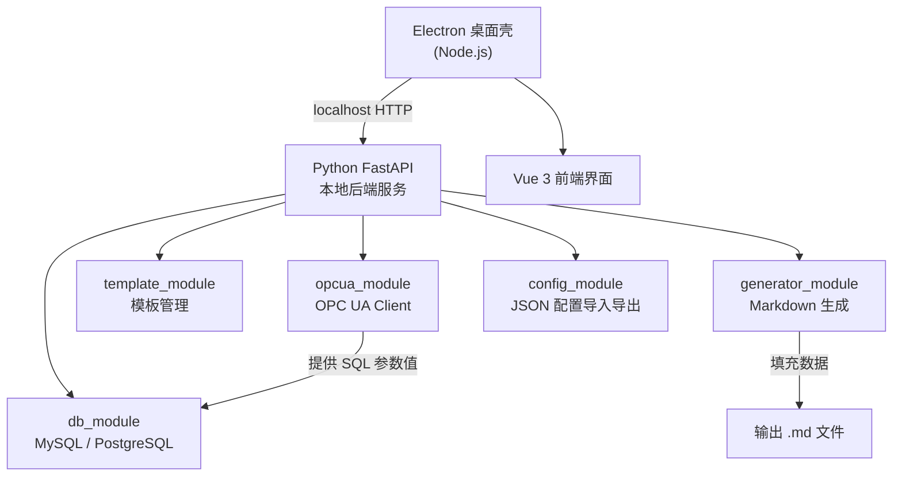
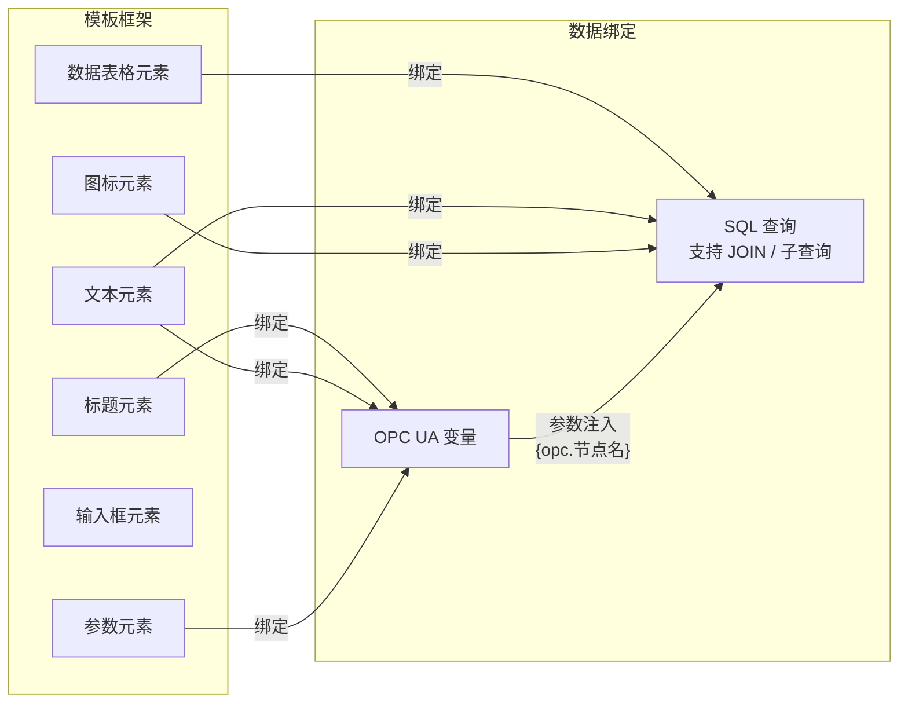
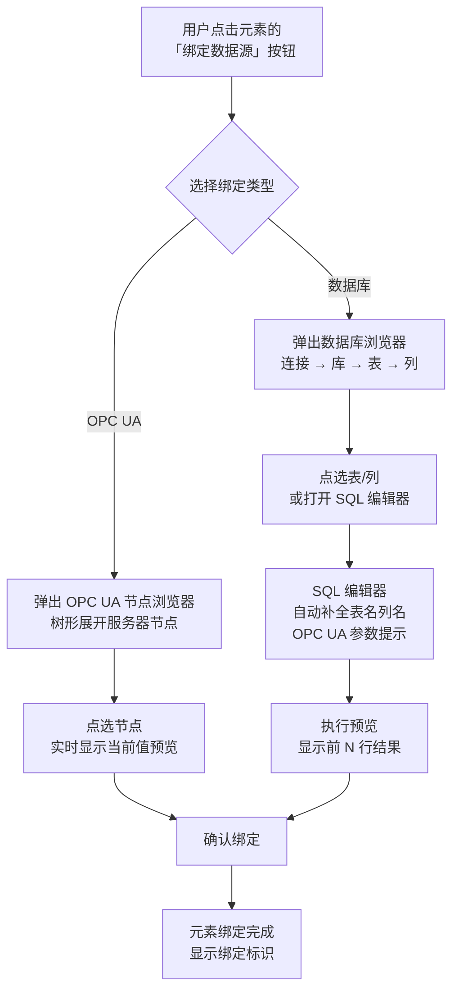

# 报表编辑器软件（SD_SMA_ReportEditor）

## 技术架构



## 报表模板编辑核心概念

模板是一个**可视化框架（Framework）**，由多种**元素（Element）**组成：

- **标题元素**：Markdown 标题（h1~h6），可绑定 OPC UA 变量或 DB 数据作为动态标题
- **文本元素**：静态或动态段落文本，支持 `{{变量名}}` 占位符
- **图标元素**：插入图标/图片路径，路径可来自配置或 DB 查询结果
- **参数元素**：显示单个值（如温度、压力），绑定 OPC UA 节点实时读取
- **输入框元素**：预留手工填写区域，生成报表时留空或带默认值
- **数据表格元素**：绑定一条 SQL 查询，查询结果自动渲染为 Markdown 表格

每个元素都可以**绑定数据源**：

- **OPC UA 变量**：直接绑定节点 ID，生成时读取实时值
- **数据库查询**：编写完整 SQL 语句（支持 JOIN 跨表查询），SQL 中的参数可用 `{opc.节点名}` 占位符引用 OPC UA 变量值，生成时先读 OPC UA 值再代入 SQL 执行



## 项目目录

位于 `P000_SD_SMA_SCADA/_Prj/SD_SMA_ReportEditor/`，作为 P000 仓库的子项目。

```
SD_SMA_ReportEditor/
├── _Doc/                     # 项目文档（计划、工单、变更记录）
├── backend/                  # Python FastAPI 后端
│   ├── main.py               # 启动入口，注册所有路由
│   ├── modules/
│   │   ├── db_module.py      # MySQL + PostgreSQL 连接与查询（支持完整 SQL / JOIN）
│   │   ├── opcua_module.py   # OPC UA 变量读取（asyncua）
│   │   ├── template_module.py# 报表模板 CRUD（元素级 JSON 结构）
│   │   ├── generator_module.py # Markdown 报表生成（OPC UA 值 → SQL 参数 → 渲染）
│   │   ├── history_module.py # 历史报表记录管理
│   │   └── config_module.py  # 配置导入/导出（JSON）
│   ├── models/               # Pydantic 数据模型
│   ├── data/                 # 本地持久化目录（自动创建）
│   │   ├── config.json       # 数据源配置（DB 连接 + OPC UA 服务器）
│   │   ├── templates/        # 模板文件（每个模板一个 .json）
│   │   └── history/          # 历史生成的报表（.md + 元信息 .json）
│   └── requirements.txt
├── frontend/                 # Electron + Vue 3 + Vite
│   ├── electron/
│   │   └── main.js           # Electron 主进程，启动 Python 子进程
│   ├── src/
│   │   ├── views/
│   │   │   ├── Dashboard.vue          # 首页概览（快速入口 + 最近报表）
│   │   │   ├── DataSourceConfig.vue   # 数据源配置（DB 连接管理 + OPC UA 服务器管理）
│   │   │   ├── TemplateManager.vue    # 模板管理（列表 + 新建/复制/删除/编辑入口）
│   │   │   ├── TemplateEditor.vue     # 可视化模板框架编辑器
│   │   │   ├── ReportGenerator.vue    # 报表生成与预览
│   │   │   ├── ReportHistory.vue      # 历史报表浏览（列表 + 查看/导出/删除）
│   │   │   └── Settings.vue           # 全局设置（存储路径 + 配置导入导出）
│   │   └── components/
│   │       ├── MarkdownPreview.vue    # 实时 Markdown 预览
│   │       ├── ElementPanel.vue       # 元素工具面板（拖拽添加元素）
│   │       ├── ElementConfig.vue      # 元素属性配置（绑定数据源、SQL、OPC UA）
│   │       ├── SqlEditor.vue          # SQL 编辑器（语法高亮 + OPC UA 参数提示）
│   │       └── FieldPicker.vue        # 数据字段 / OPC UA 节点选择器
│   └── package.json
└── README.md
```

## 交互式数据源浏览与绑定

绑定参数时，用户不需要手动输入节点 ID 或表名，而是通过**实时浏览、点选**的方式完成绑定。

### 后端探索 API

- **db_module**：
  - `GET /db/connections` — 列出已配置的所有数据库连接
  - `GET /db/{conn_id}/databases` — 列出该连接下的所有数据库
  - `GET /db/{conn_id}/tables` — 列出指定数据库的所有表
  - `GET /db/{conn_id}/columns/{table}` — 列出指定表的所有列（名称、类型）
  - `POST /db/{conn_id}/preview` — 执行 SQL 并返回前 N 行预览结果
- **opcua_module**：
  - `GET /opcua/servers` — 列出已配置的所有 OPC UA 服务器
  - `GET /opcua/{server_id}/browse` — 浏览 OPC UA 节点树（递归展开）
  - `GET /opcua/{server_id}/read/{node_id}` — 读取指定节点的当前值（用于预览）

### 前端交互流程



### 前端组件职责

- **FieldPicker.vue**：统一的数据源选择器弹窗，内含两个 Tab——「OPC UA 节点」和「数据库」
  - OPC UA Tab：树形控件，实时调用 `/opcua/{server_id}/browse` 逐级展开节点，选中后显示当前值预览
  - 数据库 Tab：级联选择（连接 → 库 → 表 → 列），点选表后自动生成基础 `SELECT` 语句，也可切换到 SqlEditor 自由编写
- **SqlEditor.vue**：基于 CodeMirror 的 SQL 编辑器，自动补全已浏览到的表名和列名，支持 `{opc.节点名}` 参数提示，底部有「执行预览」按钮
- **ElementConfig.vue**：元素属性面板，点击「绑定」按钮弹出 FieldPicker，绑定完成后显示绑定来源标识

## 核心模块说明

- **db_module**：封装 SQLAlchemy，支持 MySQL（PyMySQL）和 PostgreSQL（psycopg2）；提供连接测试、数据库/表/列探索 API、完整 SQL 执行（含 JOIN / 子查询 / 跨表查询）、参数化查询（OPC UA 变量值作为参数注入）、SQL 预览（返回前 N 行）、结果序列化
- **opcua_module**：使用 `asyncua` 库，配置服务器地址 + 节点 ID 列表；提供节点树浏览（browse）、单节点值读取（预览）、批量读取；读取的值既可直接用于模板元素，也可作为 SQL 查询的参数
- **template_module**：模板以 JSON 存储，结构为 `元素列表`，每个元素包含 `type`（title/text/icon/param/input/table）、`content`（静态内容/占位符）、`binding`（数据源绑定配置：OPC UA 节点 或 SQL 语句 + OPC UA 参数映射）
- **generator_module**：生成流程：1) 读取所有 OPC UA 变量值 → 2) 将 OPC UA 值代入 SQL 参数执行查询 → 3) 遍历模板元素，替换占位符为实际数据 → 4) 拼接 Markdown 输出
- **history_module**：管理历史生成的报表；每次生成时自动保存 .md 文件 + 元信息 .json（生成时间、使用的模板、数据源快照）到 `data/history/`；提供列表查询、按时间/模板筛选、查看、导出、删除
- **config_module**：全量配置（数据源连接、OPC UA 服务器、模板列表）序列化为 JSON，支持导入/导出

## 本地持久化

所有数据保存在 `backend/data/` 目录下，无需额外数据库：

- `config.json`：数据源配置，包含所有 DB 连接信息（地址、端口、用户名、数据库名，密码加密存储）和 OPC UA 服务器信息（地址、端口、安全策略）
- `templates/`：每个模板保存为独立 `.json` 文件，文件名为模板 ID，内含模板名称、创建/修改时间、元素列表及绑定配置
- `history/`：每次生成报表自动存档，包含 `.md` 报表文件 + `.meta.json` 元信息（生成时间、模板名、数据源快照）

启动时自动检测并创建 `data/` 目录结构，确保首次运行即可用。

## 页面与功能总览

| 页面 | 功能 |
|------|------|
| **Dashboard** | 首页概览：快速入口（新建模板、生成报表）、最近生成的报表列表 |
| **DataSourceConfig** | 数据源配置管理：添加/编辑/删除/测试 DB 连接；添加/编辑/删除/测试 OPC UA 服务器连接 |
| **TemplateManager** | 模板管理：列表展示所有模板（名称、修改时间）、新建/复制/重命名/删除模板、点击进入 TemplateEditor 编辑 |
| **TemplateEditor** | 可视化模板编辑器：拖拽元素、配置绑定、实时 Markdown 预览 |
| **ReportGenerator** | 选择模板 → 生成报表 → 预览 → 导出 .md 文件（同时自动存入历史） |
| **ReportHistory** | 历史报表列表：按时间/模板筛选、查看历史报表内容、重新导出、删除 |
| **Settings** | 全局设置：本地存储路径配置、全量 JSON 配置导入/导出 |

## 关键依赖

- 后端：`fastapi`, `uvicorn`, `sqlalchemy`, `pymysql`, `psycopg2-binary`, `asyncua`, `pydantic`
- 前端：`electron`, `vue3`, `vite`, `vue-router`, `pinia`, `@vueuse/core`, `markdown-it`（预览），`codemirror`（SQL 编辑器）

## 交付形式

- 开发阶段：`npm run dev`（前端）+ `uvicorn main:app`（后端）分别启动
- 打包阶段：Electron Builder 将前端 + Python 可执行文件（PyInstaller 打包）打包为 Windows `.exe` 安装包

## 开发建议

- 每个里程碑完成后做一次 **git tag**（如 `v0.1-M1`），便于回溯
- 每个工单对应一个 **git 分支**（如 `feature/m1-t1`），完成后合并到 main
- M5（可视化编辑器）是最复杂的里程碑，建议预留最多时间
- M1~M3 完成后就有一个能连接数据源的可用界面，可以先验证核心通路
- 如遇阻塞，可先跳到不依赖的工单（如 M7-T1 Settings 可提前做）
