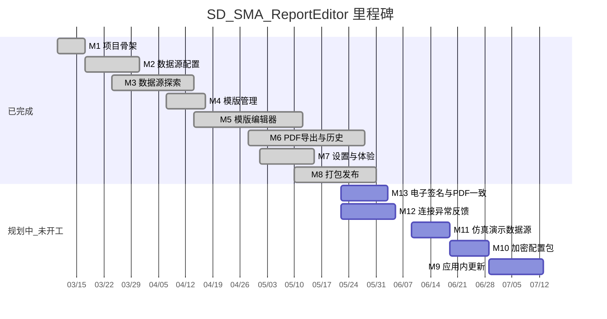
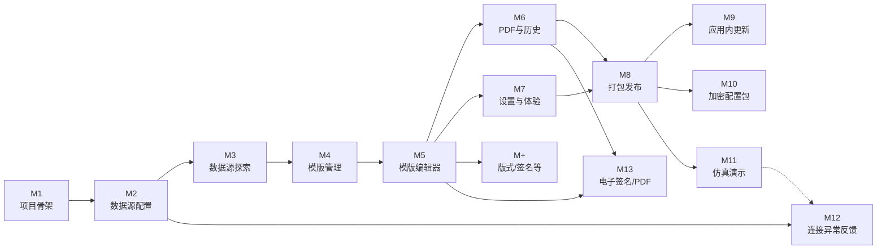

# SD_SMA_ReportEditor — 里程碑与工单跟踪

> **最后核对：** 2026-05-21（对照当前仓库 `backend/`、`frontend/`、`packaging/`）  
> 原计划中的「六元素拖拽 + 独立 Markdown 生成管线」已演进为 **版式/区带模板编辑器 + PDF 导出**；下文按**实际交付**标注状态。

---

## 进度总览

| 里程碑 | 目标（摘要） | 状态 | 说明 |
|--------|----------------|------|------|
| **M1** | 项目骨架、Electron 可启动 | ✅ 完成 | 2026-03-10 |
| **M2** | 数据源配置（DB / OPC UA） | ✅ 完成 | `config_store`、`database` / `opcua` 路由，`DataSourceConfig` |
| **M3** | 数据源探索与 SQL | ✅ 完成 | `DatabaseWorkbench`、OPC 树与节点选取，超出原 FieldPicker 范围 |
| **M4** | 报表模版管理 | ✅ 完成 | `template_store`、`TemplateManager` |
| **M5** | 可视化模版编辑 | ✅ 完成 | `report-template/` 工作区（版式区带、表项 SQL、导出预览栈） |
| **M6** | 报表生成与历史（PDF） | ✅ 完成 | PDF 导出 + 文件夹历史；Markdown 管线已取消，见 [005](005_交付格式决策-取消Markdown管线.md) |
| **M7** | 设置与体验 | ✅ 完成 | 配置导入导出、环境诊断、数据路径、Dashboard 入口 |
| **M8** | 打包发布 | ✅ 完成 | Win NSIS + Mac DMG 已可安装；PyInstaller 后端已纳入打包 |
| **M+** | 计划外增量 | ✅ 已交付 | 版式预设、签名库、跨机配置、安装版诊断等（见文末） |
| **M9** | 应用内检查更新与一键升级 | ⬜ 规划中 | 见下文 |
| **M10** | 加密配置包导出/导入 | ⬜ 规划中 | 替代明文 JSON 备份，导出时设密码 |
| **M11** | 仿真数据库 + 仿真 OPC UA（演示） | ⬜ 规划中 | 软件内一键接入演示环境 |
| **M12** | 数据源连接异常报警与反馈 | ⬜ 规划中 | 需先完成交互设计再开发 |
| **M13** | 电子签名与 PDF 导出签章一致 | ⬜ 规划中 | 模版内签章 vs PDF 成品效果调校，见下文 |

**图例：** ✅ 完成 · 🟡 部分完成 / 待验收 · ⬜ 未做 · 📋 规划中

---

## 里程碑路线图

> Gitea 按下方 Mermaid 渲染甘特图。**规划中**条目须写**明确日期**；若写 `after m2` 等依赖已完成里程碑，条会落在过去（例如 M12 误显示在 4 月）。调整计划时改日期即可，不必改工单正文。

**图中规划时间（示意，非承诺排期）：** M13/M12 并行起步 → M11 → M10 → M9；与上文「实现顺序建议」一致时可随进度改条形日期。

---

## 里程碑依赖关系

---

## 下一阶段规划（M9–M13）

> **记录日期：** 2026-05-21  
> 以下为用户确认的后续需求，**尚未开工**。实现顺序建议：**M13 可与 M6 回归并行**（签章视觉）→ **M12 设计 ∥ M11** → M11 → M10 → M9。

---

## M1 - 项目骨架（5 个工单）

**目标：** 可运行的空壳应用，前后端联通，Electron 窗口正常显示。

| 工单 | 内容 | 交付物 | 验收标准 | 状态 |
|------|------|--------|----------|------|
| M1-T1 | 创建目录结构、git init、README.md | 项目根目录 + git 仓库 | 目录结构完整，git 可提交 | ✅ 完成 |
| M1-T2 | Python 后端初始化：FastAPI + main.py + requirements.txt + data/ 自动创建 | 可启动的 FastAPI 服务 | `uvicorn main:app` 成功，`/docs` 可见 | ✅ 完成 |
| M1-T3 | 前端初始化：Vite + Vue 3 + vue-router + pinia | Vue 开发服务器 | `npm run dev` 成功 | ✅ 完成 |
| M1-T4 | Electron 主进程：启动 Python 子进程 + 加载前端 | `electron/main.cjs` | `npm run electron:dev` 弹出窗口且后端就绪 | ✅ 完成 |
| M1-T5 | 全局布局：侧边栏 + 多页面路由 + Dashboard 入口 | `MainLayout`、路由表 | 各菜单可切换 | ✅ 完成 |

**M1 完成标志：** Electron 启动后可见导航与 Dashboard，前后端通信正常。——**已达成（2026-03-10）**

---

## M2 - 数据源配置（5 个工单）

**目标：** 配置并保存 DB / OPC UA 连接，可测试连通性。

| 工单 | 内容 | 交付物（实际） | 验收标准 | 状态 |
|------|------|----------------|----------|------|
| M2-T1 | 配置读写与 data/ 初始化 | `core/settings.py`、`modules/config_store.py`、`init_data_dirs` | 启动创建 `data/`，`config.json` 可读写 | ✅ 完成 |
| M2-T2 | DB 连接 CRUD + 测试 | `api/routers/database.py`、`modules/db_connection_ops.py` | 增删改查 + 测试连接 | ✅ 完成 |
| M2-T3 | OPC UA 连接 CRUD + 测试 | `api/routers/opcua.py`、`modules/opcua_service.py` | 同上 | ✅ 完成 |
| M2-T4 | 前端 DB 连接管理 | `DataSourceConfig` + `features/datasource/database-workbench/` | 表单保存、列表、测试反馈 | ✅ 完成 |
| M2-T5 | 前端 OPC UA 管理 | `features/datasource/opcua/OpcUaPanel.vue` 等 | 同上 | ✅ 完成 |

**M2 完成标志：** 界面添加 MySQL 与 OPC UA 连接，测试通过，重启后配置仍在。——**已达成**

---

## M3 - 数据源探索与交互式浏览（5 个工单）

**目标：** 浏览库表 / OPC 节点树，编写并预览 SQL。

| 工单 | 内容 | 交付物（实际） | 验收标准 | 状态 |
|------|------|----------------|----------|------|
| M3-T1 | DB 探索 API | `database` 路由（库表列、查询、ER、DDL 预览等） | 可列出结构并执行只读查询 | ✅ 完成 |
| M3-T2 | OPC UA 探索 API | `opcua` 路由（浏览、读值、订阅相关） | 树形浏览与读值 | ✅ 完成 |
| M3-T3 | DB 级联浏览 UI | `ObjectTree`、`ConnectionManager`、`DatabaseWorkbench` | 连接→库→表→列可浏览 | ✅ 完成 |
| M3-T4 | OPC UA 树形 UI | `OpcUaTree`、`OpcUaNodePickerModal` | 展开节点、选取绑定 | ✅ 完成 |
| M3-T5 | SQL 编辑与预览 | `QueryEditor`、`QuickQueryPanel`、`DataGrid` 等 | 编写 SQL 并查看结果 | ✅ 完成 |

> 原工单中的 `FieldPicker.vue` / `SqlEditor.vue` **未按文件名实现**；能力已并入数据源工作台与模版编辑器内的绑定面板。

**M3 完成标志：** 能浏览真实库表与 OPC 节点，SQL 可执行预览。——**已达成**

---

## M4 - 模板管理（2 个工单）

**目标：** 报表模版增删改查，持久化到本地。

| 工单 | 内容 | 交付物（实际） | 验收标准 | 状态 |
|------|------|----------------|----------|------|
| M4-T1 | 模版 CRUD API | `api/routers/templates.py`、`modules/template_store.py` | API 可用，重启后数据不丢 | ✅ 完成 |
| M4-T2 | 模版管理页 | `TemplateManager.vue`、`NewTemplateWizardDialog` | 列表、新建、进入编辑 | ✅ 完成 |

**M4 完成标志：** 可新建模版并在列表管理，点击进入编辑器。——**已达成**

---

## M5 - 可视化模板编辑器（5 个工单）

**目标：** 可视化组装模版，绑定数据，预览导出效果。

| 工单 | 内容 | 交付物（实际） | 验收标准 | 状态 |
|------|------|----------------|----------|------|
| M5-T1 | 元素/区带工具 | `TemplateEditorWorkspace`、`TemplateBodyCanvas`、版式区对话框 | 可编辑页眉页脚/正文区带 | ✅ 完成 |
| M5-T2 | 编辑画布 | `LayoutPresetMiniPage`、`TemplateMiniPage` 等 | 选中、编辑、预览联动 | ✅ 完成 |
| M5-T3 | 属性与绑定 | `TemplateElementProps`、`TemplateTableSqlVisualPanel`、OPC/SQL 绑定 | 绑定 OPC 与表项 SQL | ✅ 完成 |
| M5-T4 | 导出预览 | `TemplateExportPreviewStack` | 预览与导出栈一致 | ✅ 完成 |
| M5-T5 | 保存加载联调 | 模版 API + 前端 `report-template` 模型 | 保存后重开内容恢复 | ✅ 完成 |

> 实现路径为 **版式 + 区带 + 表项** 模型（`frontend/src/lib/report-template/`），非原计划「六种 Element 拖拽面板」；`rptp/` 原型概念已并入主应用。

**M5 完成标志：** 可编辑模版、绑定数据源、预览导出效果、持久化不丢。——**已达成**

---

## M6 - 报表生成与历史（PDF，4 个工单）

**目标：** 生成报表、留存、回看导出。交付格式为 **PDF**，不再实现 Markdown 成品管线（**取消理由**见 [005_交付格式决策-取消Markdown管线.md](005_交付格式决策-取消Markdown管线.md)）。

| 工单 | 内容 | 交付物（实际） | 验收标准 | 状态 |
|------|------|----------------|----------|------|
| M6-T1 | 后端 Markdown 生成 | 原计划 `generator_module.py` | — | ❌ 已取消（不纳入当前版本） |
| M6-T2 | 后端 history（`.md` 归档） | 原计划 `history_module.py` | — | ❌ 已取消（改为导出目录 PDF） |
| M6-T3 | 生成报表前端 | `ReportGenerator.vue` | 手动/条件触发 **PDF 导出**（Electron） | ✅ 完成 |
| M6-T4 | 历史报表前端 | `ReportHistory.vue` | 监视导出文件夹中的 **PDF** 列表/预览 | ✅ 完成 |

**M6 完成标志：** 桌面版选模版 → 导出 PDF → 在绑定文件夹查看历史。——**已达成（Win / Mac 安装版已验证可导出）**。

---

## M7 - 全局设置与优化（3 个工单）

**目标：** 配置管理、首页体验、整体可用性。

| 工单 | 内容 | 交付物（实际） | 验收标准 | 状态 |
|------|------|----------------|----------|------|
| M7-T1 | 设置页 | `Settings.vue` + `features/settings/*` | 数据路径、配置包导入导出、本地迁移 | ✅ 完成 |
| M7-T2 | Dashboard | `Dashboard.vue` | 各功能快速入口（含版式、签名） | ✅ 完成 |
| M7-T3 | 体验与反馈 | 环境诊断、Toast、向导 `SetupWizard` 等 | 操作有反馈，安装版可自检环境 | ✅ 基本完成 |

**M7 完成标志：** 设置与首页可用，交互顺畅。——**已达成**

---

## M8 - 打包发布（3 个工单）

**目标：** 可交付的 Windows / macOS 安装包。

| 工单 | 内容 | 交付物（实际） | 验收标准 | 状态 |
|------|------|----------------|----------|------|
| M8-T1 | PyInstaller 后端 | `backend/scripts/build-backend-exe.*`、`backend/dist/report_backend/` | 无 Python 环境可跑后端 | ✅ 完成 |
| M8-T2 | Electron Builder 安装包 | `packaging/windows`、`packaging/mac`，NSIS + DMG | 安装后可启动，功能可用 | ✅ 完成 |
| M8-T3 | 端到端验收 | Win / Mac 安装版实测 | 安装后可配置、编辑模版、导出 PDF | ✅ 完成 |

**M8 完成标志：** 安装包在目标系统上完成「配置 → 模版 → 导出 PDF」闭环。——**已达成（Windows、macOS 均可安装使用）**。

---

## M+ - 计划外已交付能力

| 编号 | 能力 | 主要位置 | 状态 |
|------|------|----------|------|
| M+-1 | 版式预设（页眉页脚/纸张） | `layout_presets` API、`LayoutPresets.vue`、`LayoutPresetEditor.vue` | ✅ |
| M+-2 | 签名库 | `signatures` API、`SignaturesLibrary.vue` | ✅ |
| M+-3 | 运行环境诊断（开发/安装版区分） | `diagnostics_service`、`EnvironmentDiagnostics.vue` | ✅ |
| M+-4 | 跨机配置导入（密码按目标机重加密） | `config_import_export.py`、`ConfigImportExport.vue` | ✅ |
| M+-5 | 卸载清理用户数据、NSIS 增强 | `frontend/build/installer.nsh`、`packaging/` | ✅ |
| M+-6 | 开发/打包目录整理 | `scripts/dev/`、`packaging/`、文档 | ✅ |

---

## M9 - 应用内检查更新与一键升级（部分完成 → 0.1.6 / 0.1.7）

**目标：** 安装版启动后（或设置页手动）可发现新版本，用户点击即可完成升级，减少现场手工下载安装包。

| 工单 | 内容 | 交付物（实际） | 验收标准 | 状态 |
|------|------|----------------|----------|------|
| M9-T1 | 版本与更新源方案 | Portal 静态目录 `latest.json` | 团队确认发布渠道 | ✅ 0.1.6 |
| M9-T2 | 检查更新 API / 元数据 | `electron/updater.cjs` + `latest.json` | 能解析有新版本 / 已最新 / 失败 | ✅ 0.1.6 |
| M9-T3 | Electron 下载与安装 | 自研下载 + Win NSIS 调起 / Mac DMG 打开 | Windows 一键安装；Mac 拖入应用程序 | ✅ 0.1.6 / 0.1.7 引导优化 |
| M9-T4 | 设置页 UI | `AppUpdateSection.vue`、启动弹窗、红点 | 检查 / 下载 / 安装闭环 | ✅ 0.1.6 |
| M9-T5 | 更新体验 polish | SHA256 失败提示、更新源/上次检查、Mac 升级步骤 | 现场可自助排错 | ✅ 0.1.7 |
| M9-T6 | 断点续传与 Mac 升级体验 | HTTP Range 续传、跳过版本、Mac 自动退出与可选装后打开 | 暂停后可继续；Mac DMG 流程更顺畅 | ✅ 0.1.8 |

**M9 完成标志（修订）：** 在已安装的旧版上点击「检查更新」→ 发现新版 → 下载并安装 → 启动后版本号正确（Mac 需用户拖放 .app，可选装后自动打开）。——**基本达成（0.1.8）**

**设计要点（已实现 / 保留）：**

- 内网环境支持 **镜像 URL** 与 **跳过 TLS 校验**（高级设置）。
- 升级包 **SHA256 校验**（0.1.7 增强失败提示）。
- 升级前 **停止后端子进程**（`stopBackend`）。
- **断点续传**（0.1.8）：暂停保留 partial 文件，支持 HTTP Range。
- **跳过此版本**（0.1.8）：写入 `update-settings.json`，静默检查不再弹窗。
- **macOS 装后打开**（0.1.8）：退出前启动 detached watcher，检测 `/Applications/Report Editor.app` mtime 变化后 `open`。

---

## 0.1.7 发布说明（草案）

- 修复 macOS 安装版「运行环境诊断」误显示为 Windows 安装版
- 软件更新：SHA256 校验失败提示更清晰；显示更新源与上次检查时间；macOS 升级分步引导
- 数据库 / OPC UA 连接测试失败时显示更可读的原因与操作建议
- 设置与签名库：说明「图像签章」与 PDF 数字证书签名的区别

---

## 0.1.8 发布说明（草案）

- 软件更新：下载支持断点续传（暂停后可「继续下载」）
- macOS：一键升级后自动退出；可选「替换完成后尝试自动打开应用」
- 软件更新：启动弹窗与设置页可「跳过此版本」；下载进度显示百分比
- 设置页：macOS 升级步骤更新；「打开已安装的应用」快捷按钮

> **发版后**：打包 Win/Mac 安装包，计算 SHA256 填入 `packaging/updates/latest.json` 并同步 Portal 下载目录。

---

## M10 - 加密配置包导出/导入（规划中）

**目标：** 配置迁移不再依赖**明文 JSON**；导出为**带密码的二进制包**（或加密容器），导入时输入密码解密；降低配置文件泄露风险。

**背景：** 现行「本机备份」JSON 含明文数据库/OPC 口令（见 `config-import-export` README）；脱敏包虽无口令但仍可读结构。用户希望：**导出时设密码 → 得到 `.repkg`（名称待定）二进制文件**。

| 工单 | 内容 | 交付物（拟定） | 验收标准 | 状态 |
|------|------|----------------|----------|------|
| M10-T1 | 包格式与加密方案 | 文档 + `schemas`：文件头、版本号、KDF（如 PBKDF2）、AEAD（如 AES-GCM） | 明确与现有 `config_bundle` JSON 结构的打包关系；支持向后兼容导入旧 JSON（可选） | ⬜ 待做 |
| M10-T2 | 后端导出/导入 API | `export_encrypted_bundle(password)` / `import_encrypted_bundle(file, password)` | 错误密码有明确错误码；大包模版+版式+签名+配置 | ⬜ 待做 |
| M10-T3 | 前端导出流程 | 导出前弹窗输入密码 + 确认；保存对话框过滤扩展名 | 导出文件非明文可读；忘记密码无法恢复（界面提示） | ⬜ 待做 |
| M10-T4 | 前端导入流程 | 选文件 → 输入密码 → 合并/覆盖策略与现有一致 | 导入后连接可测、跨机密码仍按目标机 Fernet 重加密 | ⬜ 待做 |
| M10-T5 | 与「脱敏 JSON」并存 | `ConfigImportExport.vue` 文案与按钮分层 | 演示/审计用脱敏 JSON；生产迁移用加密包 | ⬜ 待做 |

**设计要点（待细化）：**

- 二进制包内 payload 可为 **压缩后的 JSON** 或 **msgpack**，外层统一加密。
- 密码强度提示；可选「仅本机记住上次导出路径」不落盘密码。
- **不**替代 PDF 导出；仅针对**配置/模版迁移包**。

**M10 完成标志：** 导出 `.repkg`（名待定）→ 用文本编辑器打开为乱码 → 正确密码导入成功 → 错误密码提示明确。

---

## M11 - 仿真数据库与仿真 OPC UA（演示）（规划中）

**目标：** 无真实产线时，在软件内**一键连接演示用数据库与 OPC UA**，用于培训、展会、功能演示。

**背景：** 仓库已有 `docker-compose.yml`（MariaDB）、`backend/scripts/demo_opcua_server.py`；`install_and_start_dev_web` 可拉起容器，但**安装版用户**缺少图形化「仿真模式」入口。

| 工单 | 内容 | 交付物（拟定） | 验收标准 | 状态 |
|------|------|----------------|----------|------|
| M11-T1 | 演示数据源定义 | 内置连接模版：主机/端口/库名/节点表；与 compose 默认值一致 | 文档写明端口（如 3306、4840）及初始数据脚本（若有） | ⬜ 待做 |
| M11-T2 | 后端健康检查 | API：仿真 DB/OPC 是否可达；可选「启动演示服务」钩子（仅开发版或附带脚本） | 安装版至少能**检测**并引导；开发版可一键检测 compose | ⬜ 待做 |
| M11-T3 | 前端「演示模式」入口 | `DataSourceConfig` 或 `SetupWizard`：添加仿真连接、测试、标为演示 | 一键写入 config 并测试通过（服务已启动前提下） | ⬜ 待做 |
| M11-T4 | 演示数据种子（可选） | SQL 脚本 / 最小表 + OPC 模拟节点 | 连上后可跑一条示例 SQL、读一个 OPC 节点 | ⬜ 待做 |
| M11-T5 | 与生产连接区分 | UI 标签「仿真」；导出 PDF 水印或设置项（可选） | 用户能分辨演示连接，避免误用于生产配置包 | ⬜ 待做 |

**设计要点（待细化）：**

- **安装版**是否内置 Docker 依赖（通常否）→ 演示可能拆为：**(A) 连接远程团队演示服务器** **(B) 文档引导本机 docker compose**。
- 仿真 OPC 可复用 `demo_opcua_server.py`；仿真 DB 与现有 MariaDB 驱动一致。

**M11 完成标志：** 新机器按引导启动演示服务后，软件内一键添加仿真 DB + OPC，测试连接成功，并能完成一次 PDF 导出演示。

---

## M12 - 数据库 / OPC UA 连接异常报警与反馈（规划中）

**目标：** 连接失败、超时、断线、认证错误时，用户能**立即、准确**知道「哪条连接、什么错误、建议怎么做」，而不是静默失败或笼统报错。

**背景：** 已有连接「测试」按钮、`ConnectionTabLed` 等零散反馈；缺**统一错误模型**与**持续态**（标签页、导出前、自动导出触发时）的联动。

| 工单 | 内容 | 交付物（拟定） | 验收标准 | 状态 |
|------|------|----------------|----------|------|
| M12-T1 | **交互与信息架构设计** | `_Doc` 设计说明（或 Figma 要点）：错误分级、文案、展示位置 | 评审通过：覆盖测试连接 / 工作台查询 / 模版导出 / 自动导出 | ⬜ 待做 |
| M12-T2 | 后端统一错误结构 | `schemas`：`ConnectionErrorDetail`（code、message、hint、connection_id、source: db\|opcua） | API 失败时返回机器可读 code + 人类可读 hint | ⬜ 待做 |
| M12-T3 | DB 连接异常映射 | `db_connection_ops` / `database` 路由：捕获驱动异常 → 统一结构 | 常见：拒绝连接、未知库、认证失败、超时、只读冲突 | ⬜ 待做 |
| M12-T4 | OPC UA 异常映射 | `opcua_service`：会话失败、节点不存在、证书问题 | 与 M12-T2 结构一致 | ⬜ 待做 |
| M12-T5 | 前端全局与局部反馈 | Toast + 连接 Tab 红/黄灯 + 详情抽屉；导出前阻断或二次确认 | 断线时自动导出不静默失败；用户可展开「技术详情」 | ⬜ 待做 |
| M12-T6 | 可选：后台探活 | 定时 ping 已保存连接（可开关）；Dashboard 汇总 | 设置中可关闭；避免拖垮弱网 | ⬜ 待做 |

**设计要点（M12-T1 需先产出）：**

| 场景 | 建议反馈 |
|------|----------|
| 保存连接时测试失败 | 表单下方 Inline 错误 + 禁止标为「已验证」 |
| 已保存连接后续失败 | Tab 灯变红 + 悬停显示最后一次错误与时间 |
| 工作台执行 SQL 失败 | 结果区错误卡片：SQL 片段 + 根因 +「检查连接」跳转 |
| 模版导出 / PDF 填数失败 | 模态摘要：「DB 连接 A 超时」「OPC 节点 X 无数据」；可重试 |
| 自动导出触发失败 | 系统通知或历史页旁路日志；避免仅写控制台 |

**错误分级（拟定）：** `fatal`（需用户修改配置）/ `retryable`（网络抖动）/ `degraded`（部分节点无值但仍可导出）。

**M12 完成标志：** 人为制造断网、错误密码、错误端口三类故障，界面均能指出连接名与可操作建议，且导出流程不无声失败。

---

## M13 - 电子签名与 PDF 签章一致（规划中）

**目标：** 厘清并统一两类「签名」概念，使用户在模版编辑器、导出预览、最终 PDF 中看到的**签章效果一致**；按现场要求调校尺寸、清晰度与叠放方式。

**问题背景（现状差异）：**

| 概念 | 本软件现行实现 | 常见「PDF 电子签名」含义 |
|------|----------------|---------------------------|
| **模版内电子签名** | `signature` 控件：签名库 PNG（手写图）+ 可选姓名水印；`SignatureDisplayMode`（手写图 / 水印 / 两者） | 多指在 PDF 阅读器里可验证的**数字签章**（证书、签章域） |
| **PDF 导出** | Electron `printToPDF` 将页面（含签名图层）**光栅化**进 PDF，本质是「签字图打印进 PDF」 | 不等于 PKCS#7 / 国密 PDF 签章；Adobe 中不一定显示为可验证电子签章 |

因此用户感知为：**编辑器里调的电子签名** 与 **导出的 PDF 上看到的签名** 在位置、大小、模糊、裁切、分页断档等方面**不一致**，或与客户期待的「PDF 电子签章」不是同一类产品能力。

**关联代码（调校入口）：**

- 签名库：`SignaturesLibrary.vue`、`signature_asset_store`、`api/routers/signatures.py`
- 模版控件：`TemplateElementProps.vue`、`TemplateMiniSignatures.vue`、`model.ts`（`signatureDisplayMode`）
- 导出栈：`TemplateExportPreviewStack.vue`、`PdfExportView.vue`、`electron/main.cjs`（`pdf-export-run` / `printToPDF`）

| 工单 | 内容 | 交付物（拟定） | 验收标准 | 状态 |
|------|------|----------------|----------|------|
| M13-T1 | 差异调研与样张 | `_Doc` 或工单附件：编辑器预览 vs 导出预览 vs 最终 PDF 对比截图 | 列出至少 3 类差异（尺寸、分辨率、分页/裁切、透明底、水印字号） | ⬜ 待做 |
| M13-T2 | 产品边界说明 | 设置或帮助文案：本软件签名为**图像签章**；是否规划证书签章单列 | 用户不再与 Acrobat「数字签名」混淆；需求若要做证书签章则另立 M13+ | ⬜ 待做 |
| M13-T3 | 预览与 PDF 渲染统一 | 保证 `TemplateExportPreviewStack` 与 `PdfExportView` 共用同一套签章 CSS/缩放/DPI 参数 | 同一模版在同一缩放下，预览与 PDF 像素级接近（允许 ±1px 容差） | ⬜ 待做 |
| M13-T4 | 签章控件与签名库调校 | 手写图分辨率、区带内最大宽高、水印字体、`both` 模式叠放顺序 | 签名库条目在 A4 区带内不变形、不糊；多签章不互相遮挡关键字段 | ⬜ 待做 |
| M13-T5 | 导出 PDF 参数 | `printToPDF` 的 `scale`、页边距、背景打印、字体嵌入（若影响水印） | Win/Mac 各导出一份样张，与编辑器「导出预览」一致 | ⬜ 待做 |
| M13-T6 | 回归用例 | 模版含 1～3 个签章 + 水印/仅图/两者 组合 | 手动导出与 OPC 自动导出路径均通过同一套签章渲染 | ⬜ 待做 |

**设计要点（待 M13-T1 确认）：**

- **本期范围**：以**视觉签章与 PDF 打印一致**为主，不默认实现 PDF 数字证书签名（若需要，单独评估第三方库或后置签章服务）。
- 签章图片建议统一 **导出 DPI**（如按 2× 屏宽渲染后再缩入 PDF），避免 `printToPDF` 默认 96 DPI 导致笔画发虚。
- 分页时签章区跨页：明确是**裁切**、**整体挪到下一页**还是**每页重复页脚签章**（与版式预设页脚区策略一致）。
- 模版编辑器「导出预览」与「生成报表」页 PDF 导出应走**同一渲染入口**，避免双实现再次分叉。

**M13 完成标志：** 选定 1 份含多签章的标准模版，在 Win/Mac 安装版上：编辑器导出预览、生成报表导出 PDF、肉眼与放大 200% 对比均一致；现场认可「图像签章」产品定义。

---

## 其它待办（低优先级）

| 优先级 | 建议工单 | 说明 |
|--------|----------|------|
| 低 | 补充书面验收记录（可选） | 将 Win/Mac 安装与导出步骤记入 `_Doc` 或测试台账 |
| 低 | Markdown 成品导出（仅当业务重新提出） | 见 [005](005_交付格式决策-取消Markdown管线.md) |

---

## 变更记录

| 日期 | 内容 |
|------|------|
| 2026-03-10 | 创建里程碑与工单文档，共 8 个里程碑、32 个工单 |
| 2026-03-10 | M1 全部完成（T1–T5） |
| 2026-05-20 | 按仓库现状核对：M2–M5、M7 标为完成；M6 标注 PDF 路径完成、Markdown 管线未实现；M8 打包完成、E2E 待验收；增补 M+ 与待办建议 |
| 2026-05-20 | M6/M8 标为完成；新增 [005](005_交付格式决策-取消Markdown管线.md) 说明取消 Markdown 成品理由；Win/Mac 安装与 PDF 导出已验收 |
| 2026-05-21 | 新增下一阶段 M9–M12：应用内更新、加密配置包、仿真演示数据源、连接异常报警（含 M12 设计要点） |
| 2026-05-21 | 新增 M13：电子签名（图像签章）与 PDF 导出效果一致化调校，区分 PDF 数字签章 |
| 2026-05-22 | 0.1.7 草案：Mac 诊断文案、更新体验 polish、连接错误可读性、签章产品说明；M9 标为基本完成 |
| 2026-05-19 | 0.1.8 草案：断点续传、跳过版本、Mac 装后自动打开、下载进度百分比；M9-T6 完成 |
