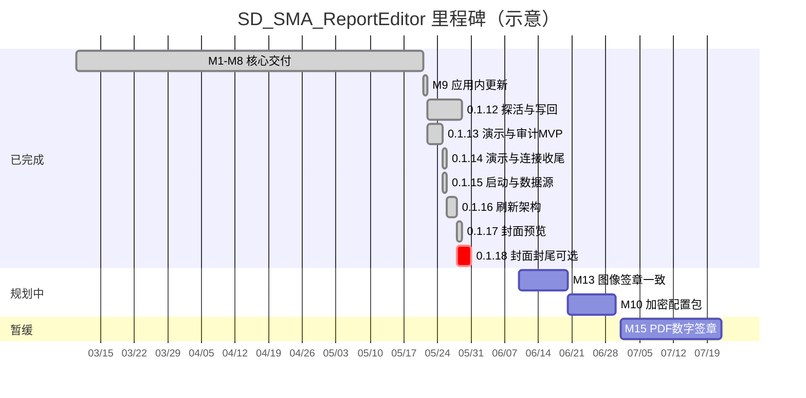
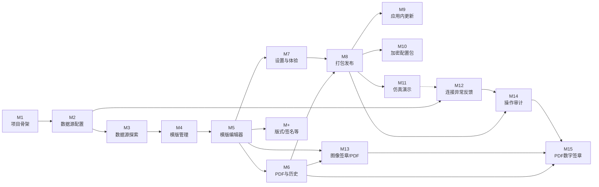

# SD_SMA_ReportEditor — 里程碑与工单跟踪

> **最后核对：** 2026-05-28（**0.1.17** Portal 双平台；封面/封尾可选已合入 `main`；**M15 PDF 数字签章** 仅文档规划、**暂缓开发**）  
> 原计划中的「六元素拖拽 + 独立 Markdown 生成管线」已演进为 **版式/区带模板编辑器 + PDF 导出**；下文按**实际交付**标注状态。

---

## 进度总览

| 里程碑 | 目标（摘要） | 状态 | 说明 |
|--------|----------------|------|------|
| **M1** | 项目骨架、Electron 可启动 | ✅ 完成 | 2026-03-10 |
| **M2** | 数据源配置（DB / OPC UA） | ✅ 完成 | `config_store`、`database` / `opcua` 路由，`DataSourceConfig` |
| **M3** | 数据源探索与 SQL | ✅ 完成 | `DatabaseWorkbench`、OPC 树与节点选取 |
| **M4** | 报表模版管理 | ✅ 完成 | `template_store`、`TemplateManager` |
| **M5** | 可视化模版编辑 | ✅ 完成 | `report-template/` 工作区（版式区带、表项 SQL、导出预览栈） |
| **M6** | 报表生成与历史（PDF） | ✅ 完成 | PDF 导出 + 文件夹历史；Markdown 管线已取消，见 [005](005_交付格式决策-取消Markdown管线.md) |
| **M7** | 设置与体验 | ✅ 完成 | 配置导入导出、环境诊断、Dashboard 入口（含审计卡片、连接汇总） |
| **M8** | 打包发布 | ✅ 完成 | Win NSIS + Mac DMG；PyInstaller 后端；Portal `publish-portal-release.mjs` |
| **M+** | 计划外增量 | ✅ 已交付 | 版式/签名、云端同步、演示双通道、审计等（见文末 M+） |
| **M9** | 应用内检查更新与一键升级 | ✅ 完成 | 0.1.6～0.1.9；Portal `latest.json`、断点续传、跳过版本 |
| **M10** | 加密配置包导出/导入 | ⬜ 规划中 | 替代明文 JSON 备份，导出时设密码 |
| **M11** | 仿真数据库 + 仿真 OPC UA（演示） | ✅ 基本完成 | **0.1.13** 双通道 MVP；**0.1.14** 应用内启停 compose；**不做** PDF 水印 |
| **M12** | 数据源连接异常报警与反馈 | 🟡 部分完成 | Tab 灯/探活/Toast/**0.1.14** Dashboard 汇总与异常详情弹窗；T1 设计文档待做 |
| **M13** | 图像签章与 PDF 导出视觉一致 | ⬜ 规划中 | 与 **M15** 分离；PNG 水印进 PDF，**非**阅读器可验证签章 |
| **M14** | 操作审计 | ✅ 基本完成 | **0.1.13** MVP；**0.1.14** 高级筛选/CSV/保留策略；M10/M15 联动延后 |
| **M15** | PDF 数字签章（可验证 / 合规） | 📋 暂缓 | 本地或内网可实施；需 CA/证书决策；详见下文 **M15** |

**图例：** ✅ 完成 · 🟡 部分完成 / 待验收 · ⬜ 未做 · 📋 仅规划未开工 · ⏸ 暂缓

**当前版本：** `frontend/package.json` **0.1.20**。**Portal：** 待 **0.1.20** 双平台打包（`build.sh` / `build.ps1 -Version 0.1.20 -Fresh`）。

---

## 版本路线图（0.1.12～0.1.18）

> **记录日期：** 2026-05-28  
> **0.1.12**～**0.1.18**（已发布）→ **0.1.19** 侧边栏更新区 → **0.1.20**（计划）导航收起 → **0.1.21+** M13 图像签章 → **0.3.0+** M15 PDF 数字签章（**暂缓**）。

### 0.1.12 — 连接可靠性与导出反馈可观测 ✅

**主题：** 手动测试、探活、写回可观测、配置加固（**不含**全量操作审计）。**发布：** 2026-05-22。

| 工单 | 内容 | 交付物（拟定） | 验收标准 | 状态 |
|------|------|----------------|----------|------|
| V0112-T1 | 连接 Tab 错误详情 | 悬停 Tab 显示最后一次错误、时间、连接名 | 断网、错密码、错端口可定位到具体连接 | ✅ tooltip（**0.1.14** 增补点击弹窗） |
| V0112-T2 | 可选定时探活（M12-T6 小版） | 设置项开关；间隔可配；Dashboard 汇总 | 默认关闭；探活驱动 Tab 灯 | ✅ 设置项与轮询（**0.1.14** Dashboard DB+OPC 汇总） |
| V0112-T3 | 导出反馈「测试写回 PLC」 | 「生成报表」页按钮 | 不导出 PDF；PLC 侧可读 | ✅ |
| V0112-T4 | 写回失败可观测 | Toast + 状态区摘要 | 写回失败不静默 | ✅ |
| V0112-T5 | 绑定校验（按已配置项） | 导出前仅校验已填 NodeId | 不要求三节点齐全 | ✅ |
| V0112-T6 | 配置备份与迁移加固 | 设置页 callout + 文档 | Win 升级保配置 | ✅ |
| V0112-T7 | 自动导出 + 写回联调回归 | 自动路径调用写回 | 与手动导出一致 | 🟡 代码已对齐，待现场复验 |

**关联里程碑：** M12（部分）、M7

---

### 0.1.13 — 可验证 + 可追溯 ✅

**主题：** 演示环境双通道、操作审计 MVP、Mac 补丁、发版 Smoke。**发布：** 2026-05-25（Mac / Win）。**主安装包不内置 Docker**。

#### A. 补丁

| 工单 | 内容 | 验收标准 | 状态 |
|------|------|----------|------|
| V0113-F1 | Mac「打开已安装的应用」 | 不再报 `object could not be cloned` | ✅ |
| V0113-F2 | 其它现场反馈小 bug | 补丁级 | ✅ 仪表盘审计卡片 **0.1.14** 补全 |

#### B. 演示双通道（M11 MVP）

| 工单 | 内容 | 交付物 | 验收标准 | 状态 |
|------|------|--------|----------|------|
| V0113-D1 | **远程演示服务器** | 内置远程 DB/OPC 预设 | 一键添加远程演示连接 | ✅ |
| V0113-D2 | **演示工具包（可选）** | `demo-pack/latest.json` + zip + 打包脚本 | 应用内下载、SHA256、解压 | ✅ 代码；Portal demo-pack **待发布** |
| V0113-D3 | 设置页「演示与培训」 | 远程/本地通道；健康检测 | 连接 Tab 标「仿真」 | ✅ |
| V0113-D4 | 一键添加演示连接 | `/demo/apply_connections` | 完成一次 PDF 导出演示 | ✅ |

**设计要点（仍有效）：** 默认远程演示；工具包分开发布；本机需 Docker Desktop；**0.1.14** 应用内启停 compose；**明确不做** PDF 水印、主包内置 Docker。

#### C. 操作审计 MVP（M14 切片）

| 工单 | 内容 | 交付物 | 验收标准 | 状态 |
|------|------|--------|----------|------|
| V0113-A1 | 审计模型与存储 | `backend-data/audit/operations.jsonl` | 不含 password 明文 | ✅ |
| V0113-A2 | 后端 API | 追加、分页、导出 JSON | 安装版可写 | ✅ |
| V0113-A3 | 前端 `auditLog` 埋点 | 配置/导出/写回/演示/更新 | 关键路径覆盖 | ✅ |
| V0113-A4 | 独立审计页 | `/audit` + `AuditLogSection.vue` | 列表、类型筛选、导出 JSON | ✅ |

#### D. 验证打底

| 工单 | 内容 | 验收标准 | 状态 |
|------|------|----------|------|
| V0113-V1 | `_Doc/008_发版Smoke清单.md` | 远程 + 本地工具包两套路径 | ✅ |
| V0113-V2 | 发版前 `npm test` | 单元测试全绿 | ✅ 53/53 |

**0.1.13 完成标志：** Mac 升级页正常；远程或本地演示可导出 PDF；审计三条典型操作可查。——**已达成**

**关联里程碑：** M11（MVP）、M14（MVP）、M7

---

### 0.1.14 — 演示好用 + 审计好用 + 连接看得见 ✅

**主题：** M11/M14 收尾、M12 小收尾、Win 样式与双平台发布。**发布：** 2026-05-25（Mac / Win + Portal）。

| 工单 | 内容 | 交付物 | 验收标准 | 状态 |
|------|------|--------|----------|------|
| V0114-M11 | 演示工具包应用内启停 | `demo-pack.cjs` start/stop；`DemoTrainingSection` 按钮 | Docker Desktop 下可启停 compose | ✅ |
| V0114-M11-UI | 演示与培训 Win 样式 | `settings-sections.css` 按钮 flex | 按钮不再异常全宽拉伸 | ✅ |
| V0114-M14 | 审计高级能力 | 类型/结果/日期筛选；CSV；90 天保留 | `/audit/export.csv`；`_maybe_trim` | ✅ |
| V0114-M14-UI | 审计入口补全 | 侧边栏 + Dashboard 卡片 | Win 旧包遗漏 → 新包必含 | ✅ |
| V0114-M12 | 连接可观测收尾 | `DashboardConnectionHealth`；`ConnectionHealthFailuresDialog` | DB+OPC 汇总；点击「N 异常」看详情 | ✅ |
| V0114-PKG | 双平台打包 + Portal | `build.sh` / `build.ps1` + `publish-portal-release.mjs` | `latest.json` 双平台 SHA256 | ✅ |

**说明：** 启动卡顿、表/视图不显示、OPC 保存失败、云端同步 TLS 等修复已随 **0.1.15** 安装包发布；0.1.14 用户请升级至 0.1.15。

**明确不做：** M11-T7 PDF 演示水印；M10 加密包；M13 全量签章调校。

**关联里程碑：** M11-T6、M14-T6、M12-T5/T6

---

### 0.1.15 — 启动与数据源稳定性 ✅

**主题：** 0.1.14 安装包补丁；启动快、数据源秒开、云端同步更稳。**发布：** 2026-05-25（Mac / Win + Portal）。

| 工单 | 内容 | 交付物 | 验收标准 | 状态 |
|------|------|--------|----------|------|
| V0115-START | Electron 启动优化 | `main.cjs`：先开窗、`waitForBackend` 后台化；僵死进程清理 | 不再长时间卡在「正在加载连接…」；8000 被占时可自愈 | ✅ |
| V0115-DS | 数据源本地快照与缓存 | `datasource-workbench-cache.ts`；`DatabaseWorkbench`；启动快照 IPC | 打开数据源 Tab 立即见连接/表；后台探活刷新 | ✅ |
| V0115-OPC | OPC 保存修复 | `OpcUaPanel.vue` 补 `apiFetch`；OPC 启动快照 | 保存 OPC 连接不再报 `apiFetch is not defined` | ✅ |
| V0115-SYNC | 云端模版/版式同步 | `layout-sync.cjs` 重试与友好错误 | 弱网/TLS 失败有重试与中文提示 | ✅ |
| V0115-PKG | bump + 双平台打包 + Portal | `bump-version.mjs` → `0.1.15`；`build.ps1` / `build.sh` | `latest.json` 双平台 SHA256 | ✅ |
| V0115-SMOKE | 发版 Smoke | [008_发版Smoke清单.md](008_发版Smoke清单.md) | 0.1.14 功能 + 本版启动/数据源路径通过 | 🟡 待现场复验 |

**可选同期（非阻塞 0.1.15）：** V0112-T7 自动导出写回现场复验；M11-T4 Portal 演示工具包 zip 发布。

**下一功能版建议：** **0.1.16+** → **M13**（签章/PDF 一致）→ **M10**（加密配置包）。

**关联里程碑：** M7、M2/M3、M+ 启动快照

---

### 0.1.16 — 数据源「刷新架构」修复 ✅

**主题：** 数据库工作台刷新后表/视图被清空。**发布：** 2026-05-28（Mac arm64、Win x64 + Portal）。

| 工单 | 内容 | 状态 |
|------|------|------|
| V0116-DS | `DatabaseWorkbench` 先拉库列表再拉当前库表/视图 | ✅ |
| V0116-PKG | Windows `build.ps1` 分平台发布、`publish-portal-release --only win\|mac` | ✅ |

**关联里程碑：** M2/M3

---

### 0.1.17 — 封面/末页预览与双平台 Portal 🟡

**主题：** 封面/末页画布控件在缩略图与导出预览中显示。**发布：** 2026-05-28（Portal **0.1.17** 双平台；安装包可能早于后续代码提交）。

| 工单 | 内容 | 状态 |
|------|------|------|
| V0117-TPL | `TemplateMiniPage` 封面/末页渲染 `coverElements` / `backElements` | ✅ |
| V0117-PKG | Mac arm64 DMG；Portal `latest.json` 含 Win **0.1.17** | 🟡 代码已发版；**0.1.18** 建议重打包含封面/封尾可选 |

**关联里程碑：** M5、M7

---

### 0.1.18 — 模版封面/封尾可选（计划补丁）📝

**主题：** 未选用封面/封尾时不生成空白页；列表缩略图「未选用」；取消版式清空残留；编辑器白屏修复。**代码：** `main` @ `7f0ece4` 起已合入，**待打包**。

| 工单 | 内容 | 交付物 | 验收标准 | 状态 |
|------|------|--------|----------|------|
| V0118-COV | 封面/封尾可选逻辑 | `editor-sheet.ts`、`TemplateExportPreviewStack`、`TemplateEditorWorkspace` | 向导「不使用」→ 导出仅正文页 | ✅ 代码 |
| V0118-LIST | 模版管理缩略图 | `TemplateManager`「未选用」占位；下拉「不使用封面/封尾」 | 取消版式后缩略图与下拉一致 | ✅ 代码 |
| V0118-CLEAR | 清空残留 | `clearOptionalSheetFromTemplate`、`stripStaleOptionalSheetZones` | 旧数据加载后不再误显封面 | ✅ 代码 |
| V0118-PKG | bump + 双平台 + Portal | `0.1.18`；`007` 更新 | Smoke 含无封面模版路径 | ⬜ 待打包 |

**明确不做（本版）：** M13 图像 DPI 调校；**M15** PDF 数字签章。

**下一版建议：** **0.1.19**（可选小版）→ **M13**；**M15** 待产品/证书决策后再排期。

---

### 签章相关版本路线（总览，M15 暂缓）

| 版本 | 里程碑 | 范围 | 状态 |
|------|--------|------|------|
| **0.1.18** | — | 封面/封尾可选（非签章） | 📝 待打包 |
| **0.1.19～0.1.20** | **M13** | 图像签章：预览与 `printToPDF` 视觉一致 | ⬜ 规划中 |
| **0.3.0** | **M15 一期** | PDF 数字签章 MVP（单域 + 本机/内网证书） | 📋 **暂缓** |
| **0.3.x** | **M15 二期** | 多签章、国密、UKey、LTV、可选云签 | 📋 暂缓 |

> **说明：** 「可验证电子签名」**可在本地/内网实现**（PAdES + 证书 + 时间戳），与是否上云无关；暂缓原因是需 CA/合规决策与独立签章管线，而非技术不可行。详见 **M15**。

---

## 里程碑路线图

> Gitea 按下方 Mermaid 渲染甘特图。**规划中**条目须写**明确日期**；若写 `after m2` 等依赖已完成里程碑，条会落在过去（例如 M12 误显示在 4 月）。调整计划时改日期即可，不必改工单正文。



**图中时间为示意排期**，以 [007_版本发布记录.md](007_版本发布记录.md) 实际发布日期为准。

---

## 里程碑依赖关系



---

## 下一阶段规划（近期 vs 暂缓）

> **记录日期：** 2026-05-28  

| 优先级 | 内容 | 目标版本 |
|--------|------|----------|
| **P0** | **0.1.20** 打包：侧边栏收起 + 更新圆形控件 + Portal | 0.1.20 |
| **P1** | **M13** 图像签章与 PDF 打印视觉一致 | 0.1.19～0.1.20 |
| **P2** | **M10** 加密配置包；**M12-T1** 错误 IA 文档 | 0.2.x |
| **P3** | **M15** PDF 数字签章（可验证、防篡改、审计） | **0.3.0+，暂缓** |

**已发布：** 0.1.0～**0.1.17**（Portal 双平台）。**暂缓：** **M15** 直至完成 [M15-T0 决策清单](#m15---pdf-数字签章可验证--合规暂缓)。

---

## M1 - 项目骨架（5 个工单）

**目标：** 可运行的空壳应用，前后端联通，Electron 窗口正常显示。

| 工单 | 内容 | 交付物 | 验收标准 | 状态 |
|------|------|--------|----------|------|
| M1-T1 | 创建目录结构、git init、README.md | 项目根目录 + git 仓库 | 目录结构完整，git 可提交 | ✅ 完成 |
| M1-T2 | Python 后端初始化：FastAPI + main.py + requirements.txt + data/ 自动创建 | 可启动的 FastAPI 服务 | `uvicorn main:app` 成功，`/docs` 可见 | ✅ 完成 |
| M1-T3 | 前端初始化：Vite + Vue 3 + vue-router + pinia | Vue 开发服务器 | `npm run dev` 成功 | ✅ 完成 |
| M1-T4 | Electron 主进程：启动 Python 子进程 + 加载前端 | `electron/main.cjs` | `npm run electron:dev` 弹出窗口且后端就绪 | ✅ 完成 |
| M1-T5 | 全局布局：侧边栏 + 多页面路由 + Dashboard 入口 | `MainLayout`、路由表 | 各菜单可切换 | ✅ 完成 |

**M1 完成标志：** Electron 启动后可见导航与 Dashboard，前后端通信正常。——**已达成（2026-03-10）**

---

## M2 - 数据源配置（5 个工单）

**目标：** 配置并保存 DB / OPC UA 连接，可测试连通性。

| 工单 | 内容 | 交付物（实际） | 验收标准 | 状态 |
|------|------|----------------|----------|------|
| M2-T1 | 配置读写与 data/ 初始化 | `core/settings.py`、`modules/config_store.py`、`init_data_dirs` | 启动创建 `data/`，`config.json` 可读写 | ✅ 完成 |
| M2-T2 | DB 连接 CRUD + 测试 | `api/routers/database.py`、`modules/db_connection_ops.py` | 增删改查 + 测试连接 | ✅ 完成 |
| M2-T3 | OPC UA 连接 CRUD + 测试 | `api/routers/opcua.py`、`modules/opcua_service.py` | 同上 | ✅ 完成 |
| M2-T4 | 前端 DB 连接管理 | `DataSourceConfig` + `features/datasource/database-workbench/` | 表单保存、列表、测试反馈 | ✅ 完成 |
| M2-T5 | 前端 OPC UA 管理 | `features/datasource/opcua/OpcUaPanel.vue` 等 | 同上 | ✅ 完成 |

**M2 完成标志：** 界面添加 MySQL 与 OPC UA 连接，测试通过，重启后配置仍在。——**已达成**

---

## M3 - 数据源探索与交互式浏览（5 个工单）

**目标：** 浏览库表 / OPC 节点树，编写并预览 SQL。

| 工单 | 内容 | 交付物（实际） | 验收标准 | 状态 |
|------|------|----------------|----------|------|
| M3-T1 | DB 探索 API | `database` 路由（库表列、查询、ER、DDL 预览等） | 可列出结构并执行只读查询 | ✅ 完成 |
| M3-T2 | OPC UA 探索 API | `opcua` 路由（浏览、读值、订阅相关） | 树形浏览与读值 | ✅ 完成 |
| M3-T3 | DB 级联浏览 UI | `ObjectTree`、`ConnectionManager`、`DatabaseWorkbench` | 连接→库→表→列可浏览 | ✅ 完成 |
| M3-T4 | OPC UA 树形 UI | `OpcUaTree`、`OpcUaNodePickerModal` | 展开节点、选取绑定 | ✅ 完成 |
| M3-T5 | SQL 编辑与预览 | `QueryEditor`、`QuickQueryPanel`、`DataGrid` 等 | 编写 SQL 并查看结果 | ✅ 完成 |

> 原工单中的 `FieldPicker.vue` / `SqlEditor.vue` **未按文件名实现**；能力已并入数据源工作台与模版编辑器内的绑定面板。

**M3 完成标志：** 能浏览真实库表与 OPC 节点，SQL 可执行预览。——**已达成**

---

## M4 - 模板管理（2 个工单）

**目标：** 报表模版增删改查，持久化到本地。

| 工单 | 内容 | 交付物（实际） | 验收标准 | 状态 |
|------|------|----------------|----------|------|
| M4-T1 | 模版 CRUD API | `api/routers/templates.py`、`modules/template_store.py` | API 可用，重启后数据不丢 | ✅ 完成 |
| M4-T2 | 模版管理页 | `TemplateManager.vue`、`NewTemplateWizardDialog` | 列表、新建、进入编辑 | ✅ 完成 |

**M4 完成标志：** 可新建模版并在列表管理，点击进入编辑器。——**已达成**

---

## M5 - 可视化模板编辑器（5 个工单）

**目标：** 可视化组装模版，绑定数据，预览导出效果。

| 工单 | 内容 | 交付物（实际） | 验收标准 | 状态 |
|------|------|----------------|----------|------|
| M5-T1 | 元素/区带工具 | `TemplateEditorWorkspace`、`TemplateBodyCanvas`、版式区对话框 | 可编辑页眉页脚/正文区带 | ✅ 完成 |
| M5-T2 | 编辑画布 | `LayoutPresetMiniPage`、`TemplateMiniPage` 等 | 选中、编辑、预览联动 | ✅ 完成 |
| M5-T3 | 属性与绑定 | `TemplateElementProps`、`TemplateTableSqlVisualPanel`、OPC/SQL 绑定 | 绑定 OPC 与表项 SQL | ✅ 完成 |
| M5-T4 | 导出预览 | `TemplateExportPreviewStack` | 预览与导出栈一致 | ✅ 完成 |
| M5-T5 | 保存加载联调 | 模版 API + 前端 `report-template` 模型 | 保存后重开内容恢复 | ✅ 完成 |

> 实现路径为 **版式 + 区带 + 表项** 模型（`frontend/src/lib/report-template/`），非原计划「六种 Element 拖拽面板」；`rptp/` 原型概念已并入主应用。

**M5 完成标志：** 可编辑模版、绑定数据源、预览导出效果、持久化不丢。——**已达成**

---

## M6 - 报表生成与历史（PDF，4 个工单）

**目标：** 生成报表、留存、回看导出。交付格式为 **PDF**，不再实现 Markdown 成品管线（**取消理由**见 [005_交付格式决策-取消Markdown管线.md](005_交付格式决策-取消Markdown管线.md)）。

| 工单 | 内容 | 交付物（实际） | 验收标准 | 状态 |
|------|------|----------------|----------|------|
| M6-T1 | 后端 Markdown 生成 | 原计划 `generator_module.py` | — | ❌ 已取消（不纳入当前版本） |
| M6-T2 | 后端 history（`.md` 归档） | 原计划 `history_module.py` | — | ❌ 已取消（改为导出目录 PDF） |
| M6-T3 | 生成报表前端 | `ReportGenerator.vue` | 手动/条件触发 **PDF 导出**（Electron） | ✅ 完成 |
| M6-T4 | 历史报表前端 | `ReportHistory.vue` | 监视导出文件夹中的 **PDF** 列表/预览 | ✅ 完成 |

**M6 完成标志：** 桌面版选模版 → 导出 PDF → 在绑定文件夹查看历史。——**已达成（Win / Mac 安装版已验证可导出）**。

---

## M7 - 全局设置与优化（3 个工单）

**目标：** 配置管理、首页体验、整体可用性。

| 工单 | 内容 | 交付物（实际） | 验收标准 | 状态 |
|------|------|----------------|----------|------|
| M7-T1 | 设置页 | `Settings.vue` + `features/settings/*` | 数据路径、配置包导入导出、本地迁移 | ✅ 完成 |
| M7-T2 | Dashboard | `Dashboard.vue` + `DashboardConnectionHealth.vue` | 功能快速入口（含审计）；连接探活汇总 | ✅ 完成 |
| M7-T3 | 体验与反馈 | 环境诊断、Toast、向导 `SetupWizard` 等 | 操作有反馈，安装版可自检环境 | ✅ 基本完成 |

**M7 完成标志：** 设置与首页可用，交互顺畅。——**已达成**

---

## M8 - 打包发布（3 个工单）

**目标：** 可交付的 Windows / macOS 安装包。

| 工单 | 内容 | 交付物（实际） | 验收标准 | 状态 |
|------|------|----------------|----------|------|
| M8-T1 | PyInstaller 后端 | `backend/scripts/build-backend-exe.*`、`backend/dist/report_backend/` | 无 Python 环境可跑后端 | ✅ 完成 |
| M8-T2 | Electron Builder 安装包 | `packaging/windows`、`packaging/mac`，NSIS + DMG | 安装后可启动，功能可用 | ✅ 完成 |
| M8-T3 | 端到端验收 | Win / Mac 安装版实测 | 安装后可配置、编辑模版、导出 PDF | ✅ 完成 |

**M8 完成标志：** 安装包在目标系统上完成「配置 → 模版 → 导出 PDF」闭环。——**已达成（Windows、macOS 均可安装使用）**。

---

## M+ - 计划外已交付能力

| 编号 | 能力 | 主要位置 | 状态 |
|------|------|----------|------|
| M+-1 | 版式预设（页眉页脚/纸张） | `layout_presets` API、`LayoutPresets.vue`、`LayoutPresetEditor.vue` | ✅ |
| M+-2 | 签名库 | `signatures` API、`SignaturesLibrary.vue` | ✅ |
| M+-3 | 运行环境诊断（开发/安装版区分） | `diagnostics_service`、`EnvironmentDiagnostics.vue` | ✅ |
| M+-4 | 跨机配置导入（密码按目标机重加密） | `config_import_export.py`、`ConfigImportExport.vue` | ✅ |
| M+-5 | 卸载清理用户数据、NSIS 增强 | `frontend/build/installer.nsh`、`packaging/` | ✅ |
| M+-6 | 开发/打包目录整理 | `scripts/dev/`、`packaging/`、文档 | ✅ |
| M+-7 | 模版与版式 Portal 云端同步 | `layout-sync.cjs`、Portal API | ✅ 0.1.4～0.1.6 |
| M+-8 | 应用内软件更新 | `electron/updater.cjs`、Portal `latest.json` | ✅ M9 / 0.1.6～0.1.9 |
| M+-9 | 演示双通道 + 工具包 | `DemoTrainingSection`、`demo-pack.cjs` | ✅ 0.1.13；启停 **0.1.14** |
| M+-10 | 操作审计 | `audit_log.py`、`/audit` 页面 | ✅ MVP 0.1.13；增强 **0.1.14** |
| M+-11 | Portal 发版脚本 | `publish-portal-release.mjs` | ✅ 打包后同步 manifest |
| M+-12 | 数据源启动快照与架构缓存 | `datasource-workbench-cache.ts`、`main.cjs` IPC | ✅ **0.1.15** |

---

## M9 - 应用内检查更新与一键升级 ✅

**目标：** 安装版启动后（或设置页手动）可发现新版本，用户点击即可完成升级，减少现场手工下载安装包。

| 工单 | 内容 | 交付物（实际） | 验收标准 | 状态 |
|------|------|----------------|----------|------|
| M9-T1 | 版本与更新源方案 | Portal 静态目录 `latest.json` | 团队确认发布渠道 | ✅ 0.1.6 |
| M9-T2 | 检查更新 API / 元数据 | `electron/updater.cjs` + `latest.json` | 能解析有新版本 / 已最新 / 失败 | ✅ 0.1.6 |
| M9-T3 | Electron 下载与安装 | 自研下载 + Win NSIS 调起 / Mac DMG 打开 | Windows 一键安装；Mac 拖入应用程序 | ✅ 0.1.6 / 0.1.7 引导优化 |
| M9-T4 | 设置页 UI | `AppUpdateSection.vue`、启动弹窗、红点 | 检查 / 下载 / 安装闭环 | ✅ 0.1.6 |
| M9-T5 | 更新体验 polish | SHA256 失败提示、更新源/上次检查、Mac 升级步骤 | 现场可自助排错 | ✅ 0.1.7 |
| M9-T6 | 断点续传与 Mac 升级体验 | HTTP Range 续传、跳过版本、Mac 自动退出与可选装后打开 | 暂停后可继续；Mac DMG 流程更顺畅 | ✅ 0.1.8 |
| M9-T7 | 更新体验收尾 | 每小时检查、下载速度/ETA、Win 下载修复、错误提示、清除跳过 | 0.1.7 可顺利升到最新；现场可自助排错 | ✅ 0.1.9 |

**M9 完成标志（修订）：** 在已安装的旧版上点击「检查更新」→ 发现新版 → 下载并安装 → 启动后版本号正确（Mac 需用户拖放 .app，可选装后自动打开）。——**已达成（0.1.9）**

**设计要点（已实现 / 保留）：**

- 内网环境支持 **镜像 URL** 与 **跳过 TLS 校验**（高级设置）。
- 升级包 **SHA256 校验**（0.1.7 增强失败提示）。
- 升级前 **停止后端子进程**（`stopBackend`）。
- **断点续传**（0.1.8）：暂停保留 partial 文件，支持 HTTP Range。
- **跳过此版本**（0.1.8）：写入 `update-settings.json`，静默检查不再弹窗。
- **macOS 装后打开**（0.1.8）：退出前启动 detached watcher，检测 `/Applications/Report Editor.app` mtime 变化后 `open`。

---

## 版本发布记录

各版本完整变更说明见 **[007_版本发布记录.md](007_版本发布记录.md)**（发版时在该文档维护，本文档不再重复展开 0.1.x 全文）。

---

## M10 - 加密配置包导出/导入（规划中）

**目标：** 配置迁移不再依赖**明文 JSON**；导出为**带密码的二进制包**（或加密容器），导入时输入密码解密；降低配置文件泄露风险。

**背景：** 现行「本机备份」JSON 含明文数据库/OPC 口令（见 `config-import-export` README）；脱敏包虽无口令但仍可读结构。用户希望：**导出时设密码 → 得到 `.repkg`（名称待定）二进制文件**。

| 工单 | 内容 | 交付物（拟定） | 验收标准 | 状态 |
|------|------|----------------|----------|------|
| M10-T1 | 包格式与加密方案 | 文档 + `schemas`：文件头、版本号、KDF（如 PBKDF2）、AEAD（如 AES-GCM） | 明确与现有 `config_bundle` JSON 结构的打包关系；支持向后兼容导入旧 JSON（可选） | ⬜ 待做 |
| M10-T2 | 后端导出/导入 API | `export_encrypted_bundle(password)` / `import_encrypted_bundle(file, password)` | 错误密码有明确错误码；大包模版+版式+签名+配置 | ⬜ 待做 |
| M10-T3 | 前端导出流程 | 导出前弹窗输入密码 + 确认；保存对话框过滤扩展名 | 导出文件非明文可读；忘记密码无法恢复（界面提示） | ⬜ 待做 |
| M10-T4 | 前端导入流程 | 选文件 → 输入密码 → 合并/覆盖策略与现有一致 | 导入后连接可测、跨机密码仍按目标机 Fernet 重加密 | ⬜ 待做 |
| M10-T5 | 与「脱敏 JSON」并存 | `ConfigImportExport.vue` 文案与按钮分层 | 演示/审计用脱敏 JSON；生产迁移用加密包 | ⬜ 待做 |

**设计要点（待细化）：**

- 二进制包内 payload 可为 **压缩后的 JSON** 或 **msgpack**，外层统一加密。
- 密码强度提示；可选「仅本机记住上次导出路径」不落盘密码。
- **不**替代 PDF 导出；仅针对**配置/模版迁移包**。

**M10 完成标志：** 导出 `.repkg`（名待定）→ 用文本编辑器打开为乱码 → 正确密码导入成功 → 错误密码提示明确。

---

## M11 - 仿真数据库与仿真 OPC UA（演示）

**目标：** 无真实产线时，在软件内**一键连接演示用数据库与 OPC UA**，用于培训、展会、功能演示与发版回归。

**背景：** 仓库已有 `docker-compose.yml`、`backend/scripts/demo_opcua_server.py`。**0.1.13** 交付双通道 MVP；**0.1.14** 交付应用内 compose 启停。**不做** PDF 演示水印（M11-T7 取消）。

**双通道策略：**

| 通道 | 说明 | 体积/性能 |
|------|------|-----------|
| **A. 远程演示服务器** | 默认；设置内一键添加团队演示 DB/OPC | 主程序零增；依赖网络 |
| **B. 本地演示工具包** | Portal 下载 zip → `userData/demo-pack/` → Docker compose | 主程序零增；zip 数 MB |

**主安装包不内置 Docker 引擎。**

| 工单 | 内容 | 版本 | 状态 |
|------|------|------|------|
| M11-T1 | 演示连接预设（远程 + 本地 localhost） | 0.1.13 | ✅ |
| M11-T2 | 健康检查 API + 设置页引导 | 0.1.13 | ✅ |
| M11-T3 | 设置「演示与培训」+ 一键添加 + Tab 标「仿真」 | 0.1.13 | ✅ |
| M11-T4 | 演示工具包 zip + `demo-pack/latest.json` 发布流程 | 0.1.13 | ✅ 脚本；Portal zip **待发布** |
| M11-T5 | 演示数据种子 SQL / OPC 节点 | 0.1.13 | ✅ 含于工具包 |
| M11-T6 | 应用内一键启动/停止 compose | 0.1.14 | ✅ |
| M11-T7 | PDF 演示水印 | — | ❌ 不做 |

**M11 完成标志（修订）：** 远程 **或** 本地工具包路径下，能添加仿真连接、测试通过、完成 PDF 导出演示；本地路径可在应用内启停 compose。——**已达成（0.1.14）**

---

## M12 - 数据库 / OPC UA 连接异常报警与反馈

**目标：** 连接失败、超时、断线、认证错误时，用户能**立即、准确**知道「哪条连接、什么错误、建议怎么做」，而不是静默失败或笼统报错。

**背景：** 0.1.10～0.1.12 已交付 Tab 灯、探活、Toast、导出前检查；**0.1.14** 增补 Dashboard 汇总（DB+OPC）与异常详情弹窗。M12-T1 统一错误 IA 文档仍待单独产出。

| 工单 | 内容 | 交付物（拟定） | 验收标准 | 状态 |
|------|------|----------------|----------|------|
| M12-T1 | **交互与信息架构设计** | `_Doc` 设计说明：错误分级、文案、展示位置 | 覆盖测试/工作台/导出/自动导出 | ⬜ 待做 |
| M12-T2 | 后端统一错误结构 | `ConnectionErrorDetail` 等 | API 返回 code + hint | 🟡 0.1.7 / 0.1.10 部分 |
| M12-T3 | DB 连接异常映射 | `db_connection_ops` | 常见驱动错误可读 | ✅ 0.1.7 |
| M12-T4 | OPC UA 异常映射 | `opcua_service` | 与 T2 结构一致 | ✅ 0.1.7 |
| M12-T5 | 前端全局与局部反馈 | Toast + Tab 灯 + 详情弹窗 | 导出不静默失败 | 🟡 **0.1.14** 异常详情弹窗；tooltip 已有 |
| M12-T6 | 可选：后台探活 | 定时 ping；Dashboard 汇总 | 设置可关闭 | ✅ 探活 + **0.1.14** Dashboard 卡片 |

**设计要点（M12-T1 需先产出）：**

| 场景 | 建议反馈 |
|------|----------|
| 保存连接时测试失败 | 表单下方 Inline 错误 + 禁止标为「已验证」 |
| 已保存连接后续失败 | Tab 灯变红 + 悬停显示最后一次错误与时间 |
| 工作台执行 SQL 失败 | 结果区错误卡片：SQL 片段 + 根因 +「检查连接」跳转 |
| 模版导出 / PDF 填数失败 | 模态摘要：「DB 连接 A 超时」「OPC 节点 X 无数据」；可重试 |
| 自动导出触发失败 | 系统通知或历史页旁路日志；避免仅写控制台 |

**错误分级（拟定）：** `fatal`（需用户修改配置）/ `retryable`（网络抖动）/ `degraded`（部分节点无值但仍可导出）。

**M12 完成标志：** 断网、错密码、错端口三类故障，界面能指出连接名与错误；Dashboard / 数据源可查看异常列表。——**大部分达成**；T1 设计文档与 SQL 工作台错误卡片仍可选补强。

---

## M14 - 操作审计

**目标：** 对配置变更、导出、OPC 写回、软件更新等**关键操作**留痕，支持查询与导出，便于现场追溯与合规。

**版本归属：** **0.1.13** MVP；**0.1.14** 筛选/CSV/保留策略；M10 加密包联动延后。

| 工单 | 内容 | 版本 | 状态 |
|------|------|------|------|
| M14-T1 | 审计范围与数据模型 | 0.1.13 | ✅ JSONL |
| M14-T2 | 持久化与 API | 0.1.13 / 0.1.14 | ✅ 含 CSV、`result`/日期筛选 |
| M14-T3 | 前端 `auditLog` 埋点 | 0.1.13 | ✅ |
| M14-T4 | 独立审计页 `/audit` | 0.1.13 | ✅ |
| M14-T5 | 与 M10 加密包关系 | 0.1.16+ | ⬜ |
| M14-T6 | 高级筛选 + CSV + 保留 | 0.1.14 | ✅ 90 天 + 5000 条 |

**M14 完成标志（修订）：** 关键操作可查、可按类型/结果/日期筛选、可导出 JSON/CSV；Dashboard 与侧边栏可进入审计页。——**已达成（0.1.14）**

---

## M13 - 图像签章与 PDF 导出视觉一致（规划中）

> **与 M15 分离：** 本期只做 **PNG/水印「图像签章」** 在编辑器、导出预览、`printToPDF` 成品中的**位置与清晰度一致**。**不在 M13 实现** PDF 阅读器可验证的数字证书签章 → 见 **M15**（暂缓）。

**目标：** 用户所见即所得：模版编辑器、导出预览、最终 PDF 中**图像签章**效果一致；按现场调校 DPI、尺寸、叠放与跨页策略。

**问题背景（现状差异）：**

| 概念 | 本软件现行实现（M13 范围） | 常见「PDF 电子签名」含义（→ **M15**） |
|------|---------------------------|--------------------------------------|
| **模版内电子签名** | `signature` 控件：签名库 PNG + 可选姓名水印 | PDF 阅读器可验证的**数字签章**（证书、签章域） |
| **PDF 导出** | `printToPDF` **光栅化**签字图进 PDF | PKCS#7 / PAdES / 国密 PDF 签章；改内容签章失效 |

因此两类诉求需分开排期：**M13 = 好看、一致**；**M15 = 可验证、防篡改、审计级效力**（需证书与独立签章步骤）。

**关联代码（调校入口）：**

- 签名库：`SignaturesLibrary.vue`、`signature_asset_store`、`api/routers/signatures.py`
- 模版控件：`TemplateElementProps.vue`、`TemplateMiniSignatures.vue`、`model.ts`（`signatureDisplayMode`）
- 导出栈：`TemplateExportPreviewStack.vue`、`PdfExportView.vue`、`electron/main.cjs`（`pdf-export-run` / `printToPDF`）

| 工单 | 内容 | 交付物（拟定） | 验收标准 | 状态 |
|------|------|----------------|----------|------|
| M13-T1 | 差异调研与样张 | `_Doc` 或工单附件：编辑器预览 vs 导出预览 vs 最终 PDF 对比截图 | 列出至少 3 类差异（尺寸、分辨率、分页/裁切、透明底、水印字号） | ⬜ 待做 |
| M13-T2 | 产品边界说明 | 设置「关于电子签名」文案 | 区分图像签章 vs PDF 数字证书 | 🟡 0.1.7 设置页已有说明 |
| M13-T3 | 预览与 PDF 渲染统一 | 保证 `TemplateExportPreviewStack` 与 `PdfExportView` 共用同一套签章 CSS/缩放/DPI 参数 | 同一模版在同一缩放下，预览与 PDF 像素级接近（允许 ±1px 容差） | ⬜ 待做 |
| M13-T4 | 签章控件与签名库调校 | 手写图分辨率、区带内最大宽高、水印字体、`both` 模式叠放顺序 | 签名库条目在 A4 区带内不变形、不糊；多签章不互相遮挡关键字段 | ⬜ 待做 |
| M13-T5 | 导出 PDF 参数 | `printToPDF` 的 `scale`、页边距、背景打印、字体嵌入（若影响水印） | Win/Mac 各导出一份样张，与编辑器「导出预览」一致 | ⬜ 待做 |
| M13-T6 | 回归用例 | 模版含 1～3 个签章 + 水印/仅图/两者 组合 | 手动导出与 OPC 自动导出路径均通过同一套签章渲染 | ⬜ 待做 |

**设计要点（待 M13-T1 确认）：**

- **本期范围**：仅**视觉签章与 PDF 打印一致**；PDF 数字证书签章一律归入 **M15**（已暂缓）。
- 签章图片建议统一 **导出 DPI**（如按 2× 屏宽渲染后再缩入 PDF），避免 `printToPDF` 默认 96 DPI 导致笔画发虚。
- 分页时签章区跨页：明确是**裁切**、**整体挪到下一页**还是**每页重复页脚签章**（与版式预设页脚区策略一致）。
- 模版编辑器「导出预览」与「生成报表」页 PDF 导出应走**同一渲染入口**，避免双实现再次分叉。

**M13 完成标志：** 选定 1 份含多签章的标准模版，在 Win/Mac 安装版上：编辑器导出预览、生成报表导出 PDF、肉眼与放大 200% 对比均一致；现场认可「图像签章」产品定义。

**目标版本：** **0.1.19** 或 **0.1.20**（小功能版，不 bump 到 0.2.0 亦可）。

---

## M15 - PDF 数字签章（可验证 / 合规）⏸ 暂缓

**状态：** 📋 **仅规划、暂不开发**（2026-05-28）。复杂度与合规前置条件较高；实现上**支持本地/内网**（非必须云签），但需先完成决策与 PoC。

**目标：** 在现有「生成 PDF」之后增加**密码学签章**步骤，使 Adobe/福昕等阅读器可验证：**签署人（证书）**、**签署时间（可选 TSA）**、**文档未被篡改**；并与 **M14 操作审计** 记录签章元数据（文件哈希、证书 SN、结果）。

**与现行能力对比：**

| 能力 | 图像签章（已有 / M13） | PDF 数字签章（M15） |
|------|------------------------|---------------------|
| 外观 | PNG、水印 | 可有签章外观 + **签章域** |
| 防篡改 | ❌ 改 PDF 内容可能仍「看起来正常」 | ✅ 改内容后验证失败 |
| 阅读器验证 | ❌ | ✅（依赖受信任证书） |
| 法律效力 | 流程证据为主 | 证书 + 流程 + 法规适用 |
| 实现位置 | `printToPDF` 内 | **导出后** 独立 `sign-pdf`（后端或本地服务） |

**架构原则（已定方向，未开工）：**

```text
阶段 A（保留）：模版 → printToPDF → 未签章 PDF（可含图像签章）
阶段 B（新增）：未签章 PDF → 本地/内网 sign-pdf → 已签章 PDF（PAdES 或国密）
```

`printToPDF` **不能**替代阶段 B。

**开工前决策清单（M15-T0，全部 ⬜）：**

| # | 决策项 | 选项示例 |
|---|--------|----------|
| 1 | 司法/行业场景 | 仅中国《电子签名法》/ 是否国密 |
| 2 | 签名等级 | 高级电子签名 / 是否追求司法强采信 |
| 3 | 证书来源 | 企业内网 CA / `.pfx` / USB Key / 云签 API |
| 4 | 签署主体 | 单位公章 / 操作员个人 / 多人会签顺序 |
| 5 | 部署形态 | 仅本机 FastAPI / 独立签章微服务 |

**工单（暂缓，按阶段拆分）：**

| 工单 | 阶段 | 内容 | 交付物（拟定） | 验收标准 | 状态 |
|------|------|------|----------------|----------|------|
| M15-T0 | 0 | 决策清单评审 | 会议纪要或 009 文档第 1 章 | 五项决策有结论 | ⬜ 暂缓 |
| M15-T1 | 0 | 方案与边界 | `_Doc/009_PDF数字签章方案.md` | 架构图、与 M13/M14 关系、不做清单 | ⬜ 暂缓 |
| M15-T2 | 0 | 技术 PoC | 后端脚本或 API 原型 | 测试证书对样张 PDF 签一章；Adobe 验证通过 | ⬜ 暂缓 |
| M15-T3 | 1 | 后端 `POST /reports/sign-pdf` | `routers/` + 签章服务模块 | 输入 PDF 路径/字节 + 策略 → 输出已签章 PDF + 验证摘要 | ⬜ 暂缓 |
| M15-T4 | 1 | 模版签章域映射 | `signature` 控件 → PDF Signature Field 矩形 | 页码、坐标与编辑器控件一致（容差约定） | ⬜ 暂缓 |
| M15-T5 | 1 | 「生成报表」集成 | `ReportGenerator.vue` + 设置项 | 可选「导出后数字签章」；失败可读错误 | ⬜ 暂缓 |
| M15-T6 | 1 | 验证与审计 | 设置页「验证 PDF」；`audit` 类型 `pdf_digital_sign` | 记录哈希、证书、时间、TSA、结果 | ⬜ 暂缓 |
| M15-T7 | 2 | 国密 / UKey / 多签章 | 按 T0 结论 | 国密样张或 Key 签署成功 | ⬜ 暂缓 |
| M15-T8 | 2 | Smoke + 007 | `008` 增补数字签章路径 | Win/Mac 各 1 份标准样张 | ⬜ 暂缓 |

**阶段与版本建议：**

| 阶段 | 版本 | 交付 |
|------|------|------|
| **0** 决策 + PoC | — | T0～T2；不发安装包 |
| **1** MVP | **0.3.0** | 单签章域 + 一种证书来源（建议先 **内网 CA / 测试 pfx**） |
| **2** 增强 | **0.3.x** | 多签章、国密、UKey、LTV；可选云签适配器 |

**M15 完成标志（一期）：** 标准模版导出 PDF → 自动数字签章 → 阅读器显示有效 → 篡改后验证失败 → 审计可查 → 产品/法务认可证书与流程边界。

**明确不做（除非 T0 另行批准）：**

- 在 `printToPDF` 内嵌 PKCS#7（不可行且难维护）
- 用图像 PNG 冒充数字签章
- 无证书的自签名当作「司法级」交付

**关联代码（规划入口）：** `ReportGenerator.vue`、`electron/main.cjs`（`pdf-export-run` 之后）、`backend/` 新签章模块、`SignaturesLibrary.vue`（仅图像，M15 另建证书配置 UI）。

---

## 其它待办（低优先级）

| 优先级 | 建议工单 | 说明 |
|--------|----------|------|
| 低 | 补充书面验收记录（可选） | 将 Win/Mac 安装与导出步骤记入 `_Doc` 或测试台账 |
| 低 | Markdown 成品导出（仅当业务重新提出） | 见 [005](005_交付格式决策-取消Markdown管线.md) |

---

## 变更记录

| 日期 | 内容 |
|------|------|
| 2026-07-17 | **0.3.103**：AI 悬浮按钮/展开窗可拖动与遮罩调整（docs/026） |
| 2026-07-17 | **0.3.102**：Windows 分屏插 U 盘检测提示（docs/025） |
| 2026-07-15 | **0.3.101**：普通表格单元格可视化 SQL 保存（docs/024） |
| 2026-07-15 | **0.3.100**：历史报表分屏左⇄右复制/移动（docs/022） |
| 2026-03-10 | 创建里程碑与工单文档，共 8 个里程碑、32 个工单 |
| 2026-03-10 | M1 全部完成（T1–T5） |
| 2026-05-20 | 按仓库现状核对：M2–M5、M7 标为完成；M6 标注 PDF 路径完成、Markdown 管线未实现；M8 打包完成、E2E 待验收；增补 M+ 与待办建议 |
| 2026-05-20 | M6/M8 标为完成；新增 [005](005_交付格式决策-取消Markdown管线.md) 说明取消 Markdown 成品理由；Win/Mac 安装与 PDF 导出已验收 |
| 2026-05-21 | 新增下一阶段 M9–M12：应用内更新、加密配置包、仿真演示数据源、连接异常报警（含 M12 设计要点） |
| 2026-05-21 | 新增 M13：电子签名（图像签章）与 PDF 导出效果一致化调校，区分 PDF 数字签章 |
| 2026-05-22 | 0.1.7 草案：Mac 诊断文案、更新体验 polish、连接错误可读性、签章产品说明；M9 标为基本完成 |
| 2026-05-19 | 0.1.8 草案：断点续传、跳过版本、Mac 装后自动打开、下载进度百分比；M9-T6 完成 |
| 2026-05-22 | 0.1.9 草案：Win 下载修复、每小时检查、下载速度/ETA、错误提示、清除跳过版本；M9 完成 |
| 2026-05-22 | 新增 [007_版本发布记录.md](007_版本发布记录.md)，各版本变更集中维护 |
| 2026-05-22 | 0.1.11 发布：Win 升级保留配置、导出反馈 OPC 绑定、Tab 状态灯 |
| 2026-05-22 | **0.1.12 草案**：探活、测试写回、写回可观测、按项绑定校验、配置备份加固 |
| 2026-05-19 | **0.1.12 开发**：T3 测试写回、T6 配置加固、T2 探活设置、T1 Tab tooltip、T4/T5/T7 写回可观测与校验 |
| 2026-05-19 | **0.1.13 重规划**：演示双通道（远程+可选工具包）、审计 MVP、补丁、Smoke；主包不内置 Docker |
| 2026-05-22 | 0.1.10 发布：PDF/自动导出可读错误、导出前连接检查、全局 Toast、OPC UA 导出结果写回 PLC |
| 2026-05-25 | **全文档核对**：进度总览同步 M9✅、M11/M14🟡；0.1.12/0.1.13 标已发布；新增 **0.1.14** 工单与甘特图 |
| 2026-05-25 | 0.1.13 发布（Mac/Win）；0.1.14 代码：演示启停、审计增强、连接可观测、Win 演示样式 |
| 2026-05-25 | **0.1.15** 发布（Mac/Win + Portal）；V0115-PKG ✅；V0115-SMOKE 待现场复验 |
| 2026-05-25 | **0.1.14** 发布（Mac/Win + Portal）；新增 **0.1.15** 启动与数据源稳定性工单；M11/M14 标基本完成 |
| 2026-05-28 | **0.1.16/0.1.17** 工单入库；**M13** 收窄为图像签章；新增 **M15** PDF 数字签章（可验证/合规）**暂缓**；**0.1.18** 封面/封尾可选待打包；签章版本路线 0.1.19→M13、0.3.0→M15 |
