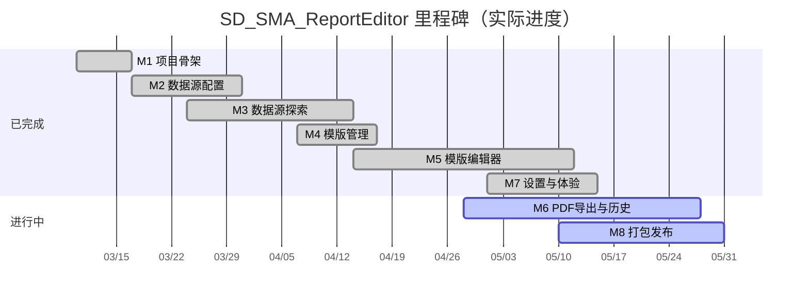
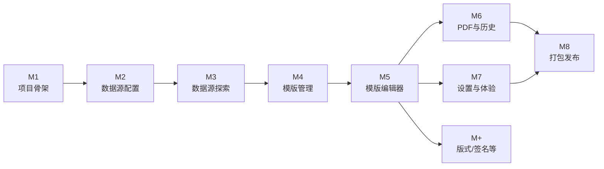

# SD_SMA_ReportEditor — 里程碑与工单跟踪

> **最后核对：** 2026-05-20（对照当前仓库 `backend/`、`frontend/`、`packaging/`）  
> 原计划中的「六元素拖拽 + 独立 Markdown 生成管线」已演进为 **版式/区带模板编辑器 + PDF 导出**；下文按**实际交付**标注状态。

---

## 进度总览

| 里程碑 | 目标（摘要） | 状态 | 说明 |
|--------|----------------|------|------|
| **M1** | 项目骨架、Electron 可启动 | ✅ 完成 | 2026-03-10 |
| **M2** | 数据源配置（DB / OPC UA） | ✅ 完成 | `config_store`、`database` / `opcua` 路由，`DataSourceConfig` |
| **M3** | 数据源探索与 SQL | ✅ 完成 | `DatabaseWorkbench`、OPC 树与节点选取，超出原 FieldPicker 范围 |
| **M4** | 报表模版管理 | ✅ 完成 | `template_store`、`TemplateManager` |
| **M5** | 可视化模版编辑 | ✅ 完成 | `report-template/` 工作区（版式区带、表项 SQL、导出预览栈） |
| **M6** | 报表生成与历史 | 🟡 部分完成 | **PDF 导出 + 文件夹历史**已交付；原计划的 Markdown `generator` / 后端 `history` API 未实现 |
| **M7** | 设置与体验 | ✅ 基本完成 | 配置导入导出、环境诊断、数据路径、Dashboard 入口 |
| **M8** | 打包发布 | 🟡 基本完成 | Win NSIS + Mac DMG + PyInstaller；正式 E2E 验收待登记 |
| **M+** | 计划外增量 | ✅ 已交付 | 版式预设、签名库、跨机配置、安装版诊断等（见文末） |

**图例：** ✅ 完成 · 🟡 部分完成 / 待验收 · ⬜ 未做

---

## 里程碑路线图

---

## 里程碑依赖关系

---

## M1 - 项目骨架（5 个工单）

**目标：** 可运行的空壳应用，前后端联通，Electron 窗口正常显示。

| 工单 | 内容 | 交付物 | 验收标准 | 状态 |
|------|------|--------|----------|------|
| M1-T1 | 创建目录结构、git init、README.md | 项目根目录 + git 仓库 | 目录结构完整，git 可提交 | ✅ 完成 |
| M1-T2 | Python 后端初始化：FastAPI + main.py + requirements.txt + data/ 自动创建 | 可启动的 FastAPI 服务 | `uvicorn main:app` 成功，`/docs` 可见 | ✅ 完成 |
| M1-T3 | 前端初始化：Vite + Vue 3 + vue-router + pinia | Vue 开发服务器 | `npm run dev` 成功 | ✅ 完成 |
| M1-T4 | Electron 主进程：启动 Python 子进程 + 加载前端 | `electron/main.cjs` | `npm run electron:dev` 弹出窗口且后端就绪 | ✅ 完成 |
| M1-T5 | 全局布局：侧边栏 + 多页面路由 + Dashboard 入口 | `MainLayout`、路由表 | 各菜单可切换 | ✅ 完成 |

**M1 完成标志：** Electron 启动后可见导航与 Dashboard，前后端通信正常。——**已达成（2026-03-10）**

---

## M2 - 数据源配置（5 个工单）

**目标：** 配置并保存 DB / OPC UA 连接，可测试连通性。

| 工单 | 内容 | 交付物（实际） | 验收标准 | 状态 |
|------|------|----------------|----------|------|
| M2-T1 | 配置读写与 data/ 初始化 | `core/settings.py`、`modules/config_store.py`、`init_data_dirs` | 启动创建 `data/`，`config.json` 可读写 | ✅ 完成 |
| M2-T2 | DB 连接 CRUD + 测试 | `api/routers/database.py`、`modules/db_connection_ops.py` | 增删改查 + 测试连接 | ✅ 完成 |
| M2-T3 | OPC UA 连接 CRUD + 测试 | `api/routers/opcua.py`、`modules/opcua_service.py` | 同上 | ✅ 完成 |
| M2-T4 | 前端 DB 连接管理 | `DataSourceConfig` + `features/datasource/database-workbench/` | 表单保存、列表、测试反馈 | ✅ 完成 |
| M2-T5 | 前端 OPC UA 管理 | `features/datasource/opcua/OpcUaPanel.vue` 等 | 同上 | ✅ 完成 |

**M2 完成标志：** 界面添加 MySQL 与 OPC UA 连接，测试通过，重启后配置仍在。——**已达成**

---

## M3 - 数据源探索与交互式浏览（5 个工单）

**目标：** 浏览库表 / OPC 节点树，编写并预览 SQL。

| 工单 | 内容 | 交付物（实际） | 验收标准 | 状态 |
|------|------|----------------|----------|------|
| M3-T1 | DB 探索 API | `database` 路由（库表列、查询、ER、DDL 预览等） | 可列出结构并执行只读查询 | ✅ 完成 |
| M3-T2 | OPC UA 探索 API | `opcua` 路由（浏览、读值、订阅相关） | 树形浏览与读值 | ✅ 完成 |
| M3-T3 | DB 级联浏览 UI | `ObjectTree`、`ConnectionManager`、`DatabaseWorkbench` | 连接→库→表→列可浏览 | ✅ 完成 |
| M3-T4 | OPC UA 树形 UI | `OpcUaTree`、`OpcUaNodePickerModal` | 展开节点、选取绑定 | ✅ 完成 |
| M3-T5 | SQL 编辑与预览 | `QueryEditor`、`QuickQueryPanel`、`DataGrid` 等 | 编写 SQL 并查看结果 | ✅ 完成 |

> 原工单中的 `FieldPicker.vue` / `SqlEditor.vue` **未按文件名实现**；能力已并入数据源工作台与模版编辑器内的绑定面板。

**M3 完成标志：** 能浏览真实库表与 OPC 节点，SQL 可执行预览。——**已达成**

---

## M4 - 模板管理（2 个工单）

**目标：** 报表模版增删改查，持久化到本地。

| 工单 | 内容 | 交付物（实际） | 验收标准 | 状态 |
|------|------|----------------|----------|------|
| M4-T1 | 模版 CRUD API | `api/routers/templates.py`、`modules/template_store.py` | API 可用，重启后数据不丢 | ✅ 完成 |
| M4-T2 | 模版管理页 | `TemplateManager.vue`、`NewTemplateWizardDialog` | 列表、新建、进入编辑 | ✅ 完成 |

**M4 完成标志：** 可新建模版并在列表管理，点击进入编辑器。——**已达成**

---

## M5 - 可视化模板编辑器（5 个工单）

**目标：** 可视化组装模版，绑定数据，预览导出效果。

| 工单 | 内容 | 交付物（实际） | 验收标准 | 状态 |
|------|------|----------------|----------|------|
| M5-T1 | 元素/区带工具 | `TemplateEditorWorkspace`、`TemplateBodyCanvas`、版式区对话框 | 可编辑页眉页脚/正文区带 | ✅ 完成 |
| M5-T2 | 编辑画布 | `LayoutPresetMiniPage`、`TemplateMiniPage` 等 | 选中、编辑、预览联动 | ✅ 完成 |
| M5-T3 | 属性与绑定 | `TemplateElementProps`、`TemplateTableSqlVisualPanel`、OPC/SQL 绑定 | 绑定 OPC 与表项 SQL | ✅ 完成 |
| M5-T4 | 导出预览 | `TemplateExportPreviewStack` | 预览与导出栈一致 | ✅ 完成 |
| M5-T5 | 保存加载联调 | 模版 API + 前端 `report-template` 模型 | 保存后重开内容恢复 | ✅ 完成 |

> 实现路径为 **版式 + 区带 + 表项** 模型（`frontend/src/lib/report-template/`），非原计划「六种 Element 拖拽面板」；`rptp/` 原型概念已并入主应用。

**M5 完成标志：** 可编辑模版、绑定数据源、预览导出效果、持久化不丢。——**已达成**

---

## M6 - 报表生成与历史（4 个工单）

**目标：** 生成报表、留存、回看导出。

| 工单 | 内容 | 交付物（实际） | 验收标准 | 状态 |
|------|------|----------------|----------|------|
| M6-T1 | 后端 Markdown 生成 | 原计划 `generator_module.py` | 模版 ID → Markdown 字符串 | ⬜ 未实现（需求改为 PDF 管线） |
| M6-T2 | 后端历史 API | 原计划 `history_module.py`（`data/history/*.md`） | 生成自动存档、列表 API | ⬜ 未实现 |
| M6-T3 | 生成报表前端 | `ReportGenerator.vue` | 手动/条件触发 **PDF 导出**（Electron） | ✅ 完成 |
| M6-T4 | 历史报表前端 | `ReportHistory.vue` | 监视导出文件夹中的 **PDF** 列表/预览 | ✅ 完成 |

**M6 完成标志（修订）：** 桌面版可选模版 → 导出 PDF → 在绑定文件夹中查看历史。——**PDF 路径已达成**；若仍需服务端 Markdown 归档，需新开工单。

---

## M7 - 全局设置与优化（3 个工单）

**目标：** 配置管理、首页体验、整体可用性。

| 工单 | 内容 | 交付物（实际） | 验收标准 | 状态 |
|------|------|----------------|----------|------|
| M7-T1 | 设置页 | `Settings.vue` + `features/settings/*` | 数据路径、配置包导入导出、本地迁移 | ✅ 完成 |
| M7-T2 | Dashboard | `Dashboard.vue` | 各功能快速入口（含版式、签名） | ✅ 完成 |
| M7-T3 | 体验与反馈 | 环境诊断、Toast、向导 `SetupWizard` 等 | 操作有反馈，安装版可自检环境 | ✅ 基本完成 |

**M7 完成标志：** 设置与首页可用，交互顺畅。——**已达成**

---

## M8 - 打包发布（3 个工单）

**目标：** 可交付的 Windows / macOS 安装包。

| 工单 | 内容 | 交付物（实际） | 验收标准 | 状态 |
|------|------|----------------|----------|------|
| M8-T1 | PyInstaller 后端 | `backend/scripts/build-backend-exe.*`、`backend/dist/report_backend/` | 无 Python 环境可跑后端 | ✅ 完成 |
| M8-T2 | Electron Builder 安装包 | `packaging/windows`、`packaging/mac`，NSIS + DMG | 安装后可启动，功能可用 | ✅ 完成 |
| M8-T3 | 端到端验收 | 测试记录 | 干净机器全流程无阻断 | 🟡 待正式登记 |

**M8 完成标志：** 安装包在目标系统上完成「配置 → 模版 → 导出 PDF」闭环。——**打包链路已通，建议补一份书面验收记录。**

---

## M+ - 计划外已交付能力

| 编号 | 能力 | 主要位置 | 状态 |
|------|------|----------|------|
| M+-1 | 版式预设（页眉页脚/纸张） | `layout_presets` API、`LayoutPresets.vue`、`LayoutPresetEditor.vue` | ✅ |
| M+-2 | 签名库 | `signatures` API、`SignaturesLibrary.vue` | ✅ |
| M+-3 | 运行环境诊断（开发/安装版区分） | `diagnostics_service`、`EnvironmentDiagnostics.vue` | ✅ |
| M+-4 | 跨机配置导入（密码按目标机重加密） | `config_import_export.py`、`ConfigImportExport.vue` | ✅ |
| M+-5 | 卸载清理用户数据、NSIS 增强 | `frontend/build/installer.nsh`、`packaging/` | ✅ |
| M+-6 | 开发/打包目录整理 | `scripts/dev/`、`packaging/`、文档 | ✅ |

---

## 待办建议（后续工单）

| 优先级 | 建议工单 | 说明 |
|--------|----------|------|
| 中 | M8-T3 书面 E2E 验收 | Win / Mac 各一台干净机，记录步骤与结论 |
| 低 | M6 补充 Markdown 导出（可选） | 若业务仍需要 `.md` 文件而非仅 PDF |
| 低 | M6 后端 history API（可选） | 若需脱离「文件夹监视」的统一历史库 |

---

## 变更记录

| 日期 | 内容 |
|------|------|
| 2026-03-10 | 创建里程碑与工单文档，共 8 个里程碑、32 个工单 |
| 2026-03-10 | M1 全部完成（T1–T5） |
| 2026-05-20 | 按仓库现状核对：M2–M5、M7 标为完成；M6 标注 PDF 路径完成、Markdown 管线未实现；M8 打包完成、E2E 待验收；增补 M+ 与待办建议 |
