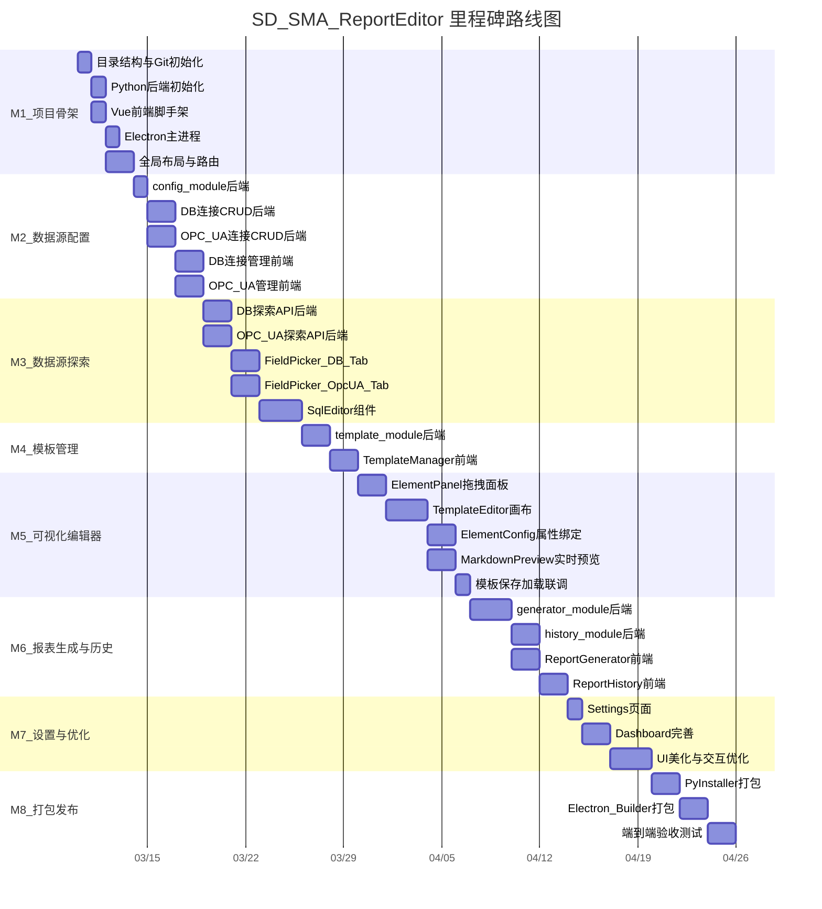
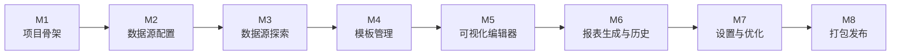

# SD_SMA_ReportEditor — 里程碑与工单跟踪

## 里程碑路线图

## 里程碑依赖关系

---

## M1 - 项目骨架（5 个工单）

**目标：** 搭建可运行的空壳应用，前后端能联通，Electron 窗口能正常显示。

| 工单 | 内容 | 交付物 | 验收标准 | 状态 |
|------|------|--------|----------|------|
| M1-T1 | 创建目录结构、git init、README.md | 项目根目录 + git 仓库 | 目录结构完整，git 可提交 | ⬜ 待做 |
| M1-T2 | Python 后端初始化：FastAPI + main.py 空壳 + requirements.txt + data/ 自动创建 | 可启动的 FastAPI 服务 | `uvicorn main:app` 启动成功，访问 `/docs` 可见 | ⬜ 待做 |
| M1-T3 | 前端初始化：Vite + Vue 3 + vue-router + pinia 脚手架 | 可启动的 Vue 开发服务器 | `npm run dev` 启动成功，浏览器可见空页面 | ⬜ 待做 |
| M1-T4 | Electron 主进程：main.js 启动 Python 子进程 + 加载前端页面 | Electron 窗口启动 | 双击运行能弹出窗口，内嵌前端页面，后端同时启动 | ⬜ 待做 |
| M1-T5 | 全局布局：侧边栏导航 + 7 个页面空壳路由 + Dashboard 快速入口卡片 | 完整导航框架 | 点击侧边栏各菜单能切换到对应空页面 | ⬜ 待做 |

**M1 完成标志：** Electron 窗口启动后，能看到侧边栏和 Dashboard，前后端通信正常。

---

## M2 - 数据源配置（5 个工单）

**目标：** 能配置并保存 DB 连接和 OPC UA 服务器信息，并测试连通性。

| 工单 | 内容 | 交付物 | 验收标准 | 状态 |
|------|------|--------|----------|------|
| M2-T1 | 后端 config_module：config.json 读写 + data/ 目录自动初始化逻辑 | config_module.py | 启动时自动创建 data/ 及子目录，config.json 可读写 | ⬜ 待做 |
| M2-T2 | 后端 DB 连接 CRUD API + 连接测试端点 | db_module.py 连接管理部分 | POST 创建连接 → GET 列出 → PUT 修改 → DELETE 删除 → POST test 返回成功/失败 | ⬜ 待做 |
| M2-T3 | 后端 OPC UA 服务器 CRUD API + 连接测试端点 | opcua_module.py 连接管理部分 | 同上，测试端点能连接到 OPC UA 服务器并返回状态 | ⬜ 待做 |
| M2-T4 | 前端 DataSourceConfig — DB 连接管理 UI | DataSourceConfig.vue（DB 部分） | 表单填写连接信息 → 保存 → 列表展示 → 测试按钮显示成功/失败 | ⬜ 待做 |
| M2-T5 | 前端 DataSourceConfig — OPC UA 服务器管理 UI | DataSourceConfig.vue（OPC UA 部分） | 同上 | ⬜ 待做 |

**M2 完成标志：** 在界面上添加一个 MySQL 连接和一个 OPC UA 服务器，测试通过，关闭重启后配置仍在。

---

## M3 - 数据源探索与交互式浏览（5 个工单）

**目标：** 能在界面上浏览数据库结构和 OPC UA 节点树，编写和预览 SQL。

| 工单 | 内容 | 交付物 | 验收标准 | 状态 |
|------|------|--------|----------|------|
| M3-T1 | 后端 DB 探索 API（列库、列表、列列、SQL 预览执行） | db_module.py 探索部分 | 各 API 返回正确结构，SQL preview 返回前 N 行 | ⬜ 待做 |
| M3-T2 | 后端 OPC UA 探索 API（节点树浏览、单节点值读取） | opcua_module.py 探索部分 | browse 返回子节点列表，read 返回节点值 | ⬜ 待做 |
| M3-T3 | 前端 FieldPicker 数据库 Tab（级联浏览 连接→库→表→列） | FieldPicker.vue DB 部分 | 点击连接展开库列表，逐级展开到列级别 | ⬜ 待做 |
| M3-T4 | 前端 FieldPicker OPC UA Tab（树形节点浏览 + 值预览） | FieldPicker.vue OPC UA 部分 | 树形展开节点，选中显示当前值 | ⬜ 待做 |
| M3-T5 | 前端 SqlEditor（CodeMirror + 补全 + OPC UA 参数提示 + 执行预览） | SqlEditor.vue | 写 SQL 有补全提示，点执行能看到结果表格 | ⬜ 待做 |

**M3 完成标志：** 在 FieldPicker 中能浏览到真实数据库表结构和 OPC UA 节点，SQL 编辑器能执行查询并预览结果。

---

## M4 - 模板管理（2 个工单）

**目标：** 能创建和管理报表模板（增删改查），模板持久化到本地文件。

| 工单 | 内容 | 交付物 | 验收标准 | 状态 |
|------|------|--------|----------|------|
| M4-T1 | 后端 template_module（模板 CRUD API + JSON 文件持久化到 data/templates/） | template_module.py | 创建/列出/获取/更新/删除模板 API 可用，重启后数据不丢失 | ⬜ 待做 |
| M4-T2 | 前端 TemplateManager.vue（模板列表 + 新建/复制/重命名/删除 + 点击进入编辑器） | TemplateManager.vue | 列表显示所有模板，各操作按钮可用，点击模板跳转编辑页 | ⬜ 待做 |

**M4 完成标志：** 能新建模板、在列表中看到、复制/重命名/删除，点击后跳到编辑器页面（编辑器此时为空壳）。

---

## M5 - 可视化模板编辑器（5 个工单，核心里程碑）

**目标：** 能通过拖拽组装模板，配置元素属性和数据绑定，实时预览 Markdown。

| 工单 | 内容 | 交付物 | 验收标准 | 状态 |
|------|------|--------|----------|------|
| M5-T1 | 前端 ElementPanel（6 种元素拖拽面板） | ElementPanel.vue | 左侧面板显示 6 种元素，可拖拽 | ⬜ 待做 |
| M5-T2 | 前端 TemplateEditor 画布（元素拖入/排序/选中/删除） | TemplateEditor.vue | 元素从面板拖入画布，可上下排序、选中高亮、删除 | ⬜ 待做 |
| M5-T3 | 前端 ElementConfig（属性编辑 + 绑定按钮调用 FieldPicker/SqlEditor） | ElementConfig.vue | 选中元素后右侧显示属性面板，点绑定弹出选择器，绑定后显示标识 | ⬜ 待做 |
| M5-T4 | 前端 MarkdownPreview（实时渲染模板为 Markdown 预览） | MarkdownPreview.vue | 画布内容变化时，右侧实时更新 Markdown 渲染结果 | ⬜ 待做 |
| M5-T5 | 模板保存/加载完整联调（前端编辑 ↔ 后端 template_module） | 联调完成 | 编辑后保存 → 关闭 → 重新打开，内容完整恢复 | ⬜ 待做 |

**M5 完成标志：** 能拖拽元素搭建模板、绑定数据库/OPC UA 数据源、实时预览 Markdown、保存后重新加载不丢失。

---

## M6 - 报表生成与历史（4 个工单）

**目标：** 选择模板一键生成报表，自动存入历史，可回看导出。

| 工单 | 内容 | 交付物 | 验收标准 | 状态 |
|------|------|--------|----------|------|
| M6-T1 | 后端 generator_module（读 OPC UA → 代入 SQL → 渲染元素 → 拼接 .md） | generator_module.py | 传入模板 ID → 返回生成的 Markdown 字符串 | ⬜ 待做 |
| M6-T2 | 后端 history_module（保存 .md + .meta.json、列表/筛选/删除 API） | history_module.py | 生成时自动存档，列表 API 返回历史记录 | ⬜ 待做 |
| M6-T3 | 前端 ReportGenerator.vue（选模板 → 生成 → 预览 → 导出 .md） | ReportGenerator.vue | 选择模板点生成，预览 Markdown，点导出保存文件 | ⬜ 待做 |
| M6-T4 | 前端 ReportHistory.vue（历史列表 + 筛选 + 查看 + 导出 + 删除） | ReportHistory.vue | 列表展示历史报表，可按时间/模板筛选，查看内容，导出/删除 | ⬜ 待做 |

**M6 完成标志：** 完整流程跑通——选模板 → 生成报表（真实数据填充）→ 预览 → 导出 → 在历史中可查看。

---

## M7 - 全局设置与优化（3 个工单）

**目标：** 完善配置管理、首页体验和整体 UI。

| 工单 | 内容 | 交付物 | 验收标准 | 状态 |
|------|------|--------|----------|------|
| M7-T1 | 前端 Settings.vue（存储路径配置 + JSON 全量配置导入/导出） | Settings.vue | 能修改存储路径、导入/导出 JSON 配置文件 | ⬜ 待做 |
| M7-T2 | Dashboard 完善（最近报表、快速入口、数据源连接状态概览） | Dashboard.vue | 首页展示有意义的信息，各入口可跳转 | ⬜ 待做 |
| M7-T3 | UI 美化与交互优化（加载状态、错误提示 toast、表单校验、快捷键） | 全局优化 | 操作有反馈，错误有提示，体验流畅 | ⬜ 待做 |

**M7 完成标志：** 软件整体可用性良好，首页信息丰富，各页面交互顺畅。

---

## M8 - 打包发布（3 个工单）

**目标：** 打包为 Windows 可安装软件。

| 工单 | 内容 | 交付物 | 验收标准 | 状态 |
|------|------|--------|----------|------|
| M8-T1 | PyInstaller 打包 Python 后端为 exe | backend.exe | 独立运行，无需 Python 环境 | ⬜ 待做 |
| M8-T2 | Electron Builder 打包为 Windows 安装包 | Setup.exe 安装包 | 安装后桌面快捷方式可启动，功能正常 | ⬜ 待做 |
| M8-T3 | 端到端验收测试（从配置到生成报表完整流程） | 测试报告 | 全流程走通无阻断性问题 | ⬜ 待做 |

**M8 完成标志：** 生成的安装包在干净 Windows 机器上安装后，完整流程可用。

---

## 变更记录

| 日期 | 内容 |
|------|------|
| 2026-03-10 | 创建里程碑与工单文档，共 8 个里程碑、32 个工单 |
