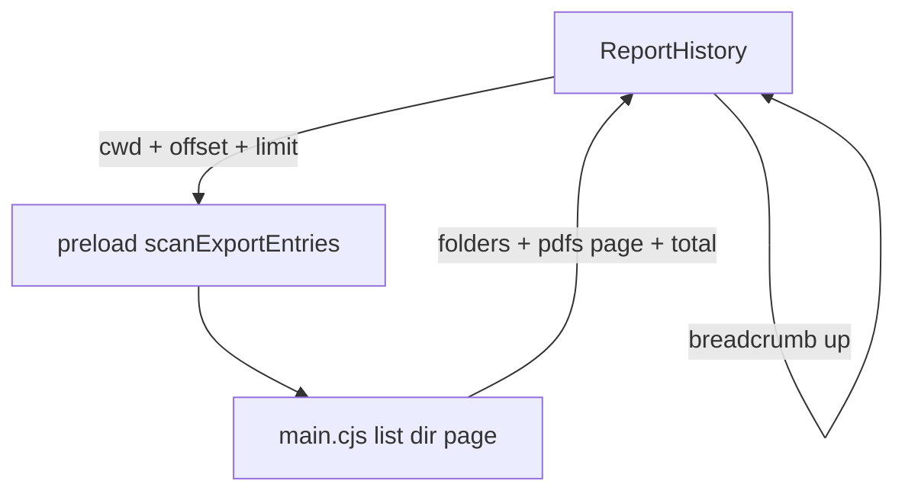

# ReportEditor 历史报表：子文件夹穿透 + 分页防卡顿

> 本文件为 **任务看板 / 实现计划**；规则见 [CLAUDE.md](../CLAUDE.md)。  
> **本轮仅写计划，未改代码。**  
> 相关：[`ReportHistory.vue`](../_Prj/SD_SMA_ReportEditor/frontend/src/views/ReportHistory.vue)、Electron `scan-export-pdfs`（[`main.cjs`](../_Prj/SD_SMA_ReportEditor/frontend/electron/main.cjs)）、[`PdfExportThumb.vue`](../_Prj/SD_SMA_ReportEditor/frontend/src/components/report-history/PdfExportThumb.vue)。  
> 仪表盘「近期 PDF」也调 `scanExportPdfs`，改造时需约定兼容或另开浅扫 API。

---

# ⌛️ 未完成：历史报表按文件夹浏览子目录，禁止平铺全量 PDF

## 产品诉求（2026-07-13）

1. 已在「历史报表」绑定**生成/导出文件夹**。  
2. 需要**文件夹穿透**：能看到并进入**子文件夹**，检查其内容。  
3. **不要**把各层 PDF **直接平铺**成一张大列表。  
4. 子目录内可能有**非常多**文件：必须**翻页**，并防止一次性加载卡顿。

## 现状（代码对照）

| 点 | 现状 |
|----|------|
| IPC `scan-export-pdfs` | 只 `readdir` **当前一层**；**跳过目录**（`if (!ent.isFile()) continue`）；只收 `.pdf` |
| UI | `ReportHistory` 把 `files` 一次性塞进 `rows` 渲染；空态文案「暂无 PDF」 |
| 防卡顿 | 缩略图模式已有 `IntersectionObserver` 懒挂载 `PdfExportThumb`；**列表模式仍一次渲染全部行**；**扫描本身无分页** |
| 与生成报表 | `watchDir` / `autoExportDir` 共用偏好；手动另存到其它路径仍不出现在此列表（文案已说明） |

因此：根目录下的 PDF 能列出；**子文件夹不可见、不可进**；大量文件时扫描+渲染都会卡。

## 目标体验（建议默认 · 待开工前确认）

### 导航模型（默认：**浏览器式单层进入**）

```text
[导出根目录]
  📁 2026-07/
  📁 batch-A/
  📄 root-report.pdf
       ↓ 点击 2026-07/
[导出根目录 / 2026-07]
  ← 上级
  📁 morning/
  📄 a.pdf
  📄 b.pdf
```

- 每次只列出**当前目录一层**：子文件夹 + 本层 PDF（其它扩展名默认不显示，或灰显「其它文件」可选）。  
- **禁止**打开根目录时递归扫全树、把所有 PDF 平铺。  
- 面包屑 / 「上级」回到父路径；不得跳出已绑定的导出根（安全边界）。

> 备选（若你更想树形）：左侧/行内可展开树，**每级懒加载**；仍禁止一次扫全树。计划默认不做深树，除非拍板改选。

### 分页与防卡顿（默认）

| 层 | 策略 |
|----|------|
| **扫描 IPC** | 按当前目录分页返回：`offset` + `limit`（建议默认 **50**，可选 20/50/100）；返回 `total` / `hasMore` |
| **排序** | 文件夹优先，再按修改时间降序（或名称）；文件夹与 PDF 共用同一分页序列 |
| **列表 UI** | 底部分页条（上一页 / 下一页 / 页码 / 每页条数）；**只挂载当前页行** |
| **缩略图 UI** | 仍只渲染当前页卡片；保留视口懒加载 PDF 预览（现有 IO） |
| **主进程** | `readdir` 可先拿名字列表再按页 `stat`（避免上万文件时同步 `stat` 全量）；大目录用 `withFileTypes`，异常项跳过 |
| **取消/重入** | 快速连点进入子目录时用 generation token，丢弃过期结果 |

### 明确不做（本功能边界）

- 不把子目录 PDF **递归合并**进根列表。  
- 不在浏览器壳实现本地读盘（仍仅 Electron）。  
- 不在本切片做全文搜索全树（可后续：按需深度搜索 + 进度条）。  
- 不自动删除空文件夹策略变更。

## 架构草案



### API 演进建议

现有：

```ts
scanExportPdfs({ dir }) → { ok, files: PdfRow[], dir }
```

建议新增（或扩展兼容）：

```ts
scanExportEntries({
  rootDir: string,   // 绑定根，防逃逸
  cwd?: string,      // 当前浏览目录，默认 = rootDir
  offset?: number,
  limit?: number,
  sort?: "mtime_desc" | "name_asc",
}) → {
  ok, rootDir, cwd,
  entries: Array<
    | { kind: "dir"; name; path; modifiedAt?; childHint?: "has_pdf" | "unknown" }
    | { kind: "pdf"; name; filePath; fileUrl; sizeBytes; modifiedAt }
  >,
  total: number,
  offset: number,
  limit: number,
}
```

- **Dashboard / mirror** 若只需「最近几个 PDF」：可继续调旧 API，或新 API `limit=5` + `cwd=root` 且 `kinds=pdf_only`（实现时定）。  
- 路径校验：`cwd` 必须在 `rootDir` 之下（`path.resolve` + relative 不以 `..` 开头）。

### UI 改动要点（`ReportHistory.vue`）

1. 面包屑：`根 / a / b`，点击任一段跳转。  
2. 行类型：文件夹行（图标、进入）；PDF 行（打开 / 位置 / 删除，行为同现）。  
3. 空态区分：本层无条目 vs 仅有空子文件夹。  
4. 分页控件 + loading 遮罩；切换目录重置到第 1 页。  
5. 文案更新：说明「显示子文件夹；进入后分页浏览，不会一次加载全部」。

## 测试计划（实现时先红后绿）

### A. 主进程列表纯函数 / IPC 契约

| # | 用例 |
|---|------|
| A1 | 仅一层：返回 dir + pdf；不包含孙目录文件 |
| A2 | 分页：`total=120, limit=50` → 第 1 页 50、第 3 页余量正确 |
| A3 | 排序：文件夹排在 PDF 前（同 kind 内 mtime/name 稳定） |
| A4 | `cwd` 逃出 `rootDir` → `ok=false` |
| A5 | 无权限/坏链目录项跳过不炸 |

### B. 前端导航 / 分页

| # | 用例 |
|---|------|
| B1 | 点文件夹 → `cwd` 变深、页码归 1 |
| B2 | 上级 / 面包屑 → 路径回退 |
| B3 | 当前页切换不请求其它页数据 |
| B4 | 快速连点只应用最后一次结果 |

### C. 手工 / 性能

| # | 步骤 | 期望 |
|---|------|------|
| C1 | 根下有子文件夹 | 可见文件夹行，非仅 PDF |
| C2 | 单目录 >500 PDF | 分页可用；切页无明显整页卡死 |
| C3 | 缩略图模式 | 仅当前页 + 视口内加载预览 |
| C4 | 仪表盘近期 PDF | 不因本改动空白或超时（兼容） |

## 实现切片建议

1. **IPC**：`scanExportEntries`（分页 + dirs）+ 单测；旧 `scanExportPdfs` 薄封装或标 deprecated。  
2. **ReportHistory**：面包屑 + 文件夹行 + 分页。  
3. **Dashboard/mirror**：兼容浅扫。  
4. 发版说明 + 手工 C 组。

## 开工前请确认（默认已选，可改）

| 项 | 默认 |
|----|------|
| 导航 | **单层进入**（非一次性树展开） |
| 分页单位 | **当前目录条目**（文件夹+PDF 混排），每页 **50** |
| 非 PDF 文件 | **默认隐藏** |
| 文件夹「含 PDF」角标 | **本切片可不做**（避免额外递归）；需要再说 |

## 本轮范围

- ✅ 记录诉求与计划（本文档）  
- ⌛️ 按上表确认后开工实现
