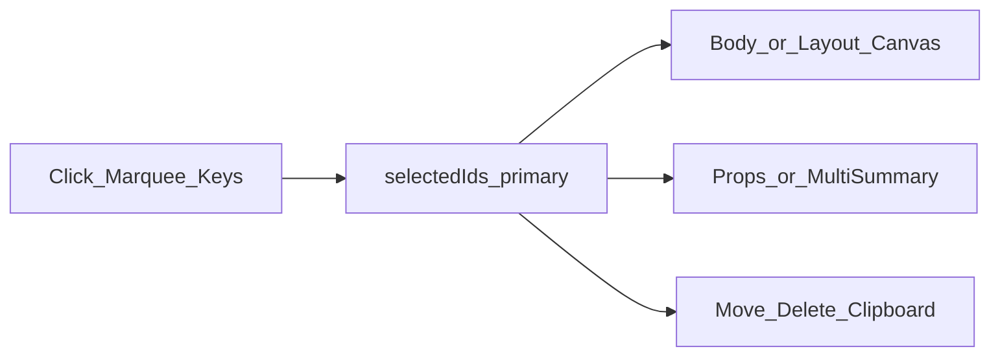

# ReportEditor 模版 / 版式编辑器：多选控件

> 本文件为 **任务看板 / 实现计划**；规则见 [CLAUDE.md](../CLAUDE.md)。  
> **本轮仅写计划，未改代码。**  
> 相关：  
> - 模版：[`TemplateEditorWorkspace.vue`](../_Prj/SD_SMA_ReportEditor/frontend/src/components/report-template/TemplateEditorWorkspace.vue)、[`TemplateBodyCanvas.vue`](../_Prj/SD_SMA_ReportEditor/frontend/src/components/report-template/TemplateBodyCanvas.vue)  
> - 版式：[`LayoutPresetEditor.vue`](../_Prj/SD_SMA_ReportEditor/frontend/src/views/LayoutPresetEditor.vue)、[`LayoutPresetPaperCanvas.vue`](../_Prj/SD_SMA_ReportEditor/frontend/src/components/report-template/LayoutPresetPaperCanvas.vue)  
> - 渲染契约已有 `selectedIds`：[`layout-zone-render.ts`](../_Prj/SD_SMA_ReportEditor/frontend/src/lib/report-template/layout-zone-render.ts)  
> - 单选查找：[`editor-selection.ts`](../_Prj/SD_SMA_ReportEditor/frontend/src/lib/report-template/editor-selection.ts)（007 扩展页眉定位）

---

# ⌛️ 未完成：模版编辑器与版式编辑器支持多选控件

## 产品诉求（2026-07-13）

在**报表模版编辑**与**版式（页眉页脚）编辑**中，支持**一次选中多个控件**，便于批量移动、删除、复制等操作（具体批量能力见下方切片）。

## 现状（代码对照）

| 区域 | 选中模型 | 说明 |
|------|----------|------|
| 模版画布 | `selId: string \| null`（`v-model:selected-id`） | 点击即单选替换；属性面板绑 `sel` 单元素 |
| 版式画布 | `presetCanvasSelId` 同理 | 三带（页眉/正文/页脚）共用一个 id |
| 键盘 | Ctrl/Cmd+C/X/V、Delete 均依赖**单个** `sel` | 无 Shift/Cmd 加选 |
| DOM 导出渲染 | `RenderZoneOptions.selectedIds?: Set` | **已预留多选描边**，编辑画布 Vue 侧未接 |
| 健康跳转 focus | 设单个 `selId` | 多选落地后仍应兼容「主选中 + 集合」 |

模版页眉/页脚/装饰层目前多为只读预览选中（007）；多选范围需明确是否包含 zone 只读层。

## 目标体验（建议默认 · 待开工前确认）

### 选择交互

| 操作 | 行为（默认） |
|------|----------------|
| 单击控件 | 单选该控件（清空其余） |
| **Ctrl/Cmd + 单击** | 切换：已在集合则移除，否则加入 |
| **Shift + 单击** | 在「同层列表」内从锚点到目标做区间加选（模版：当前 sheet 的 body 页列表；版式：当前 zone 列表） |
| 空白处按下拖拽 | **框选（marquee）**：矩形与控件包围盒相交则选中；可选修饰键：无修饰=替换选中，Ctrl/Cmd=并入 |
| Esc / 点空白（非框选） | 清空多选 |
| 健康 `?focus=` | 设为单选该 id（集合仅含该 id） |

> Mac：Cmd；Windows/Linux：Ctrl。与系统多选惯例一致。

### 视觉

- 所有选中项显示选中描边（复用/扩展 `.sel` / `.selected`）。  
- **主选中（primary）**：多选时最后一个点中的（或属性面板当前编辑对象）可略强描边 / 手柄仅主选显示缩放柄（默认：**仅 primary 显示 resize 手柄**，避免多框手柄打架）。  
- 框选过程中显示半透明矩形。

### 批量操作（MVP 必做）

| 操作 | 多选行为 |
|------|----------|
| Delete / Backspace | 删除集合内全部（一次 undo） |
| 拖拽移动 | 整组平移同一 Δx/Δy（夹紧到内容区） |
| Ctrl/Cmd+C | 复制集合（剪贴板存数组） |
| Ctrl/Cmd+X | 剪切集合 |
| Ctrl/Cmd+V | 粘贴为新 id 组，并选中新组 |

### 批量操作（建议二期）

| 操作 | 说明 |
|------|------|
| 对齐 / 分布 | 左对齐、顶对齐、水平/垂直分布 |
| 统一字号/颜色/边框 | 属性面板「多选」态：只显示共有可批量字段 |
| 一键隐藏边框 | 已有「当前页非表格」；可扩展为「仅选中项」 |
| 跨 sheet 多选 | **默认不做**：选中仅限当前 sheet（模版）或当前版式三带内（版式允许跨 header/body/footer 需拍板） |

### 属性面板

- **单选**：现有 `TemplateElementProps` / `LayoutPresetElementProps`。  
- **多选（MVP）**：右侧只显示「已选 N 项」摘要（类型计数；可选列表点选切换 primary）；**不**打开表格单元格 / 内联文本编辑。  
- **多选批改字段（二期 · 已拍板后置）**：见下方「批次划分」B3；只编辑交集字段，冲突字段隐藏或禁用。

## 批次划分（2026-07-13 确认）

| 批次 | 范围 | 说明 |
|------|------|------|
| **B1 · MVP** | 多选状态 + 高亮 + Ctrl/Cmd 加选 + 框选 + 组移动/删除/多剪贴板 | 属性栏仅摘要；单选仍走完整属性面板 |
| **B2** | Shift 区间加选；对齐 / 分布（可选同批或紧随） | 不依赖属性批改 |
| **B3 · 属性批改** | 多选时右侧可编辑**交集字段**（如 `showBorder`、填充/文字颜色、字号、换行等共性样式） | 类型专属 / 绑定 / 表格格编辑仍单选；写值一次 undo |

> 用户确认（2026-07-13）：**批量改属性记入计划、分批次后实现**；本文件补充 B3 测试用例，**本轮不写代码**。

### B3 属性批改 · 建议字段（交集）

| 字段族 | 适用 | 冲突时 |
|--------|------|--------|
| `showBorder` | 非 table 或集合内均非 table | 含 table → 隐藏该项 |
| 填充色 / 文字色 | 选中项均有对应属性 | 缺省则隐藏 |
| 字号 / 字重（若模型统一） | text/box 等同构 | 混入其它类型 → 隐藏 |
| 换行 `textAutoWrap` | 均为 text/box | 否则隐藏 |
| X/Y/W/H 数值 | **默认不做**（易踩夹紧与相对布局；用组拖拽代替） | — |
| OPC/SQL 绑定、签名、表格单元格 | **永不批改** | 仅单选 |

混合值 UI：集合内取值不一致时控件显示「混合」/ indeterminate；用户改一次则整组写入同一值。

## 数据模型建议

```ts
// 模版 / 版式共用思路
selectedIds: string[]          // 有序；末项 = primary
// 或
selectedIdSet: Set<string>
primaryId: string | null       // === selectedIds.at(-1)
```

兼容迁移：

- 保留 `selId` 计算属性 = `primaryId`，减少一次性改爆。  
- 画布 `defineModel` 逐步改为 `selectedIds`（数组）或增加并行 model。

剪贴板：扩展 [`editor-element-clipboard.ts`](../_Prj/SD_SMA_ReportEditor/frontend/src/lib/report-template/editor-element-clipboard.ts) 支持多元素 payload（相对锚点坐标，粘贴时整体偏移）。

## 架构要点



| 模块 | 改动 |
|------|------|
| `TemplateBodyCanvas` | 多选高亮；Ctrl/Cmd/Shift；marquee；拖拽整组 |
| `TemplateEditorWorkspace` | `selectedIds` 状态；del/copy/cut/paste/键盘；多选属性壳 |
| `LayoutPresetPaperCanvas` + Editor | 同上（三带） |
| `layout-zone-render` | 编辑预览若走 DOM 导出，接上已有 `selectedIds` |
| 纯函数 | `selection-set.ts`：toggle / range / marqueeHitTest / translateMany |

### 模版 zone 只读层（页眉等）

- **默认 MVP**：多选仅针对**可编辑画布控件**（body/cover/back 的 `TemplateElement`）；页眉 zone 仍单击定位（007），不参与框选批量删除。  
- 若产品要求页眉也可多选改绑：需版式编辑器侧完成，或明确「只读多选仅高亮」。

### 版式跨 zone

- **默认**：框选/加选可跨 header/body/footer（同一版式纸面）；删除/移动按各 zone 数组分别改。  
- 若易混：可改为「仅当前编辑带」——开工前确认。

## 测试计划（实现时先红后绿）

### A. 选择集合纯函数

| # | 用例 |
|---|------|
| A1 | toggle 加/减 |
| A2 | range 同列表区间 |
| A3 | marquee 与 AABB 相交 |
| A4 | primary = 末项；清空 |

### B. 模版画布（组件/集成）

| # | 用例 |
|---|------|
| B1 | Ctrl 点两个 → 双高亮 |
| B2 | 框选三个 → 集合长度 3 |
| B3 | Delete 一次去掉全部且可 undo |
| B4 | 拖拽组移动 Δ 一致 |
| B5 | focus 路由仍单选 |

### C. 版式画布

| # | 用例 |
|---|------|
| C1–C4 | 同 B，作用于 preset 三带 |

### D. 手工

| # | 步骤 |
|---|------|
| D1 | 模版正文多选移动/删除/复制粘贴 |
| D2 | 版式页眉+正文跨带（若启用） |
| D3 | 多选时属性面板为摘要，不误开表格格编辑 |
| D4 | 触控屏：至少单击单选不回归；框选可用鼠标优先 |

### E. 属性批改（B3 · 后置；实现时先红后绿）

| # | 用例 |
|---|------|
| E1 | 两同类型 text 多选 → 面板出现共有色/边框；改 `showBorder` → 两者同变、一次 undo 还原 |
| E2 | text + table 多选 → 不出现表格单元格编辑；`showBorder` 按冲突规则隐藏或仅作用于非 table（实现时二选一写死并测） |
| E3 | 两 text 颜色不同 → 色控件为「混合」；选新色后两者均为新色 |
| E4 | 多选时改绑定类入口不可用（无 OPC 批改） |
| E5 | 点摘要切到单选 primary → 恢复完整 `TemplateElementProps` |
| E6 | 版式编辑器同样 E1/E3（`LayoutPresetElementProps` 路径） |

## 实现切片建议

1. **B1**：状态 + 高亮 + Ctrl 加选 + 框选 + 组移动/删除/多剪贴板 + 属性摘要壳  
2. **B2**：Shift 区间；对齐/分布（可选）  
3. **B3**：多选交集字段批改 + 上表 E1–E6  
4. （可选）一键隐藏边框扩展为「仅选中项」

## 开工前请确认（默认已选）

| 项 | 默认 |
|----|------|
| 加选键 | Ctrl/Cmd+点；Shift 区间；空白拖拽框选 |
| Resize 手柄 | 仅 primary |
| 模版 zone 页眉 | MVP **不参与**批量多选 |
| 版式跨带 | **允许**同一纸面跨 header/body/footer |
| 多选属性批量改 | **B3 后置**（已确认）；MVP 仅摘要 + 组操作 |
| 触控多选 | MVP 不强制双指；鼠标/触控板优先 |

## 本轮范围

- ✅ 记录诉求与计划（本文档）  
- ✅ 确认：属性批改分批次（B3）+ 补充 E 组测试用例  
- ⌛️ B1 开工实现（待排期）
