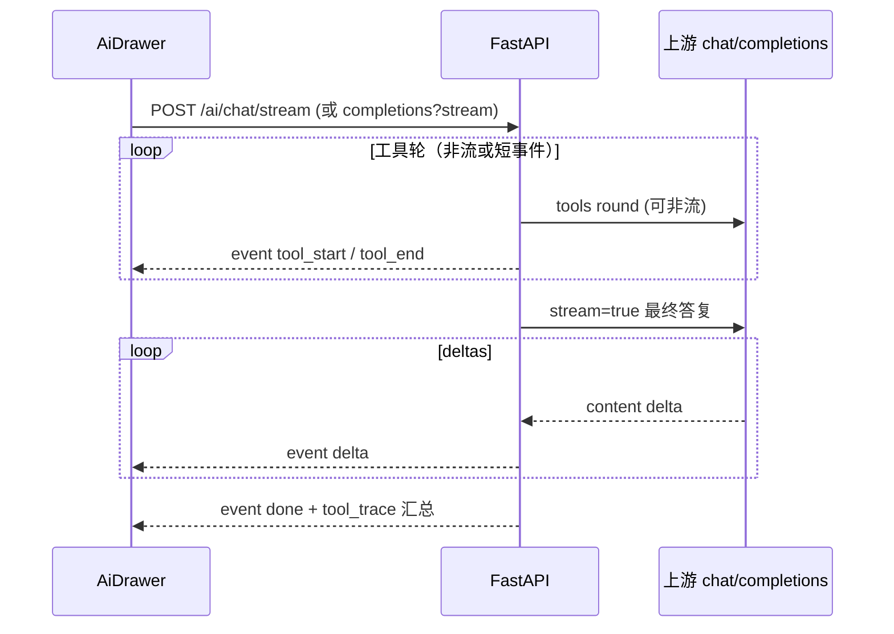

# ReportEditor AI 助手：流式输出（Streaming）

> 本文件为 **任务看板 / 实现计划**；规则见 [CLAUDE.md](../CLAUDE.md)。  
> **本轮仅写计划，未改代码。**  
> 产品诉求：AI 回复需**流式输出**（边生成边显示），降低长回答等待感。  
> 相关：[`ai_openai.py`](../_Prj/SD_SMA_ReportEditor/backend/api/routers/ai_openai.py) `run_chat_completion`、[`AiDrawer.vue`](../_Prj/SD_SMA_ReportEditor/frontend/src/features/ai-assistant/AiDrawer.vue)、[`aiSettings.ts`](../_Prj/SD_SMA_ReportEditor/frontend/src/api/aiSettings.ts)。  
> 交叉：[docs/006](006-🚧-ReportEditor-AI上游错误体验.md) 轨迹 H1 曾明确「不做 SSE」——本需求**推翻该边界**，以流式为独立切片。

---

# ⌛️ 未完成：AI 助手正文流式输出

## 产品诉求（2026-07-13）

1. 用户发送消息后，助手气泡应**逐步出现文字**（打字机/增量追加），而不是整段一次性弹出。  
2. 长回答、带工具调用的对话也要有可感知进度（至少工具进行中 + 最终正文流式）。  
3. 本轮**先写看板**；实现另开版本切片。

## 现状（代码对照）

| 点 | 现状 |
|----|------|
| 后端 `body.stream` | **直接 400**：文案「0.3.0 暂不支持 stream=true」 |
| `_forward_llm` | 一次性 `await` 上游整包 JSON |
| 工具环 | `MAX_TOOL_ROUNDS` 内多轮非流式；结束后 `attach_tool_trace` 一次返回 |
| 探活 claim guard | 整段文案检测后再调 / 改写（依赖完整 `assistant_text`） |
| 前端 AiDrawer | 等 HTTP 完成再插入助手消息；轨迹随响应一次性下发 |

结论：架构按**非流式完成对象**设计；要流式需前后端协议升级，并处理工具环与 claim 守卫的时序。

## 目标体验（建议默认）

```text
用户发送
  → 助手气泡出现（可空或「…」）
  → （可选）工具轨迹行逐步出现：调用中 → 成功/失败
  → 正文 token/片段增量追加
  → 结束：可停止按钮消失；轨迹可折叠（同 0.3.66）
```

- **可中止**：生成中提供「停止」；中止后保留已流出内容并标 `cancelled`。  
- **错误**：上游额度/网络错误用现有中文映射，流上以 error 事件结束（不丢半截时尽量保留已显示正文）。

## 名词说明（整窗）

### 「关抽屉」是什么

就是 AI 助手右侧边栏的**关闭**：点标题栏 **×**，或点旁边半透明遮罩。关掉后回到只剩右下角「AI」浮动按钮。

与流式相关的决策是：若正在生成时关掉——

| 策略 | 含义 |
|------|------|
| **后台继续（已确认）** | 关掉 ≠ 停止；请求与排队仍在跑；再打开可见进度/结果；Pending 确认框仍可盖在主界面上（Teleport） |
| Abort | 关掉 = 取消请求（**不采用**） |

「关抽屉」**不是**「停止生成」，也**不是**「清空聊天」。停止请用「停止」按钮；清空用「清空」。

### Pending 确认弹框是什么

AI 调到**危险/需本机确认**的工具时，不会直接改完，而是弹出一张**确认对话框**（组件 `AiPendingPromptDialog`），例如：

- 输入数据库密码  
- 确认删除模版/版式  
- 确认导入配置 / 快速复位  
- 确认模拟结批、选导出目录  
- 确认解锁数据源  

和聊天气泡是两层 UI：对话可以还在「生成中」，中间盖一张确认框；你点确认/取消后，工具才真正做完或放弃。流式**不取消**这套安全闸。

### 会话持久化（你已确认需要）

把聊天记录（用户/助手正文 + 工具轨迹摘要）存到本机（建议 `localStorage` 或现有 client prefs），使得：

- 关掉抽屉再打开 → **还在**  
- 刷新页面 / 重启应用 → **还在**（同机）  
- 「清空」→ 显式删掉本地记录  

默认不做：云端同步、多设备、多会话 Tab（可以后再开）。

### 边栏宽度可调（你已倾向需要）

当前抽屉宽度写死。建议支持：

- 左缘拖拽调宽（记住上次宽度）  
- 设最小/最大宽（如 320px～720px），避免挤没主界面  

与流式同版或紧随一小版均可；**纳入 014 范围**。

### 发送排队（你已提出）

生成中**仍可发下一条**：用户气泡立刻出现并标「排队中」；当前回答结束后自动按序发下一问并连续回答。

| 规则 | 约定 |
|------|------|
| 并发请求 | **串行**：同一时刻只跑一轮上游请求 |
| 发送 | 生成中输入框可发 → 入队（不打断当前流） |
| 停止 | **停止**只取消**当前**这一轮；队列里下一条默认仍继续（可选：停止时一并清队，见 G1） |
| **关抽屉** | **不停止**生成；不 Abort、**不清队**；再打开续看；可选 FAB 角标「生成中」 |
| 清空 | 清消息 + **清队列** + Abort 当前 |
| Pending | 当前轮卡在确认框时，队列暂停；确认/取消后本轮收尾，再跑队首；**抽屉关掉时 Pending 仍弹出** |
| 上限 | 建议最多排队 3～5 条，满则提示 |

> 不做：多路并行同时问模型（易乱序、费 Token、工具冲突）。

### 开工前仍建议拍板的缺口（对照代码 + 整窗体验）

下列项 014 原先未写死或只写了「实现时定」。**建议默认已标 ★**；你可改。

| # | 缺口 | 为何要补 | 建议默认 ★ |
|---|------|----------|------------|
| G1 | **停止是否清队** | 停当前后下一条自动开跑，可能不是你想要的 | **停止 = 仅当前轮**；另提供「停止并清空排队」（或二次确认） |
| G2 | **本轮出错后队列** | 额度用尽/网络失败时连发无意义 | **暂停队列**；气泡提示「后续排队已暂停」，可点「继续排队」 |
| G3 | **取消单条排队** | 发错了不想等整队 | 排队气泡可点 × **仅删该条** |
| G4 | **入队时的页上下文** | 排队期间你可能已换页 | **出队发送时**用**当时** `pageContext`（不是键入时） |
| G5 | **停止 vs Pending** | 点「停止」时确认框还开着 | **停止**时 Abort 并 **取消该轮 pending**；**关抽屉不动** pending/请求 |
| G6 | **SSE 缓冲** | Electron/反向代理可能整包缓冲，看起来「不流式」 | 后端禁缓冲（`X-Accel-Buffering: no` 等）+ 前端按 chunk 刷；验收时用真机看 |
| G7 | **消息稳定 id** | 现用 `v-for :key="i"`，排队/持久化易乱 | 每条消息 `id`（uuid）；持久化与排队都靠 id |
| G8 | **生成中输入框** | 现状 `loading` 时 textarea/发送都 disabled | 排队策略下：**输入与发送可用**；仅「停止」替换「空闲时的发送语义」或双按钮并存 |
| G9 | **流中途崩溃/刷新** | 半截助手气泡 | 持久化在 `done`/`error`/`cancelled` 时写盘；半截可标未完成，刷新后保留已显示文字 |
| G10 | **窄屏 / 小窗** | 只调宽不够 | 宽度自适应：`<480` 时抽屉近全宽；拖拽仍受 min/max 约束 |
| G11 | **无障碍** | 流式读屏 | 助手气泡区域 `aria-live="polite"`（节流，避免每 token 念一遍） |
| G12 | **Esc** | Pending 已支持 Esc 取消 | 无 Pending 时 Esc **只关抽屉**（**不** Abort，与关抽屉同策略） |
| G13 | **006 交叉** | 006 仍写「不做 SSE」 | 发版时在 006 加一句：流式改由 **014** 覆盖，不矛盾 |
| G14 | **claim `replace` 闪一下** | 探活改写会整段替换 | 允许一次整段替换；UI 可短暂「已纠正」角标（非必须） |
| G15 | **空状态快捷句** | 现状只有一句说明 | **二期**（如「探活连接」「最近导出」一键填入） |

### 明确可继续放二期（不必挡开工）

- 单条 **复制** / **重试**（Q10）  
- 导出聊天记录、搜索历史  
- 多会话 Tab、云同步  
- 语音/多模态  
- 空状态快捷 chips（G15）  
- Token/费用估算显示  

---

## 整窗交互补遗（相对「仅流式协议」· 2026-07-13）

流式只是 AiDrawer 体验的一环。对照当前抽屉（截图 + `AiDrawer.vue`），下列项一并约定；**★ = 流式同版或紧随小版**。

### 现状缺口（整窗）

| 点 | 现状 | 约定 |
|----|------|------|
| 正文展示 | `<pre>` 纯文本 | ★ 轻量 Markdown |
| 等待态 | 「思考中…」；无「停止」 | ★ 气泡增长 + **停止** |
| 工具轨迹 | 结束后一次性挂上 | ★ 边到边 `tool` 事件 |
| 阶段提示 | 无 | ★ 工具中 / 撰写中 |
| 并发发送 | 禁发；无队列 | ★ **可发入队**；串行续答（见上） |
| 清空 / 关抽屉 | 生成中可关且不中止 | ★ 清空有保护；**关抽屉不 Abort、不清队** |
| Pending 弹框 | 已有，与聊天并行 | ★ 保持；流式中仍可弹 |
| 自动滚底 | 有 | ★ 流式沿用 |
| **会话持久化** | 关抽屉/刷新丢失 | ★ **要做**（本机；见上） |
| **边栏宽度** | 固定 | ★ **可拖拽调宽并记住** |
| 重试 / 复制单条 | 无 | 二期可选 |
| 云同步 / 多会话 | 无 | 边界外 |

### 流式时按钮与状态机（默认）

```text
空闲：     [清空] [发送]
生成中：   [清空需确认] [停止] [发送→入队]；输入框可用
有排队：   用户气泡旁「排队中」+ 可 × 取消该条；当前 done 后自动发队首
停止当前： 当前气泡「已停止」；队列默认仍继续（见 G1）
本轮出错： 暂停队列（见 G2）；可继续排队
关抽屉/Esc：仅隐藏 UI；**不** Abort、**不**清队；后台继续；Pending 仍可弹
停止：      Abort 当前 + 取消本轮 Pending（见 G5）；队列默认仍继续（见 G1）
```

### Markdown（建议默认 ★ 轻量同版）

| 策略 | 说明 |
|------|------|
| **默认** | 助手气泡用轻量 Markdown（标题/列表/表格/行内代码）；用户气泡仍纯文本 |
| 流式 | 每帧或节流重渲染；未闭合 \`\`\` 当作普通文本，避免整页闪崩 |
| 不做 | 原始 HTML、脚本、外链图片随意加载 |

> 若嫌同版过大：流式先 `<pre>` 增量，Markdown **紧随 0.x+1**。

### 持久化落点（建议）

1. Key：如 `report-editor-ai-chat-v1`（可含 width）。  
2. 存：`messages[]`（role/content/toolTrace 脱敏后）、`drawerWidthPx`。  
3. 不存：API Key、pending 密码、完整工具原始大结果。  
4. 上限：条数或总字符封顶（如最近 50 条 / 200KB），防撑爆 localStorage。

### 明确仍属 014 边界外

- 006 能力矩阵 A–N 端到端剧本  
- 语音/多模态  
- 会话云同步 / 多会话 Tab  

## 架构草案（默认：SSE）



### 事件建议（NDJSON 或 `text/event-stream`）

| event | 载荷 | 说明 |
|-------|------|------|
| `status` | `{ phase: "thinking" \| "tools" \| "writing" }` | 可选 UI 状态 |
| `tool` | 与 `report_editor_tool_trace` 单步同形 | 对齐 0.3.66 轨迹 |
| `delta` | `{ text: string }` | 正文增量 |
| `replace` | `{ text: string }` | claim 改写整段替换（少用） |
| `done` | `{ tool_trace?, finish_reason }` | 正常结束 |
| `error` | `{ message }` | 失败结束 |

**默认传输**：`text/event-stream`（SSE）。备选：NDJSON chunked（便于部分代理）。

### 与工具环 / claim guard 的默认策略

| 阶段 | 策略（默认 **S1**） |
|------|---------------------|
| **工具轮** | 仍可对上游用**非流式**拿 `tool_calls`（实现简单、与现执行器兼容）；UI 用 `tool` 事件展示进度 |
| **最终正文** | 对上游 `stream=true`，转发 `delta` |
| **探活强制再调** | 最终流结束后若命中假成功声称：发纠错再调一轮（可再流式）；仍失败则 `replace` 或尾部追加如实失败文案 |
| **密文** | 流式路径同样禁止把备份口令/密文拼进 delta |

> 备选 **S2**：全轮次上游皆 stream，并解析流式 `tool_calls` 增量——复杂度高，本切片不默认。

## 拟改落点

1. **后端**：解除 `stream=true` 硬拒绝；新增流式入口（可保留旧非流式）。  
2. **上游转发**：流式读 SSE；解析 chunk → 自家 event。  
3. **前端**：流式增量 + **停止** + 轨迹边到边；轻量 Markdown。  
4. **持久化**：本机保存消息与抽屉宽度；清空可删；稳定消息 id。  
5. **调宽**：左缘拖拽，min/max + 记住宽度；窄屏近全宽。  
6. **排队**：入队/出队、单条取消、出错暂停；出队时取当前页上下文。  
7. **SSE 抗缓冲**：响应头与代理注意；单测 + 真机验收。  
8. **单测**：chunk 解析；中止；持久化；宽度钳制；队列串行。

## 明确不做（本切片边界）

- 不改模型供应商协议本身（仍走现有 Base URL + Key）。  
- 不在本切片做语音/多模态流。  
- 不强制能力矩阵 A–N 与流式捆绑（006 仍独立排期）。  
- 不做云同步 / 多会话 Tab。  
- 不做复制/重试单条（二期）。

## 验收（开工后）

- [ ] 普通问答：正文流式出现（真机无「整包蹦出」）  
- [ ] 含工具：轨迹边到边；正文仍流式  
- [ ] **停止**可中止当前轮（可取消 Pending）；**关抽屉/Esc 不停止生成**  
- [ ] 关着抽屉时生成/排队仍继续；再打开可见进度；Pending 仍可弹出  
- [ ] 生成中可再发：入队；可取消单条排队；前一条结束后自动续答  
- [ ] 本轮出错后队列暂停，可手动继续  
- [ ] 关抽屉再开 / 刷新后**聊天仍在**（未点清空；默认不持久化未发出的队列）  
- [ ] 边栏可拖宽并记住；窄屏可用  
- [ ] Pending 确认框行为与现网一致  
- [ ] （若同版 Markdown）表格/列表可读  
- [ ] 探活空口答应仍无假成功终态  
- [ ] 006 交叉说明已更新（发版时）

## 本轮范围

- ✅ 记录诉求与现状  
- ✅ SSE + S1 工具轮策略  
- ✅ 整窗：停止 / 轨迹 / Markdown / 持久化 / 调宽 / 排队  
- ✅ **缺口表 G1–G15** 与建议默认  
- ⌛️ 实现与发版（待开工）

## 开工前可确认（可选）

| # | 问题 | 默认 / 你的选择 |
|---|------|----------------|
| Q1 | 传输 | **SSE** |
| Q2 | 工具轮上流式 tool_calls | **否（S1）** |
| Q3 | 非流式旧接口 | **保留**至前端切完 |
| Q4 | 流式轨迹 UI | **边到边** |
| Q5 | 生成中关抽屉 | **不停止**（后台继续；不清队）← 已确认 |
| Q6 | 并发消息 | **可发入队 + 串行续答** ← 已确认方向 |
| Q7 | Markdown | **同版轻量**（过大可顺延） |
| Q8 | 会话持久化 | **要做（本机）** ← 已确认 |
| Q9 | 边栏调宽 | **要做并记住宽度** ← 已确认 |
| Q10 | 重试/复制单条 | **二期** |
| Q11 | 停止是否清队 | ★ **仅停当前**；另可「停止并清队」（G1） |
| Q12 | 出错后队列 | ★ **暂停**，可继续（G2） |
| Q13 | 排队页上下文 | ★ **出队时当前页**（G4） |
| Q14 | 停止与 Pending | ★ **停止时取消本轮 pending**；关抽屉不动（G5） |
| Q15 | Esc | ★ **只关抽屉**，不 Abort（G12） |
