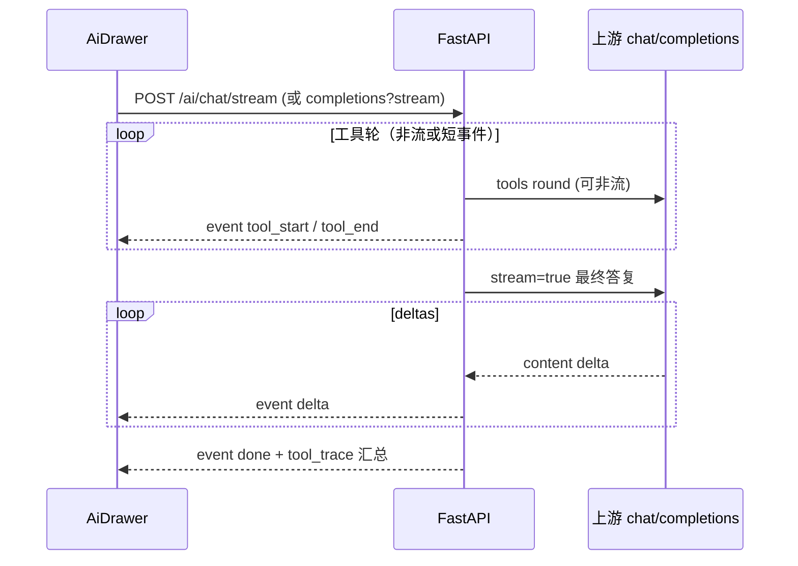

# ReportEditor AI 助手：流式输出（Streaming）

> 本文件为 **任务看板 / 实现计划**；规则见 [CLAUDE.md](../CLAUDE.md)。  
> **本轮仅写计划，未改代码。**  
> 产品诉求：AI 回复需**流式输出**（边生成边显示），降低长回答等待感。  
> 相关：[`ai_openai.py`](../_Prj/SD_SMA_ReportEditor/backend/api/routers/ai_openai.py) `run_chat_completion`、[`AiDrawer.vue`](../_Prj/SD_SMA_ReportEditor/frontend/src/features/ai-assistant/AiDrawer.vue)、[`aiSettings.ts`](../_Prj/SD_SMA_ReportEditor/frontend/src/api/aiSettings.ts)。  
> 交叉：[docs/006](006-🚧-ReportEditor-AI上游错误体验.md) 轨迹 H1 曾明确「不做 SSE」——本需求**推翻该边界**，以流式为独立切片。

---

# ⌛️ 未完成：AI 助手正文流式输出

## 产品诉求（2026-07-13）

1. 用户发送消息后，助手气泡应**逐步出现文字**（打字机/增量追加），而不是整段一次性弹出。  
2. 长回答、带工具调用的对话也要有可感知进度（至少工具进行中 + 最终正文流式）。  
3. 本轮**先写看板**；实现另开版本切片。

## 现状（代码对照）

| 点 | 现状 |
|----|------|
| 后端 `body.stream` | **直接 400**：文案「0.3.0 暂不支持 stream=true」 |
| `_forward_llm` | 一次性 `await` 上游整包 JSON |
| 工具环 | `MAX_TOOL_ROUNDS` 内多轮非流式；结束后 `attach_tool_trace` 一次返回 |
| 探活 claim guard | 整段文案检测后再调 / 改写（依赖完整 `assistant_text`） |
| 前端 AiDrawer | 等 HTTP 完成再插入助手消息；轨迹随响应一次性下发 |

结论：架构按**非流式完成对象**设计；要流式需前后端协议升级，并处理工具环与 claim 守卫的时序。

## 目标体验（建议默认）

```text
用户发送
  → 助手气泡出现（可空或「…」）
  → （可选）工具轨迹行逐步出现：调用中 → 成功/失败
  → 正文 token/片段增量追加
  → 结束：可停止按钮消失；轨迹可折叠（同 0.3.66）
```

- **可中止**：生成中提供「停止」；中止后保留已流出内容并标 `cancelled`。  
- **错误**：上游额度/网络错误用现有中文映射，流上以 error 事件结束（不丢半截时尽量保留已显示正文）。

## 架构草案（默认：SSE）



### 事件建议（NDJSON 或 `text/event-stream`）

| event | 载荷 | 说明 |
|-------|------|------|
| `status` | `{ phase: "thinking" \| "tools" \| "writing" }` | 可选 UI 状态 |
| `tool` | 与 `report_editor_tool_trace` 单步同形 | 对齐 0.3.66 轨迹 |
| `delta` | `{ text: string }` | 正文增量 |
| `replace` | `{ text: string }` | claim 改写整段替换（少用） |
| `done` | `{ tool_trace?, finish_reason }` | 正常结束 |
| `error` | `{ message }` | 失败结束 |

**默认传输**：`text/event-stream`（SSE）。备选：NDJSON chunked（便于部分代理）。

### 与工具环 / claim guard 的默认策略

| 阶段 | 策略（默认 **S1**） |
|------|---------------------|
| **工具轮** | 仍可对上游用**非流式**拿 `tool_calls`（实现简单、与现执行器兼容）；UI 用 `tool` 事件展示进度 |
| **最终正文** | 对上游 `stream=true`，转发 `delta` |
| **探活强制再调** | 最终流结束后若命中假成功声称：发纠错再调一轮（可再流式）；仍失败则 `replace` 或尾部追加如实失败文案 |
| **密文** | 流式路径同样禁止把备份口令/密文拼进 delta |

> 备选 **S2**：全轮次上游皆 stream，并解析流式 `tool_calls` 增量——复杂度高，本切片不默认。

## 拟改落点

1. **后端**：解除 `stream=true` 硬拒绝；新增流式入口（可保留旧非流式 `/v1/chat/completions` 给兼容）。  
2. **上游转发**：`httpx`/`aiohttp` 流式读 SSE；解析 OpenAI chunk → 自家 event。  
3. **前端**：`fetch` + `ReadableStream` / EventSource 风格解析；AiDrawer 增量写 `content`；生成中禁用重复发送或排队策略拍板。  
4. **停止**：`AbortController` 取消 fetch；后端感知 disconnect 则取消上游请求（尽力而为）。  
5. **单测**：chunk 解析；工具事件顺序；中止；error 映射；claim 改写不出现假成功终态。

## 明确不做（本切片边界）

- 不改模型供应商协议本身（仍走现有 Base URL + Key）。  
- 不在本切片做语音/多模态流。  
- 不强制能力矩阵 A–N 与流式捆绑（006 仍独立排期）。

## 验收（开工后）

- [ ] 普通问答：正文逐字/逐段出现，总等待感明显优于整包  
- [ ] 含工具调用：可见工具进度后，正文仍流式  
- [ ] 停止按钮可中止；已显示内容保留  
- [ ] `insufficient_quota` 等仍中文友好，无整段 JSON 刷屏  
- [ ] 探活空口答应仍被再调/改写，无假成功终态  
- [ ] 旧非流式 API 仍可用（或明确废弃并改前端唯一路径）

## 本轮范围

- ✅ 记录诉求与现状（stream 被 400）  
- ✅ 拟定 SSE + 工具轮非流 / 正文流（S1）  
- ✅ 与 006 轨迹、claim guard 的衔接说明  
- ⌛️ 实现与发版（待开工）

## 开工前可确认（可选）

| # | 问题 | 默认 |
|---|------|------|
| Q1 | 传输 | **SSE** |
| Q2 | 工具轮是否也上流式 tool_calls | **否（S1）** |
| Q3 | 非流式旧接口 | **保留**至前端切完 |
| Q4 | 流式时轨迹 UI | **边到边展示**（与 0.3.66 同组件） |
