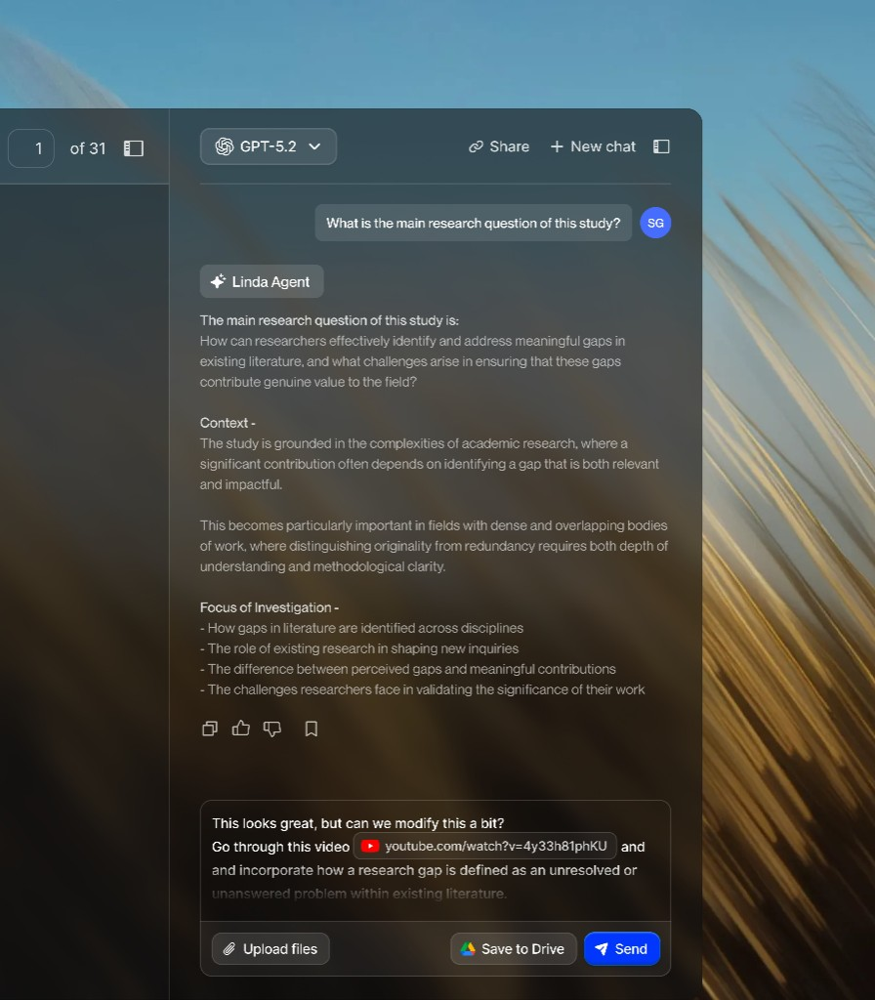

# ReportEditor AI 对话页 UI 改版（参考 ChatGPT 玻璃态）

> 本文件为 **任务看板**；规则见 [CLAUDE.md](../CLAUDE.md)。  
> **状态**：Q1–Q6 已拍板，**可开工实现**（尚未改代码）。  
> 相关实现面：[`AiDrawer.vue`](../_Prj/SD_SMA_ReportEditor/frontend/src/features/ai-assistant/AiDrawer.vue)、排队收纳 / 流式 / 工具轨迹见 [docs/006](006-🚧-ReportEditor-AI上游错误体验.md)、[docs/014](014-✅-ReportEditor-AI流式输出.md)。  
> UI 协作约定：[.cursor/skills/ui-ux-pro-max-report-editor](../.cursor/skills/ui-ux-pro-max-report-editor/SKILL.md)。

---

# ⌛️ 未完成：AI 对话页视觉与布局对齐参考稿

## 产品诉求（2026-07-13）

用户希望把 ReportEditor **AI 助手对话 UI**改成接近参考图的体验：深色玻璃态（glassmorphism）、居中对话主区、顶栏模型选择、右对齐用户气泡 + 头像、左对齐助手正文（无厚气泡）、底栏大圆角输入区。

## 参考图

本地路径：`docs/assets/016-ai-chat-ui-reference.png`

## 参考稿要素摘录（实现时对照）

| 区域 | 观感 |
|------|------|
| 整体 | 深色半透明面板 + `backdrop-filter` 模糊；大圆角；细浅描边 |
| 顶栏 | 左：模型下拉（图标 + 名称 + chevron）；右：新对话 / 展开·收起 / 关闭（无 Share） |
| 用户消息 | 右对齐深色圆角气泡；右侧圆形头像（缩写） |
| 助手消息 | 左对齐；Agent 名胶囊标签；正文**无**厚底气泡，Markdown 标题/列表清晰 |
| 助手操作 | 文末仅「复制」 |
| 输入区 | 底部大圆角输入框；右下发送（高亮）；无附件按钮 |
| 侧栏 | 本期不做 |

## 与现状差距（粗对照）

| 点 | 现状（AiDrawer） | 本期目标 |
|----|------------------|----------|
| 形态 | 右侧抽屉 + 右下 FAB | 默认抽屉；可一键展开近全屏再收回（Q1=C） |
| 主题 | 偏应用浅色/现有 token | 仅 AI 面板深色玻璃（Q2=A） |
| 气泡 | 用户/助手均气泡感较强 | 用户有气泡；助手贴底透明 |
| 顶栏 | 标题/关闭/调宽等 | 模型下拉 + 新对话 + 展开/收起 + 关闭 |
| 输入 | composer + 排队收纳条 | 大圆角一体输入 + 发送；排队收纳条保留在输入上方 |

## 已拍板（2026-07-14）

| # | 结论 |
|---|------|
| 能力不回退 | 改版不得丢掉：流式、工具轨迹、排队收纳、pending 确认、停止生成等已有能力 |
| **Q1 形态** | **C**：默认右侧抽屉；提供「展开」切近全屏，再收回抽屉 |
| **Q2 主题** | **A**：仅 AI 面板深色玻璃（抽屉与展开态一致） |
| **Q3 模型** | **A**：顶栏下拉，接现有设置里的模型列表，可直接切换 |
| **Q4 会话侧栏** | **B**：本期不做；单会话 +「新对话」清空当前 |
| **Q5 消息操作** | **B**：仅助手文末「复制」；无赞/踩/收藏/Share/Drive |
| **Q6 附件** | **A**：本期不做附件，输入区无回形针 |

## 拟改（开工后）

1. 视觉 token：玻璃面板、圆角、用户气泡 / 助手无厚底、发送强调色。  
2. 两态布局：抽屉宽可调 + 展开近全屏（记住用户偏好可选）。  
3. 消息列表：用户右对齐 + 头像；助手左对齐 + Agent 标签 + 文末复制。  
4. 顶栏：模型下拉 + 新对话 + 展开/收起 + 关闭；保留排队收纳条在 composer 上方（006）。  
5. 验收：截图对照参考图 + 回归流式/轨迹/排队/pending。

## 验收（实现后勾）

- [ ] 默认抽屉 + 可展开近全屏，均可深色玻璃观感
- [ ] 用户气泡右对齐 + 头像；助手无厚底气泡 + 可复制
- [ ] 顶栏可切换模型（接现有列表）
- [ ] 无会话侧栏、无附件、无赞踩/分享/网盘
- [ ] 既有 AI 能力无回归（流式、轨迹、排队、停止、pending）
- [ ] Electron 与浏览器模式布局一致

## 不做（本期）

- 多会话列表 / 历史侧栏  
- 附件上传、Share、Google Drive、赞踩收藏  
- 整站改深色主题
