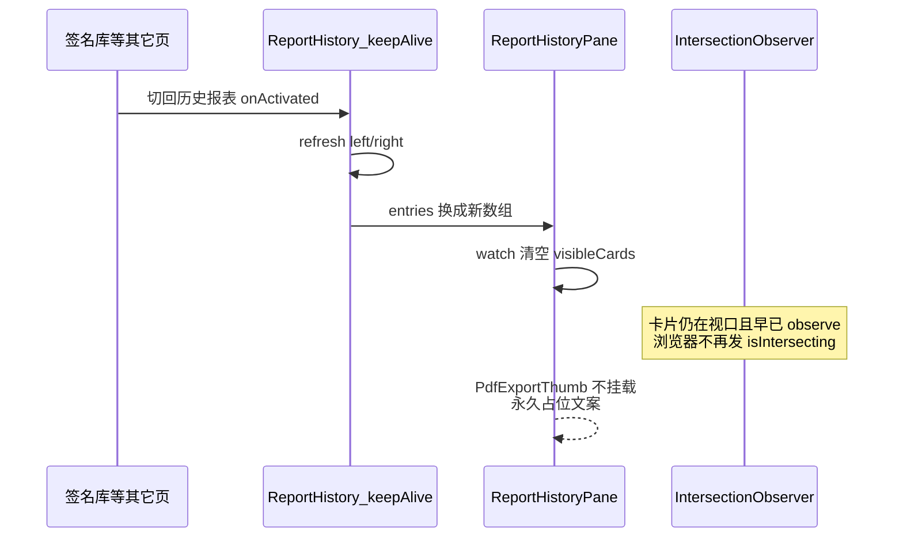

# ReportEditor：从签名库切到历史报表后缩略图停在「滚动到此加载预览」

> 本文件为 **任务看板**；规则见 [CLAUDE.md](../CLAUDE.md)。  
> **状态**：⌛️ 待修 · **根因已代码验证**（2026-07-18）。  
> **发现**：2026-07-18 · Windows 包 **0.3.107** 手测（用户）。  
> **相关**：[`ReportHistoryPane.vue`](../_Prj/SD_SMA_ReportEditor/frontend/src/components/report-history/ReportHistoryPane.vue) · [`ReportHistory.vue`](../_Prj/SD_SMA_ReportEditor/frontend/src/views/ReportHistory.vue) · [`MainLayout.vue`](../_Prj/SD_SMA_ReportEditor/frontend/src/layouts/MainLayout.vue)（`keep-alive` include `ReportHistory`）· 对照 [`TemplateManager.vue`](../_Prj/SD_SMA_ReportEditor/frontend/src/views/TemplateManager.vue)。

---

# ⌛️ 待修：keep-alive 重回历史报表后缩略图懒加载不触发

## 现象（已确认 · Win 0.3.107）

1. 先打开 **签名库**，再切换到 **历史报表**（缩略图模式）。  
2. 左右分屏卡片已在视口内（共 3 项 · 第 1/1 页，无需滚动），缩略图仍显示 **「滚动到此加载预览…」**。  
3. 截图：[FILES/029-历史报表缩略图懒加载占位.png](FILES/029-历史报表缩略图懒加载占位.png)。  
4. **预期**：任意其它页（不限签名库）切入都会复现——触发条件是 keep-alive 重新激活 + 列表 refresh，不是签名库特有。

## 根因（代码验证 · CONFIRMED）

链路如下：

| 步骤 | 代码位置 | 行为 |
|------|----------|------|
| 1 | `MainLayout.vue` `keep-alive` include `ReportHistory` | 离开页不销毁，组件与 Observer 常驻 |
| 2 | `ReportHistory.vue` `onActivated` → `refresh("left"/"right")` | 每次进入都重扫目录，`pane.entries = [...]` **新数组** |
| 3 | `ReportHistoryPane.vue` `watch(entries)` | **`visibleCards = new Set()`** 清空已可见标记 |
| 4 | 同文件 `ensureCardObserver` | 若 Observer **已存在则直接 return**，不会 unobserve/re-observe，也无几何补扫 |
| 5 | 浏览器 IO 语义 | 元素保持相交时 **不会再次回调** → 清空后无人把 path 写回 `visibleCards` |
| 6 | 模板 | `v-if="visibleCards.has(e.filePath)"` 为 false → 只显示「滚动到此加载预览…」 |

对照：模版管理 `TemplateManager` 在 `onActivated` 会调 `ensureCardObserver()`，且**刷新列表时不清空** `visibleCards`，故不易踩同一坑。历史报表两边都踩了（清空 + ensure 空操作）。

**首次冷进入本页通常正常**：`onMounted` 新建 Observer + `setCardRef` observe 时，浏览器会对当前相交元素发首轮回调。

## 修复方向（锁定）

在 [`ReportHistoryPane.vue`](../_Prj/SD_SMA_ReportEditor/frontend/src/components/report-history/ReportHistoryPane.vue) 落地，不改为「全部立即加载」。

1. **新增 `resyncCardVisibility()`**（命名可调整）：  
   - `disconnect` 现有 Observer 并置空 → 再 `ensureCardObserver()` 并对 `cardEls` 全部 `observe`；或  
   - `nextTick` 后按 `getBoundingClientRect` + 与现网一致的 `rootMargin≈400px` 把已在扩展视口内的 path 写入 `visibleCards`。  
   - **推荐前者**（重建 Observer）：与浏览器首轮回调语义一致，少维护一套几何近似。
2. **`watch(entries)`**：清空 `visibleCards` 后 `await nextTick()`，再调用 `resyncCardVisibility()`（目录刷新 / 翻页 / keep-alive 重回 refresh 均覆盖）。
3. **`onActivated`（Pane 或父页）**：可选再调一次 resync，作双保险；若 2 已覆盖 refresh→entries，父页可不改。
4. **单测**：抽出「entries 变更后须 resync」的纯函数或对 Pane 逻辑做最小 mock（清空后必须重新标记可见）；至少保证 vitest 锁住「清空后会调用 restart/resync」。
5. **验收**：签名库→历史报表；任意页→历史报表；本页换目录/翻页；长列表滚动懒加载不回归。

## 验收清单

- [ ] Win：签名库 → 历史报表（缩略图），首屏自动出预览，无需滚动  
- [ ] 任意其它 keep-alive 页 → 历史报表，同上  
- [ ] 本页刷新 / 换目录 / 翻页后懒加载仍正常  
- [ ] 长列表滚动懒加载不回归（未入视口不提前全量加载）  
- [ ] 版本记入 changelog（修完 bump）  

## 不做

- 不取消懒加载、不首屏全量渲染全部 PDF 缩略图。  
- 不改 `MainLayout` keep-alive 名单（应用级缓存策略保留）。  
