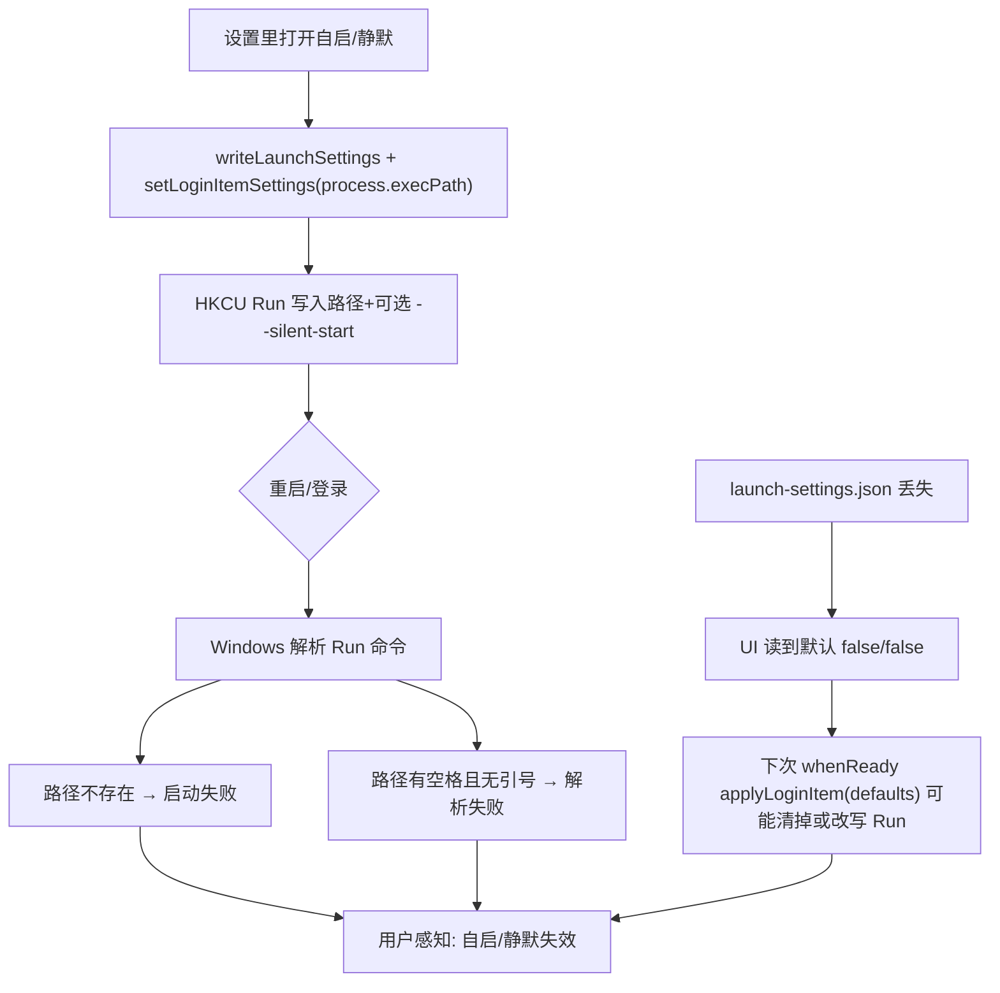

# ReportEditor：开机自启与静默无页面启动失效

> **状态**：🚧 根因已定位（本机证据），修复未落地。  
> **登记日期**：2026-07-23  
> **关联代码**：`frontend/electron/launch.cjs`、`frontend/electron/main.cjs`（`whenReady` → `applyLoginItem`）、`LaunchSettingsSection.vue`。  
> **关联**：整机单实例与托盘见 [015](015-✅-ReportEditor整机单实例与浏览器访问.md)。  
> **Electron**：`^34.0.0`（未含 CVE-2026-34768 修复线 38.8.6+ 的 Run 路径加引号行为）。

---

# ✅ 已完成：根因排查（2026-07-23 本机）

## 结论（可交付）

**开机自启「改完重启失效」的主因是：HKCU Run 登录项里的可执行路径无效，且路径含空格时未加引号，Windows 登录时根本拉不起进程。**  
静默启动依赖「进程先起来 + `--silent-start` / 偏好」；自启进程起不来时，静默一并表现为失效。

## 本机证据

| 项 | 值 |
|----|-----|
| Run 值名 | `com.brteam.sd_sma.report_editor_ai` |
| Run 命令 | `C:\Users\qih\AppData\Local\Programs\ReportEditorAI\Report Editor AI\Report Editor AI.exe --silent-start` |
| 该 exe 是否存在 | **否**（嵌套目录 `Report Editor AI\` 已不存在） |
| 当前真实安装 exe | `C:\Users\qih\AppData\Local\Programs\ReportEditorAI\Report Editor AI.exe`（**存在**） |
| 路径是否加引号 | **否**（空格名 `Report Editor AI.exe`；即使用对路径，未加引号也会被 Windows 截成 `...\Report`） |
| `launch-settings.json` | **缺失**（`%APPDATA%\sd-sma-report-editor-ai\` 下无此文件） |

## 因果链

### 主因 A — 登录项路径与现安装布局脱节（CONFIRMED）

- `applyLoginItem` 使用当时进程的 `process.execPath` 写入 Run。  
- 本机 Run 仍指向**旧布局**嵌套路径 `...\ReportEditorAI\Report Editor AI\Report Editor AI.exe`。  
- 当前 NSIS 安装为**扁平**布局：`...\ReportEditorAI\Report Editor AI.exe`。  
- 常见触发：重装/改目录/曾用 `win-unpacked` 或其它目录跑过「保存自启」后，Run 未随新 `execPath` 校正；或保存时指向了错误实例。

### 主因 B — Run 值未给含空格路径加引号（CONFIRMED + 框架级）

- 产品名导致 exe 名含空格：`Report Editor AI.exe`。  
- 本机 Run 值为**无引号**长串。Windows 会在第一个空格处截断可执行文件路径。  
- Electron ≤34 的 `setLoginItemSettings` 在 Windows 上存在**未加引号**问题（安全侧见 CVE-2026-34768；功能侧同样导致自启失败）。  
- 即使路径改成当前扁平 exe，**不加引号仍会失效**。

### 加重因素 C — 偏好文件与 Run 不同步（CONFIRMED）

- 无 `launch-settings.json` 时，设置页 `getLaunchSettings` 显示默认关，但 Run 里仍可能残留旧项（本机即如此：UI 无偏好文件 / 注册表仍有死链）。  
- `main.cjs` `whenReady` **无条件** `applyLoginItem(app, readLaunchSettings(app))`：偏好缺失 → 默认 `openAtLogin:false` → 可能清掉登录项，或与用户记忆中的「已打开」不一致。

### 加重因素 D — 五档批导等旁路进程（LIKELY）

- `REPORT_EDITOR_FIVE_TIER_EXPORT` 会 `app.setPath('userData', tmp/...)`，该目录通常**没有** `launch-settings.json`。  
- 同一套 `whenReady` 仍会 `applyLoginItem(defaults)`，可能把系统 Run **改成 false 清掉**，或以批导进程的 `execPath`（如 `win-unpacked\...`）误写登录项。  
- 与「刚调完设置、后来又跑批导/重装、再重启就坏」时间线相容。

## 非主因（已排除或次要）

| 假设 | 结论 |
|------|------|
| 仅开发态 `!isPackaged` 不写登录项 | 本机 Run **已有**项 → 曾在打包进程里写成功过；不是「从未写入」 |
| 静默逻辑本身（`shouldSilentStartThisSession`）单独坏 | 未验证到；当前更像「进程未起」导致静默无从谈起 |
| StartupApproved 禁用 | 本机未见到对应禁用项 |

---

# ⌛️ 未完成：修复（建议顺序）

1. **`applyLoginItem`（Windows）**：写入 Run 时对 `path` / 整命令 **强制加引号**；`args` 单独拼接；写完用 `getLoginItemSettings` 或读注册表校验，失败回传 UI。  
2. **启动时校正**：`whenReady` 若偏好 `openAtLogin===true`，用**当前** `process.execPath` 重写登录项（修重装后死链）；批导/自动化（`fiveTierExportSpec` 等）**禁止**调用 `applyLoginItem`。  
3. **偏好与 Run 对齐**：缺失 `launch-settings.json` 但 Run 仍开着时，避免静默用 defaults 清项；或启动时探测并提示「登录项异常，请重新保存」。  
4. **设置 UI**：保存后展示 `packaged` + 实际将使用的路径；开发态已有提示，安装版应对「校验失败」显红字。  
5. 回归：自启开/关 × 静默开/关 × 重启；重装后重开自启；确认 Run 值为 `"…\Report Editor AI.exe" [--silent-start]` 且路径 `Test-Path` 为真。

---

# ⌛️ 未完成：现象归档（用户原话）

- 设置里调整开机自启和/或静默无页面启动后，**重启会失效**。  
- 本机已用注册表 + 安装目录证实登录项死链/无引号；修复后按上节验收。
